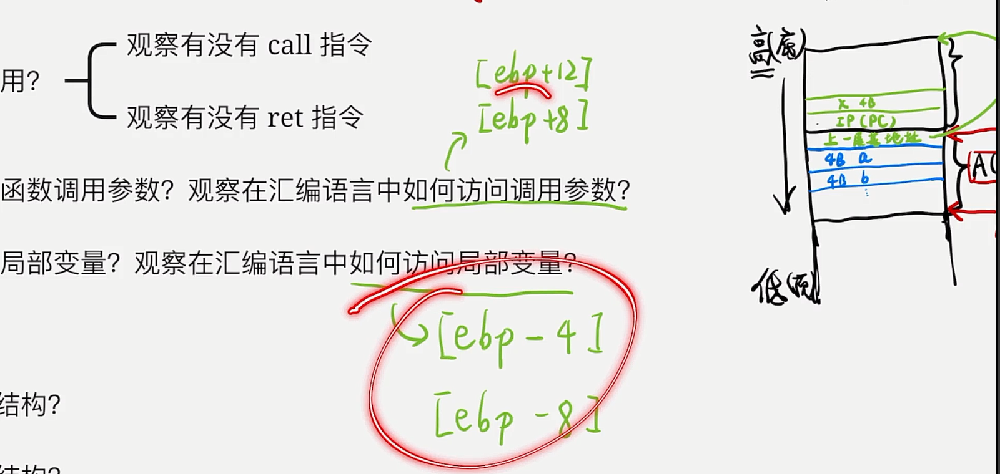
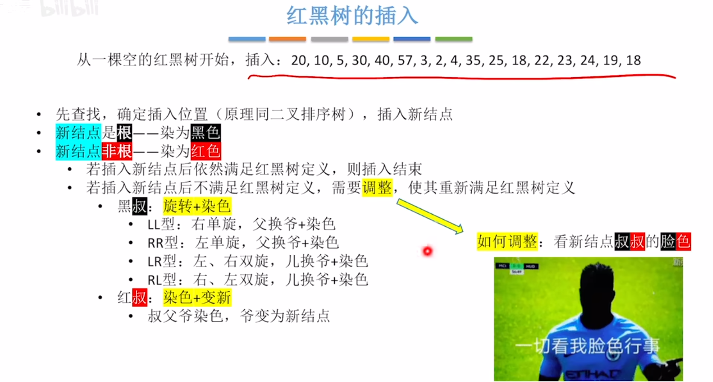
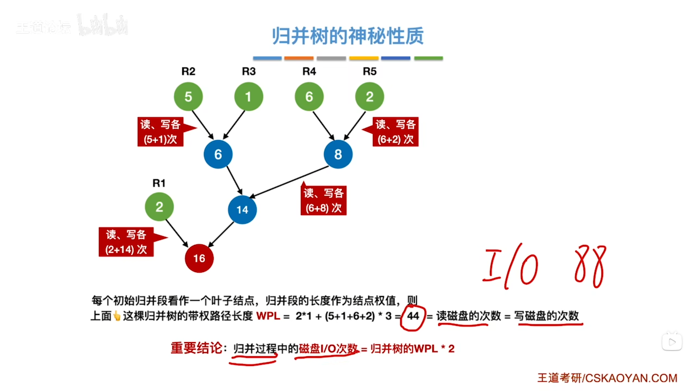

# 408知识点总结

## 数据结构

**快速排序**

  

## 操作系统

 

寻找文件时，查目录时，是按名查找，只能顺序读。但是只要找到该目录项之后，访问该文件的任何一个块，只要结合起始块号和FAT表即可随机访问其中任何一个块

 


# 408遗忘


## 操作系统

==高相应比优先 相应比=（等待时间+要求服务时间）/要求服务时间==

==peterson算法以及各种算法没有遵循什么思想==

==最佳适配算法等各种算法==

磁盘调度算法 CSCAN等  ==题目无特殊说明一般cscan就是clook  scan就是look==  

==调度算法的评价指标 周转时间 响应时间 等待时间==

相应一个请求所需时间=寻道时间+延迟时间（平均转半圈）+传输时间

置换算法中若访问位为0的页面淘汰后，调入新页面，访问位置为1，==并且指针会后移==

 

设备独立性软件也称系统调用处理程序

单缓冲区和双缓冲区用时 P289  画流水线，第二轮的第一步必须在第一轮的前两步之后才可读入缓冲区

==读者写者问题== 

系统开机后，操作系统的程序会被自动加载到内存中的系统区，这段区域是**RAM**。

回写法 直写法

死锁避免预防检测

页面分配策略与页面置换策略不能组合使用的是

## 组成原理

 汇编:把汇编文件转为目标代码   编译：把源文件转为目标代码  解释程序：不生成目标代码

大端：正常顺序

I/O方式计算思路：①一秒内外设着用CPU的时间=1秒内需要传送的次数×每次传送占用的时间

 


   

  

 

  

特殊流水线 超标量流水线

## 计算机网络

最小帧长=2τ v = 2 * (d/信号传播速率) * 传输速率

发往互联网地址即为默认路由地址0.0.0.0  子网掩码也是0.0.0.0

分组转发时间计算：第一个分组从源点到达终点时间+剩余分组从倒数第一个节点到达终点的时间

  

 

 

TCP： POP3 110  SMTP25  FTP21 

# 精读课本总结

## 计算机组成原理

KMGTPEZ

 

 

真值0：原码反码不唯一 补码移码唯一

 

 

 

   

 

 

  

移码= 偏置值 + 阶码真值     例子 -2次方 即  -2+127=125  转为无符号数并视为移码  01111101  

阶码真值为移码-01111111（127的补码）例子：1000 1100-0111 1111=0000 1101 **用补码解释** 为 13

 

==主存容量扩展：位扩并 字扩串==

引脚数： SRAM：片选1+控制读写1/2 +地址线+数据线    DRAM：行选线1+列选线1+读写控制线1/2+地址线（复用除以2）+数据线

RAID0：无纠错能力 RAID1：容量减半

SSD固态硬盘：基于闪存技术 数据以页为单位读写 以块为单位擦除   组成：闪存芯片和闪存翻译层  相比机械磁盘块但是易磨损

Cache与主存之间数据交换以块为单位    与CPU有关：CPU与主存/CPU与cache均以字为单位

 ==Cache容量=数据部分：块数×每块数据         +         控制部分 ：块数×（标记位+有效位+替换算法位+脏位（一致性维护位)==)

==主存字块标记位数=主存容量与cache容量之比==

直接映射不存在替换策略，因此无算法位 

  

快表：

cache是主存的副本

TLB是Page（页表)的副本

  

指令字长：一条指令的总长度

机器字长：CPU进行一次整数运算所能处理的二进制数据的位数

存储字长：一个存储单元中的二进制代码位数

指令的操作类型：数据传送类（MOV LOAD STORE） 运算类 程序控制类（JMP BRANCH CALL RET TRAP) 输入输出类

设计扩展操作码指令格式

==相对寻址广泛用于转移指令==。 便于程序浮动（一段代码在程序内部浮动）  有利于多道程序设计

基址寻址面向操作系统 有利于多道程序设计和编制浮动程序 主要用于解决程序逻辑空间与存储物理空间的无关性   基址寄存器不变，形式地址可变 面向操作系统

变址寻址:用于数组 适合循环程序   面向用户 p158  

==RISC和CISC对比==   RISC一定采用流水线  RISC一般使用硬布线控制器 速度快    CISC采用微程序控制器 速度慢  是 因为增加了从控制存储器读取微指令的时间

 

  

硬布线控制单元的输入信号：指令的操作码译码、机器周期信号、节拍信号、机器状态条件（来自执行单元的反馈信息即标志）

微程序控制器：==机器==指令的操作码字段形成微程序的入口地址

实现动态微程序设计可采用可擦除可编程只读存储器 EPROM

指令流水线：IF ID EX M WB

 

结构冲突：IF和M会分别对主存进行读和写     ID和WB会对分别对通用寄存器进行读和写    解决方法之一:把cache分为数据cache和指令cache  

数据冲突：WB和ID会冲突  解决方法：硬件阻塞或者软件插入空指令 数据旁路

控制相关：转移指令或者改变PC造成断流

流水线的吞吐率=任务数量/所用时间

流水线的加速比是==不使用与使用==流水线所用时间之比

流水线的效率是时空图上的面积比

高级流水线：1超标量流水线（动态多发)：按顺序发射执行，并发多条指令，需要配置多个功能部件   2.超长指令字技术（静态多发）：并行指令组合 需要多个处理部件 3.超流水线技术：划分功能段

==中断处理过程==

   

      、

中断屏蔽字屏蔽自己和比自己低的 

  

  

 

## 计算机网络 

面向连接：TCP

无连接：IP UDP

数据链路层：SDLC HDLC PPP STP 帧中继

网络层：IP IPX ICMP IGMP ARP RARP OSPF 

传输层：TCP UDP

应用层：FTP SMTP HTTP

OSI传输层只有面向链接           TCP/IP的传输层有面向连接和无连接 但是网路层无连接

比特率/数据传输率=波特率×log2 N

集线器：星型拓扑 半双工

奇偶校验码：奇校验：1的个数为奇数  偶校验：1的个数为偶数

 

码距：两码异或，有多少个1就码距就是多少

码距为n+1可以检测n位比特错

码距为2n+1可以纠正n位比特错

 

 

数据链路层：ARQ自动重传请求  包括停止等待  后退N帧GBN  选择重传SR

GBN：累积确认  ==按序接收==（执着）  接收窗口为1  发送窗口最大2^n-1  超时：重传==所有==已经发送但未被确认的帧

SR：来者不拒 超时谁重传谁，只重传出错帧  接收窗口 = 发送窗口 = 2^(n-1)

介质访问控制：信道划分介质访问控制（静态划分） 随机访问介质访问控制、轮询介质访问控制（这两个是动态划分）

 、

 

==频分复用（FDM)传输模拟信号==     ==时分复用(TDM) 传输数字信号==  

 

CSMA/CD适用于有线网络（总线型、半双工）

CD/CS均采用二进制指数退避算法： 

令牌环网既不产生冲突，也占全部带宽  令牌环局域网：物理星型 逻辑环形 适合负载高的信道

局域网：广播信道 IEEE802标准将数据链路层拆分为两个 

以太网：总线型 无连接不可靠

 

 填充至至少64B 以太网MAC帧最长1518B

 

  

==IEEE 802.11星型拓扑==

VLAN：每个VLAN是一个单独的广播域/子网   VLAN可以隔离冲突域也可以隔离广播域

 

广域网：

 


局域网交换机：工作在==全双工== 碰撞的传输数据  转发表通过自学习算法 独占媒体带宽  

 

 


**网络层**

SDN: 

 

RIP路由信息协议 OSPF链路状态路由协议 BGP边界网关协议

 

 

  
 

  

**IPV4** :  DHCP应用层协议-UDP-C/S       

ARP广播ARP请求分组， 单播ARP响应分组    而DHCP的客户端和服务器需要通过==广播==的方式进行交互

 

ICMP(网际控制报文协议)Internet Cotrol Message Protocol: ==网络层协议  装在IP数据报的数据部分==   

**IPV6:** 

组播：仅用于UDP  不提供可靠交付    D类地址 

 

**传输层**

 

 

TCP报文的首部长度和IP数据报的首部长度均是20B

UDP是==面向报文的== 维护可靠性的工作交给==应用层==    UDP数据报的长度字段包括首部和数据

TCP是==面向字节流的== 提供全双工通信  每条TCP链接是点对点的

TCP填充字段：使整个首部长度是4B的整数倍

 

 	


 

 


==DNS域名系统 C/S  UDP 53号端口==

FTP 文件传输协议 C/S  TCP 数据链接端口20  控制连接端口21

SMTP   TCP   CS  端口号25

POP3   TCP   CS    端口号110

HTTP 面向文本  TCP  

 

 

 


## 数据结构

n个顶点可以形成连通图的最小边数n-1   对比  保证形成连通图的最小边数(即n-1个顶点全连通+1个额外的顶点无边)

二叉查找树和散列查找次数(失败情况分母是mod后面的数而不是表长)

关键路径ve找最大 vl找最小  e找尾巴  事件ve vl 活动ae=弧尾位置   al=弧头位置-段长

归并树添加虚段：设节点有n个    ①若(n-1)%(k-1)=0,则无需添加虚段   ②若(n-1)%(k-1)=u≠0，则需补k-1-u个虚段

 

b树： 

KMP算法   next数组 见2015真题08重新做一下

 

 

树中结点的度：孩子的个数

 

 

**查找**

平均查找长度ASL

  

 

 

分块查找：  

**平衡二叉树**： 

**红黑树：** 

叶子（NULL结点/外部节点）和根节点一定是黑色

左根右 根叶黑 不红红 黑路同

 

  

注意事项：1. 看是否满足红黑树定义：非根结点插入只需要观察是否满足不红红特性   2.父换爷则父亲和爷爷都染色（颜色取反）     3.爷变为新节点：把爷爷看成新插入的结点，重新过一遍如上操作 

 

注意：黑高不包括根结点，从根节点的孩子到达外部节点（null结点/叶结点）个数 

 

**B树 B+树**

 

**B树的插入**

 

**B树的删除**

 

兄弟够借的情况，”三者旋转“

兄弟不够借（兄弟的结点个数等于关键字下限）父节点的其中一个元素与左右兄弟合并，若父节点也出现低于关键字下限的情况，则对父节点再次进行这个操作

  

B+树的查找必须从上到下找到叶子节点为止（不论查找成功还是失败）


**散列查找**

 

 

 

与上面那个拉链法的图对比，下面这个是线性探测法

  

**堆**

堆的删除： 

**外部排序 **

  

 

 

**败者树**

 

**最佳归并树**

  

## 操作系统

访管指令是用户态指令，将用户态转为核心态

 

操作系统的引导： 

进程是调度的基本单位 线程是资源的基本单位

 

 

同步的原则：空闲让进 忙则等待 有限等待 让权等待

 

 

锁==违反让权等待==   常用于多处理器系统，一个核忙等，其他核照常正常工作 并快速释放临界区

Wait(S)相当于P操作  Signal(S)相当于V操作 

整形信号量==不满足让权等待，会发生忙等==

记录型信号量遵循了让权等待

 

```c++
//生产者-消费者模型1
semaphore mutex = 1;   //临界区互斥
semaphore empty = n;   //可使用的空闲缓冲区数量
semaphore full = 0;    //缓冲区现存数量

producer(){
    while(1){
        生产数据;
        P(empty);
        P(mutex);
        数据放入缓冲区；
        V(mutex);
        V(full);
    }
}

consumer(){
    while(1){
        P(full);
        P(mutex);
        取数据；
        V（mutex);
        V(empty);
        消费数据；
    }
}
```


```c++
//生产者-消费者模型2
semaphore plate = 1, apple = 0, orange = 0;

dad(){
    while(1){
        准备苹果;
        P(plate);
        放苹果；
        V(apple);
    }
}

mom(){
    while(1){
        准备橘子;
        P(plate);
        放入橘子；
        V(orange);
    }
}

son(){
    while(1){
        P(orange);
        取橘子；
        V(plate);
        吃橘子；
    }
}

daughter(){
    while(1){
        P(apple);
        取苹果；
        V(plate);
        吃苹果；
    }
}
```


**⭐读者写者问题** 

```c++
//读者写者问题   ------读优先：只要有读进程还在读，写进程就会一直阻塞，可能饿死
int count = 0;     //记录读者数量
semaphore mutex = 1;   //保证更新count时互斥
semaphore rw = 1;     //保证读者和写者互斥

writer(){
    while(1){
        P（rw）;
        写数据；
        V（rw);
    }
}

reader(){
   while(1){
       P(mutex);
       if(count == 0){     //如果是第一个读进程
           P(rw);          //加锁
       } 
       count++;
       V(mutex);
       
       读数据；
           
       P(mutex);
       count--;
       if(count == 0){    //如果是最後一个读进程
           V(rw);         //解锁
       }
       V(mutex);
   } 
}
```


```c++
//读者写者问题   写优先
int count = 0;     //记录读者数量
semaphore mutex = 1;   //保证更新count时互斥
semaphore rw = 1;     //保证读者和写者互斥
****semaphore w = 1****;      //用于实现写优先

writer(){
    while(1){
        **P(w);**
        P（rw）;
        写数据；
        V（rw);
        **V(w);**
    }
}

reader(){
   while(1){
       **P(w);**
       P(mutex);
       if(count == 0){     //如果是第一个读进程
           P(rw);          //加锁
       } 
       count++;
       V(mutex);
       **V(w);**
       读数据；
           
       P(mutex);
       count--;
       if(count == 0){    //如果是最後一个读进程
           V(rw);         //解锁
       }
       V(mutex);
   } 
}

```


```c++
//吸烟者问题
int i = 0;    //存储随机数
semaphore offer1 = 0;    //烟草和纸组合
semaphore offer2 = 0;    //烟草和胶水组合
semaphore offer3 = 0;    //纸和胶水组合
semaphore finish = 1;     //表示抽烟是否完成

server P1(){
	while(1){
        P(finish);
        i = (i + 1) % 3;
        if(num == 0){
            V(offer1);     //提供烟草和纸
        }
        else if(num == 1){
            V(offer2);     //提供烟草和胶水
        }
        else{
            V(offer3);     //提供纸和胶水
        }
        任意两种材料放桌子上；
    }
}

smoker1(){     //拥有烟草者
    while(1){
        P(offer3);
        拿到纸和胶水，与自己的烟草卷成烟，抽掉；
        V（finish);
    }
}

smoker2(){     //拥有纸者
    while(1){
        P(offer2);
        拿到烟草和胶水，与自己的纸卷成烟，抽掉；
        V（finish);
    }
}

smoker1(){     //拥有胶水者
    while(1){
        P(offer1);
        拿到烟草和纸，与自己的胶水卷成烟，抽掉；
        V（finish);
    }
}
```

```c++
//哲学家进餐问题
semaphore chopstick[5] = {1, 1, 1, 1, 1};
semaphore mutex = 1;      //实现拿筷子互斥

philosophor-i(){
    while(1){
        P(mutex);
        P(chopstick[i]);
        P(chopstick[(i+1)%5]);
        V(mutex);
        吃饭；
        V(chopstick[i]);
        V(chopstick[(i+1)%5]);
        思考；
    }
}
```

死锁产生的必要条件：互斥 不剥夺 请求和保持 循环等待

死锁预防：破坏死锁的条件

死锁避免：防止系统进入不安全状态  银行家算法

死锁的检测和解除：资源分配图 允许发生死锁，解除：资源剥夺、撤销进程、进程回退

 

**内存管理**

 

 

查询快表命中仅需一次访存  未命中则需查询慢表需要一次访存，之后再进行一次访存

 

 、

**文件系统**

物理格式化/低级格式化：划分扇区，检测坏扇区，并用备用扇区替换坏扇区

逻辑格式化/高级格式化：磁盘分区 完成分区的文件系统初始化 

 

vnode只存在主存中，而inode既会被调入主存，也会在外存中存储

**I/O管理** 

 

  	单缓冲：max(C，T)+M    双缓冲：max(C+M, T)    C:  cpu==处理==数据时间      M：缓冲区中数据==传送==到用户区     T：磁盘数据==输入==到缓冲区

 

逻辑格式化后，

  

  
