写在前面：记录 2023/2/2 日，学完黑马的 c++ 基础以及核心编程。

转载：https://blog.csdn.net/weixin_48953899/article/details/117731139

对照着黑马的笔记，加入了自己的思考。同时记录自己学习 c++ 的历程。仅供学习使用，无商业用途

# C++核心编程

本阶段主要针对C++==面向对象==编程技术做详细讲解，探讨C++中的核心和精髓。

## 1 内存分区模型

C++程序在执行时，将内存大方向划分为**4个区域**

- 代码区：存放函数体的二进制代码，由操作系统进行管理的
- 全局区：存放全局变量和静态变量以及常量
- 栈区：由编译器自动分配释放, 存放函数的参数值,局部变量等
- 堆区：由程序员分配和释放,若程序员不释放,程序结束时由操作系统回收

**内存四区意义：**

不同区域存放的数据，赋予不同的生命周期, 给我们更大的灵活编程

### 1.1 程序运行前（代码区和全局区）

 在程序编译后，生成了exe可执行程序，**未执行该程序前**分为两个区域

**代码区**

 存放 CPU 执行的机器指令

 代码区是**共享**的，共享的目的是对于频繁被执行的程序，只需要在内存中有一份代码即可

 代码区是**只读**的，使其只读的原因是防止程序意外地修改了它的指令

**全局区**

 全局变量和静态变量存放在此.

 全局区还包含了常量区, 字符串常量和其他常量也存放在此.

 ==该区域的数据在程序结束后由操作系统释放==.

**示例：**

```c++
//全局变量
int g_a = 10;
int g_b = 10;

//全局常量（const修饰的全局变量）
const int c_g_a = 10;
const int c_g_b = 10;

int main() {

	//局部变量
	int a = 10;
	int b = 10;
   
    //const修饰的局部变量
	const int c_l_a = 10;    //c-const g-global l-local
	const int c_l_b = 10;
    
    //静态变量 在普通变量前面加static,属于静态变量
	static int s_a = 10;
	static int s_b = 10;

	cout << "局部变量a地址为： " << (int)&a << endl;
	cout << "局部变量b地址为： " << (int)&b << endl;

	cout << "全局变量g_a地址为： " <<  (int)&g_a << endl;
	cout << "全局变量g_b地址为： " <<  (int)&g_b << endl;

	cout << "静态变量s_a地址为： " << (int)&s_a << endl;
	cout << "静态变量s_b地址为： " << (int)&s_b << endl;

    //常量：1.字符串常量："Hello World"    2.const修饰的变量{cons修饰的局部变量和const修饰的全局变量}
	cout << "字符串常量地址为： " << (int)&"hello world" << endl;
	cout << "字符串常量地址为： " << (int)&"hello world1" << endl;

	cout << "全局常量c_g_a地址为： " << (int)&c_g_a << endl;
	cout << "全局常量c_g_b地址为： " << (int)&c_g_b << endl;
	
    cout << "局部常量c_l_a地址为： " << (int)&c_l_a << endl;
	cout << "局部常量c_l_b地址为： " << (int)&c_l_b << endl;

	system("pause");

	return 0;
}

```

打印结果：

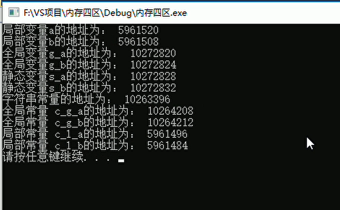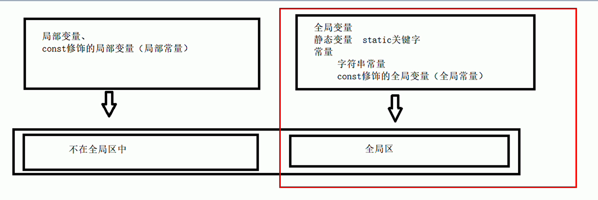

总结：

- C++中在程序运行前分为全局区和代码区
- 代码区特点是共享和只读
- 全局区中存放全局变量、静态变量、常量
- 常量区中存放 const修饰的全局常量 和 字符串常量

### 1.2 程序运行后（栈区和堆区）

**栈区**

 由编译器自动分配释放, 存放函数的参数值,局部变量等

 注意事项：不要返回局部变量的地址，栈区开辟的数据由编译器自动释放

**示例：**

```c++
//栈区注意事项：1.不要返回局部变量的地址。  2.栈区的数据由编译器管理开辟和释放
int * func()  //形参数据也会放在栈区
{
	int a = 10; //存放在栈区，栈区的数据在函数执行完后自动释放
	return &a; //返回局部变量的地址
}

int main() {

    //接收func函数的返回值
	int * p = func();   //p指针指向a的地址，*p为指向内存的数据（解引用）

	cout << *p << endl;  //第一次可以打印正确的数据，是因为编译器做了保留
	cout << *p << endl;  //第二次这个数据就不再保留了，出现乱码

	system("pause");

	return 0;
}

```

 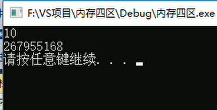

**堆区**

 由程序员分配释放,若程序员不释放,程序结束时由操作系统回收

 在C++中主要利用new在堆区开辟内存

**示例：**

```c++
int * func()
{
    //利用new关键字，可以将数组开辟到堆区
    //指针本质也是局部变量，放在栈上，指针保存的数据放在了堆区
	int * a = new int(10);   //new int(初始值)会返回一个地址
	return a; 
}

int main() {
	//在堆区开辟数据
	int *p = func();

	cout << *p << endl;
	cout << *p << endl;
    cout << *p << endl;
    cout << *p << endl;
    
	system("pause");

	return 0;
}

```

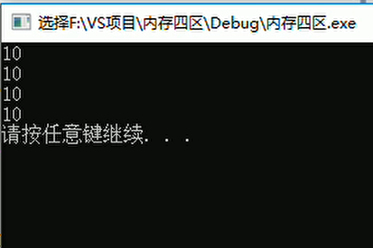 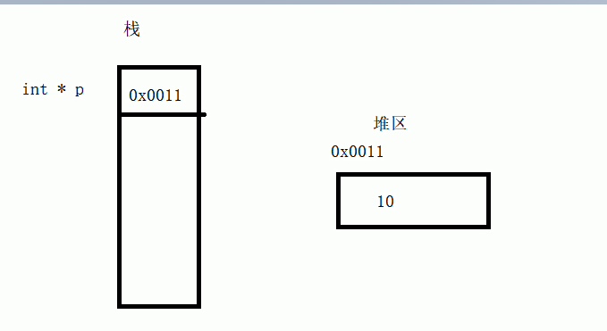

​                                                           `注释：只要程序员不把堆区释放干净，那么这个10一直存活` 

**总结：**

堆区数据由程序员管理开辟和释放

堆区数据利用new关键字进行开辟内存

### 1.3 new操作符

 C++中利用==new==操作符在堆区开辟数据

 堆区开辟的数据，由程序员手动开辟，手动释放，释放利用操作符==delete==

 语法：`new 数据类型`

 利用new创建的数据，会返回该数据对应的类型的指针

**示例1： 基本语法**

```c++
int* func()
{
    //在堆区创建整形数据
    //new返回是 该数据类型的指针
	int* a = new int(10);
	return a;
}

int main() {

	int *p = func();

	cout << *p << endl;
	cout << *p << endl;
	
	//利用delete释放堆区数据
	delete p;

	cout << *p << endl;     //内存已经被释放，再次访问就是非法操作，会报错

	system("pause");

	return 0;
}

```

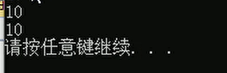 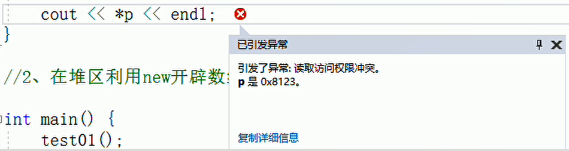

`注释：     前两次打印成功          利用delete释放后，就不可访问该空间，提示无访问权限`

**示例2：堆区开辟数组**

```c++
//堆区开辟数组
int main() {
	//在堆区创建10个整形数据的数组
	int * arr = new int[10];   //10代表数组中有10个元素

	for (int i = 0; i < 10; i++)
	{
		arr[i] = i + 100;
	}

	for (int i = 0; i < 10; i++)
	{
		cout << arr[i] << endl;
	}
	//释放数组 delete 后加 []
	delete[] arr;     //delete[]（告诉他我释放的是一个数组）+ 一个指针

	system("pause");

	return 0;
}

```

 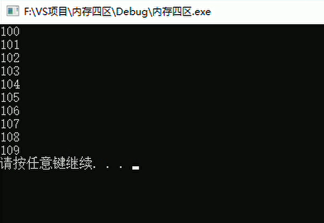    


## 2 引用

### 2.1 引用的基本使用

**作用： **给变量起别名

**语法：** `数据类型 &别名 = 原名`

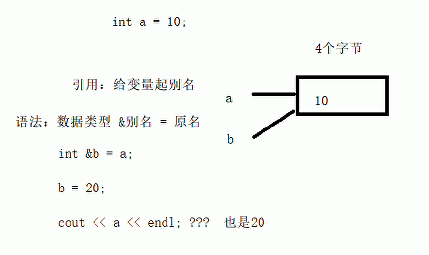 

` 注释：a和b访问的内存是一样的`

**示例：**

```cpp
int main() {

	int a = 10;
	int &b = a;

	cout << "a = " << a << endl;
	cout << "b = " << b << endl;

	b = 100;

	cout << "a = " << a << endl;
	cout << "b = " << b << endl;

	system("pause");

	return 0;
}

```

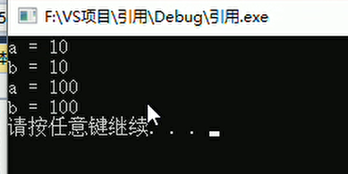 

### 2.2 引用注意事项

- 引用必须初始化
- 引用在初始化后，不可以改变
- 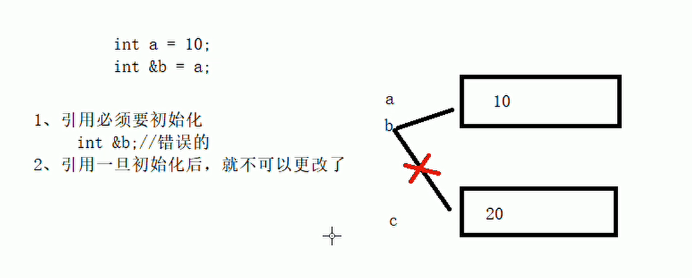 

示例：

```cpp
int main() {

	int a = 10;
	int b = 20;
	//int &c;          //错误，引用必须初始化
	int &c = a; //一旦初始化后，就不可以更改
	c = b;     //这是赋值操作，不是更改引用

	cout << "a = " << a << endl;
	cout << "b = " << b << endl;
	cout << "c = " << c << endl;

	system("pause");

	return 0;
}

```

### 2.3 引用做函数参数

**作用：**函数传参时，可以利用引用的技术让形参修饰实参

**优点：**可以简化指针修改实参

**示例：**

```cpp
//1. 值传递
void mySwap01(int a, int b) {
	int temp = a;
	a = b;
	b = temp;
}

//2. 地址传递
void mySwap02(int* a, int* b) {
	int temp = *a;
	*a = *b;
	*b = temp;
}

//3. 引用传递
void mySwap03(int& a, int& b) {
	int temp = a;
	a = b;
	b = temp;
}

int main() {

	int a = 10;
	int b = 20;

	mySwap01(a, b); //值传递，即只将实参的值传递给形参，而形参地址中值的变化并不能影响到实参的值
	cout << "a:" << a << " b:" << b << endl; 

	mySwap02(&a, &b);     //相当于&a = a，起别名。修改形参的a就相当于修改实参中的a
	cout << "a:" << a << " b:" << b << endl;

	mySwap03(a, b);
	cout << "a:" << a << " b:" << b << endl;

	system("pause");

	return 0;
}

```

> 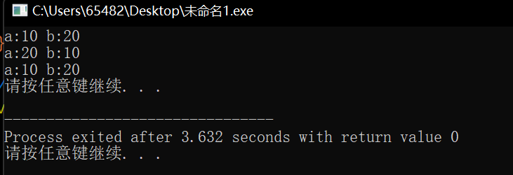 
>
> 总结：通过引用参数产生的效果同按地址传递是一样的。引用的语法更清楚简单

### 2.4 引用做函数返回值

作用：引用是可以作为函数的返回值存在的

注意：**不要返回局部变量引用**

用法：函数调用作为左值

**示例：**

```cpp
/*
 * 引用做函数的返回值
 */

//返回局部变量引用
int& test01() {    //用引用的方式返回局部变量
	int a = 10; //局部变量，存放在四区中的 栈区
	return a;
}

//返回静态变量引用
int& test02() {
	static int a = 20;    //静态变量，存放在全局区，全局区的数据在程序结束后由系统释放
	return a;
}

int main() {

	//1.不能返回局部变量的引用
	int &ref = test01();
	cout << "ref = " << ref << endl;   //第一次结果正确，是因为编译器做了保留
	cout << "ref = " << ref << endl;   //第二次结果错误，因为a的内存已经释放

	//2.如果函数的返回值是引用，这个函数的调用可以作为左值
	int &ref2 = test02();
	cout << "ref2 = " << ref2 << endl;
	cout << "ref2 = " << ref2 << endl;

	test02() = 1000;   //首先test02返回了一个a的引用，这一步就相当于把1000赋值给a，而ref2本身又是a的别名
                        //通过1000赋值给原名a，再用别名ref2访问那块内存，当然ref2会是1000

	cout << "ref2 = " << ref2 << endl;
	cout << "ref2 = " << ref2 << endl;

	system("pause");

	return 0;
}

```

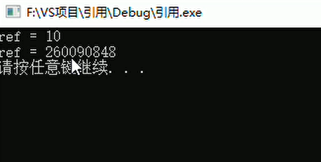 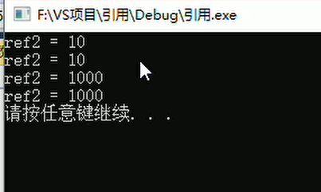

### 2.5 引用的本质

本质：**引用的本质在c++内部实现是一个==指针常量==.**

讲解示例：

```cpp
//发现是引用，转换为 int* const ref = &a;
void func(int& ref){
	ref = 100; // ref是引用，转换为*ref = 100
}

int main(){
	int a = 10;
    
    int& ref = a; //自动转换为 int* const ref = &a; 指针常量是指针指向不可改，也说明为什么引用不可更改
	ref = 20; //内部（编译器）发现ref是引用，自动帮我们转换为: *ref = 20;
    
	cout << "a:" << a << endl;
	cout << "ref:" << ref << endl;
    
	func(a);
	return 0;
}

```

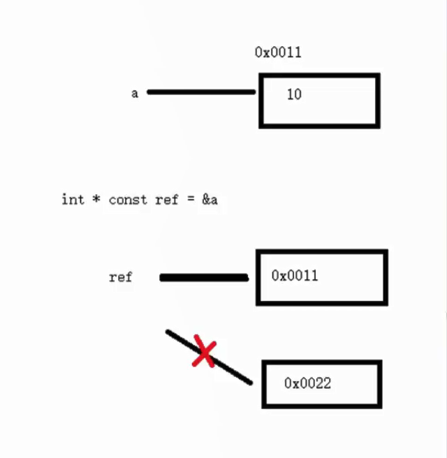  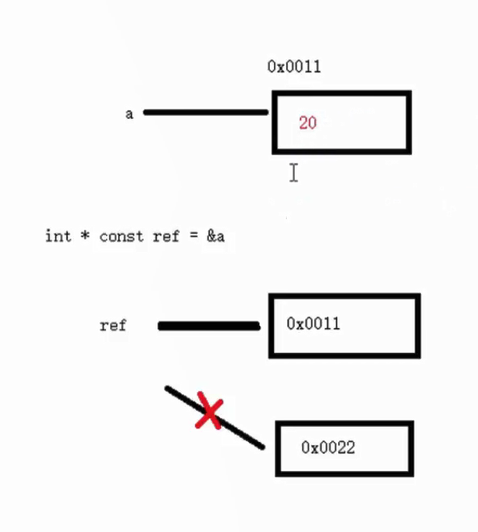 

  `注释：*ref = 20，相当于对ref解引用，找到他指向的那块内存，把值修改为20`

结论：C++推荐用引用技术，因为语法方便，引用本质是指针常量，但是所有的指针操作编译器都帮我们做了

### 2.6 常量引用

**作用：**常量引用主要用来修饰形参，防止误操作

在函数形参列表中，可以加==const修饰形参==，防止形参改变实参

**示例：**

```cpp
//常量引用使用场景：用来修饰形参，防止误操作
void showValue(const int &val) {    //加入const之后，下面那行修改则会失败 
	// val = 1000;    //报错，不能修改
	cout << "val = " << val << endl;
}

int main() {
	/*
    //int a = 10; int &ref = a;  //这句正确，但是下面这行不行
	//重要：int &ref = 10;  引用本身需要一个合法的内存空间(栈或者堆区)，因此这行错误。10是常量
	
   	const int & ref = 10;  //加入const就可以了，编译器优化代码，int temp（临时空间，找不到原名，因此不能修改ref） = 10; const int & ref = temp;
	//ref = 100;  //加入const后变为只读状态，不可以修改，这句会报错
	cout << ref << endl;
	*/

	//函数中利用常量引用防止误操作修改实参
	int a = 100;
	showValue(a);

	system("pause");

	return 0;
}

```

## 3 函数提高

### 3.1 函数默认参数

在C++中，函数的形参列表中的形参是可以有默认值的。

语法：`返回值类型 函数名 （参数= 默认值）{}`

**示例：**

```cpp
int func(int a, int b = 10, int c = 10) {   //函数默认参数，b和c的默认值为10
	return a + b + c;
}
//注意事项
//1. 如果某个位置参数有默认参数，那么从这个位置往后，从左向右，必须都要有默认参数
int func2(int a = 10, int b = 10 int c = 10);{  //a假如有默认值，那么a之后的b,c也必须有默认值
    return a + b + c;
}

//2. 如果函数声明有默认参数，函数实现的时候就不能有默认参数(声明和实现只能有一个有默认参数)
int func3(int a = 10, int b = 10);    //这是一个声明
int func3(int a = 10, int b = 10) {   //这是一个实现,这样在main函数里调用此函数的时候将会出错（二义性）
	return a + b;
}

int main() {
	//如果我们自己传入数据，就用自己的数据，如果没有，那么用默认值
    cout << "ret = " << func(100) << endl;     //也可运行，相当于a=100，b和c的默认值为10
    cout << "ret = " << func(20, 20) << endl;   //相当于a=20,b=20,c=10(默认值)

    cout << "func3(10, 10)" << endl;    //这里会报错，提示你：func2重定义了默认参数
	system("pause");

	return 0;
}

```

### 3.2 函数占位参数

C++中函数的形参列表里可以有占位参数，用来做占位，调用函数时必须填补该位置

**语法：** `返回值类型 函数名 (数据类型){}`

在现阶段函数的占位参数存在意义不大，但是后面的课程中会用到该技术

**示例：**

```cpp
//目前阶段的站位参数我们还用不到，后面课程中会用到
//函数占位参数 ，占位参数也可以有默认参数：void func(int a, int = 10){...} 调用的时候：func(10);(只传a即可)
void func(int a, int) {
	cout << "this is func" << endl;
}

int main() {

	func(10,10); //占位参数必须填补

	system("pause");

	return 0;
}

```

### 3.3 函数重载

#### 3.3.1 函数重载概述

**作用：**函数名可以相同，提高复用性

**函数重载满足条件：**

- 同一个作用域下
- 函数名称相同
- 函数参数**类型不同** 或者 **个数不同** 或者 **顺序不同**

**注意:** 函数的返回值不可以作为函数重载的条件

**示例：**

```cpp
/*函数重载满足条件：
- 同一个作用域下
- 函数名称相同
- 函数参数 类型不同或者 个数不同 或者 顺序不同*/
void func()
{
	cout << "func 的调用！" << endl;
}
void func(int a)
{
	cout << "func (int a) 的调用！" << endl;
}
void func(double a)
{
	cout << "func (double a)的调用！" << endl;
}
void func(int a ,double b)
{
	cout << "func (int a ,double b) 的调用！" << endl;
}
void func(double a ,int b)
{
	cout << "func (double a ,int b)的调用！" << endl;
}

//函数返回值不可以作为函数重载条件
//int func(double a, int b)    //最前面为int和最前面为void，在调用func(3.14, 10);时候，不接收他的返回值时候，则会产生歧义，编译器不知道是调用的int
//{
//	cout << "func (double a ,int b)的调用！" << endl;
//}


int main() {

	func();
	func(10);
	func(3.14);
	func(10,3.14);
	func(3.14, 10);
	
	system("pause");

	return 0;
}

```

#### 3.3.2 函数重载注意事项

- 引用作为重载条件
- 函数重载碰到函数默认参数

**示例：**

```cpp
//函数重载注意事项
//1、引用作为重载条件

void func(int &a)
{
	cout << "func (int &a) 调用 " << endl;
}

void func(const int &a)   //const int和int类型不同，可以重载
{
	cout << "func (const int &a) 调用 " << endl;
}


//2、函数重载碰到函数默认参数

void func2(int a, int b = 10)
{
	cout << "func2(int a, int b = 10) 调用" << endl;
}

void func2(int a)
{
	cout << "func2(int a) 调用" << endl;
}

int main() {
	
	int a = 10;
	func(a); //调用无const
	func(10);//调用有const   int &a = 10;不合法（见2.6常量引用示例第10行代码） const int &a = 10合法（见2.6常量引用示例第12行代码）

	//func2(10); //碰到默认参数产生歧义，需要避免（既可以把10传入void func2(int a, int b = 10)也可以传入void func2(int a)）

	system("pause");

	return 0;
}

```

## **4** 类和对象

C++[面向对象](https://so.csdn.net/so/search?q=面向对象&spm=1001.2101.3001.7020)的三大特性为：==封装、继承、多态==

C++认为==万事万物都皆为对象==，对象上有其属性和行为

**例如：**

 人可以作为对象，属性有姓名、年龄、身高、体重…，行为有走、跑、跳、吃饭、唱歌…

 车也可以作为对象，属性有轮胎、方向盘、车灯…,行为有载人、放音乐、放空调…

 具有相同性质的==对象==，我们可以抽象称为==类==，人属于人类，车属于车类

### 4.1 封装

#### 4.1.1 封装的意义

封装是C++面向对象三大特性之一

封装的意义：

- 将属性和行为作为一个整体，表现生活中的事物
- 将属性和行为加以权限控制

**封装意义一：**

 在设计类的时候，属性和行为写在一起，表现事物

**语法：** `class 类名{ 访问权限： 属性 / 行为 };`

**示例1：**设计一个圆类，求圆的周长

**示例代码：**

```cpp
//圆周率
const double PI = 3.14;

//1、封装的意义
//将属性和行为作为一个整体，用来表现生活中的事物

//封装一个圆类，求圆的周长
//class代表设计一个类，后面跟着的是类名
class Circle
{
    //访问权限
public:    //public是公共的权限

	//属性
	int m_r;//半径

	//行为
	//获取到圆的周长
	double calculateZC()
	{
		//2 * pi  * r
		//获取圆的周长
		return  2 * PI * m_r;
	}
};

int main() {

	//通过圆类，创建具体的圆（对象）。   （实例化：通过一个类，创建一个对象的过程）
	// c1就是一个具体的圆
	Circle c1;
	c1.m_r = 10; //给圆对象的属性（半径）进行赋值操作

	//2 * pi * 10 = = 62.8
	cout << "圆的周长为： " << c1.calculateZC() << endl;

	system("pause");

	return 0;
} 

```

**示例2：**设计一个学生类，属性有姓名和学号，可以给姓名和学号赋值，可以显示学生的姓名和学号

**示例2代码：**

```cpp
//学生类
class Student {
public:
    
    //类中的属性和行为，我们统一称为成员
    //属性：称为成员属性/成员变量
    //行为：称为成员函数/成员方法
	void setName(string name) {
		m_name = name;
	}
	void setID(int id) {
		m_id = id;
	}

	void showStudent() {
		cout << "name:" << m_name << " ID:" << m_id << endl;
	}
public:
	string m_name;
	int m_id;
};

int main() {

	Student stu;
	stu.setName("德玛西亚");
	stu.setID(250);
	stu.showStudent();

	system("pause");

	return 0;
}

```

**封装意义二：**

类在设计时，可以把属性和行为放在不同的权限下，加以控制

访问权限有三种：

1. public 公共权限
2. protected 保护权限
3. private 私有权限

**示例：**

```cpp
//三种权限
//公共权限  public     成员 类内可以访问  类外可以访问
//保护权限  protected  成员 类内可以访问  类外不可以访问  儿子可以访问父亲中的保护内容（学继承的时候会深入）
//私有权限  private    成员 类内可以访问  类外不可以访问  儿子不可以访问父亲中的私有内容（等学继承深入）

class Person
{
	//姓名  公共权限
public:
	string m_Name;

	//汽车  保护权限
protected:
	string m_Car;

	//银行卡密码  私有权限
private:
	int m_Password;

public:
	void func()
	{
		m_Name = "张三";
		m_Car = "拖拉机";
		m_Password = 123456;
	}
};

int main() {

	Person p;
	p.m_Name = "李四";      //可以改（外部可以访问）
	//p.m_Car = "奔驰";     //保护权限类外访问不到
	//p.m_Password = 123;   //私有权限类外访问不到

  //  p.func();  //在类中如果这个函数是private时，在外部这个函数也将不可调用
	system("pause");

	return 0;
}

```

#### 4.1.2 struct和class区别

在C++中 struct和class唯一的**区别**就在于 **默认的访问权限不同**

区别：

- struct 默认权限为公共
- class 默认权限为私有

```cpp
class C1
{
	int  m_A; //默认是私有权限
};

struct C2
{
	int m_A;  //默认是公共权限
};

int main() {

	C1 c1;
	c1.m_A = 10; //错误，访问权限是私有

	C2 c2;
	c2.m_A = 10; //正确，访问权限是公共

	system("pause");

	return 0;
}

```

#### 4.1.3 成员属性设置为私有

**优点1：**将所有成员属性设置为私有，可以自己控制读写权限

**优点2：**对于写权限，我们可以检测数据的有效性

**示例：**

```cpp
class Person {
   //虽然我们的成员属性（m_Name,m_Age,m_Lover是私有，我们仍然可以对外提供public的接口，来对属性进行访问）
public:

	//写姓名
	void setName(string name) {
		m_Name = name;
	}
    //读姓名
	string getName()
	{
		return m_Name;
	}

	//读年龄 
	int getAge() {
        //m_Age = 0;  //如果只读，则必须初始化
		return m_Age;
	}
	//假设题目改改，年龄可写，则写年龄（对于写权限，我们可以检测数据的有效性）
	void setAge(int age) {
		if (age < 0 || age > 150) {
            m_Age = 0;
            cout << "你个老妖精!" << endl;
			return;
		}
		m_Age = age;   //年龄正常则正常赋值
	}

	//写情人
	void setLover(string lover) {
		m_Lover = lover;
	}

private:
	string m_Name; //姓名 可读可写 
	
	int m_Age; //年龄 只读

	string m_Lover; //情人 只写
};


int main() {

	Person p;
	//姓名设置
	p.setName("张三");
	cout << "姓名： " << p.getName() << endl;   //打印结果为张三	

	//年龄设置
	p.setAge(1000);
	cout << "年龄： " << p.getAge() << endl;

	//情人设置
	p.setLover("苍井");
	//cout << "情人： " << p.m_Lover << endl;  //只写属性，不可以读取

	system("pause");

	return 0;
}

```

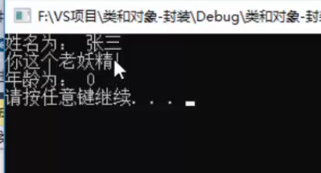 

**练习案例1：设计立方体类**

设计立方体类(Cube)

求出立方体的面积和体积

分别用全局函数和成员函数判断两个立方体是否相等。

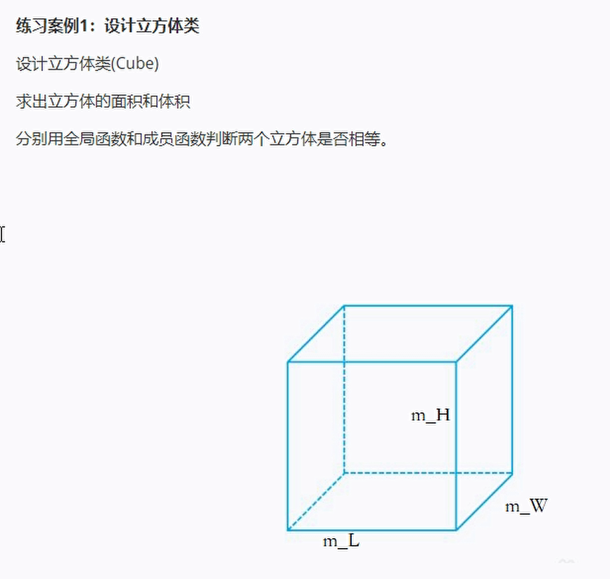 

```c++
#include <iostream>
using namespace std;

class Cube{
public:
	//设置长 
	void setL(int l){
		m_L = l;
	}
	
	//获取长
	int getL(){
		return m_L;
	} 
	
	//设置宽度 
	void setW(int w){
		m_W = w;
	}
	
	//获取宽度 
	int getW(){
		return m_W;
	}
	
	//设置高度 
	void setH(int h){
		m_H = h;
	}
	
	//获取高度 
	int getH(){
		return m_H;
	}
	
	//获取立方体面积
	int calculateS(){
		return 2*m_L*m_W + 2*m_L*m_H + 2*m_W*m_H;
	} 
	
	//获取立方体体积
	int calculateV(){
		return m_L*m_W*m_H; 
	} 
	
	//利用成员函数判断两个立方体是否相等
	bool isSameByClass(Cube &c){
		if(m_L == c.getL() && m_W == c.getW() && m_H == c.getH()){
		return true;
		}
	return false;
	}

private:
	int m_L; //长 
	int m_W; //宽 
	int m_H; //高		
}; 

bool isSame(Cube &c1, Cube &c2){ //为了减小开销，我们采取引用方式（用值传递将会拷贝一份数据） 
	if(c1.getL() == c2.getL() && c1.getW() == c2.getW() && c1.getH() == c2.getH()){
		return true;
	}
	return false;
} 

int main(){
	
	Cube c1;
	c1.setL(10);
	c1.setW(10);
	c1.setH(10);
	
	cout << "c1的面积为：" << c1.calculateS() << endl;
	cout << "c1的体积为：" << c1.calculateV() << endl;
	
	Cube c2;
	c2.setL(10);
	c2.setW(10);
	c2.setH(13);
	
	//利用全局函数判断 
	bool ret = isSame(c1, c2);
	if(ret){
		cout << "全局函数判断：c1和c2是相等的" << endl; 
	}
	else{
		cout << "全局函数判断：c1和c2不相等" << endl; 
	}
	//利用成员函数判断
	ret = c1.isSameByClass(c2); 
	if(ret){
		cout << "成员函数判断：c1和c2是相等的" << endl; 
	}
	else{
		cout << "成员函数判断：c1和c2不相等" << endl; 
	}
	
	system("pause");
	return 0;
} 

```

 ​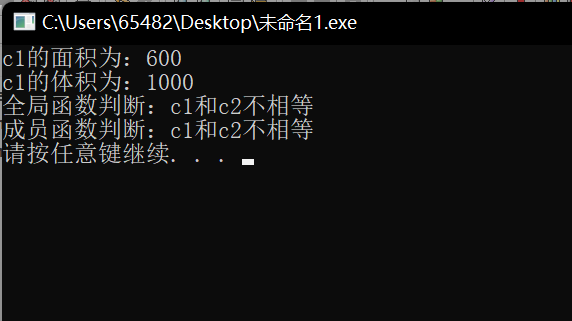 

**练习案例2：点和圆的关系**

设计一个圆形类（Circle），和一个点类（Point），计算点和圆的关系。

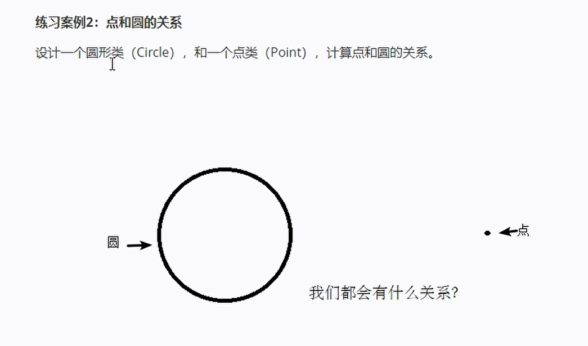  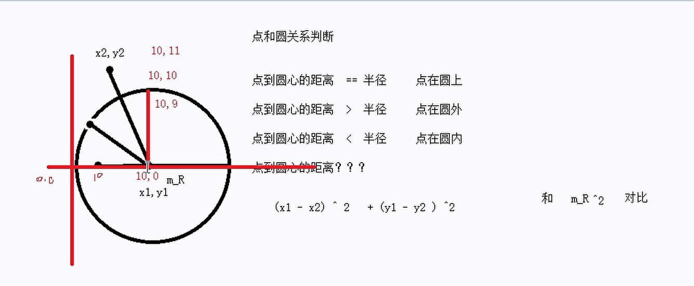

```c++
#include <iostream>
using namespace std;

//点类
class Point{
public:
	//设置x
 	void setX(int x){
 		m_X = x; 
	 }
	//获取x 
	int getX(){
		return m_X;
	} 
	//设置y 
 	void setY(int y){
 		m_Y = y; 
	 }
	//获取y 
	int getY(){
		return m_Y;
	} 
	
private:
	int m_X;  //x坐标 
	int m_Y;  //y坐标 
};

//圆类 
class Circle{
public: 
	//设置半径
	void setR(int r){
		m_R = r;
	}
	//获取半径 
	int getR(){
		return m_R;
	}
	//设置圆心 
	void setCenter(Point center){  //在圆类中创建一个圆心（点类）
		m_Center = center;
	}
	//获取圆心 
	Point getCenter(){
		return m_Center;
	}
	
private:
	int m_R;    //半径	
    //本案例核心1：在这：在一个类中，可以让另一个类，作为本类的成员
	Point m_Center;   //圆心 
};

//判断点和圆的关系的函数
void isInCircle(Circle &c, Point &p){
	//两点距离的平方
	int distance = 
		(c.getCenter().getX() - p.getX())*(c.getCenter().getX() - p.getX()) + 
		(c.getCenter().getY() - p.getY())*(c.getCenter().getY() - p.getY());
	
	//计算半径的平方
	int rDistance = c.getR()*c.getR();
	
	//判断关系
	if(distance == rDistance){
		cout << "点在圆上" << endl;
	}
	else if(distance > rDistance){
		cout << "点在圆外" << endl;
	}
	else{
		cout << "点在圆内" << endl;
	} 
}
int main(){
	//创建圆
	Circle c;
	c.setR(10);
    
	Point center;
	center.setX(10);
	center.setY(0);
	c.setCenter (center);
	
	
    //创建点
	Point p;
	p.setX(10);
	p.setY(10);
	
	//判断关系 
	isInCircle(c, p);
	
	system("pause");
	return 0;
} 

```

 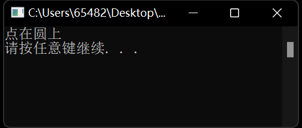 

- **本案例核心2：大型开发中不可能把所有类都写在一个文件中。通常头文件中写声明，源文件中写实现**

1. 复制点类，并注释掉

2. 头文件创建.h文件（例如：point.h)，源文件中创建.cpp文件（例如：point.cpp)

3. 在.h文件中，为了防止头文件重复包含，开头加上#pragma once  #include <iostream> using namespace std; 然后把类粘贴过来

4. 粘贴过来的类只需要成员的声明即可，把实现全部删掉 ，然后把声明加分号作为补全 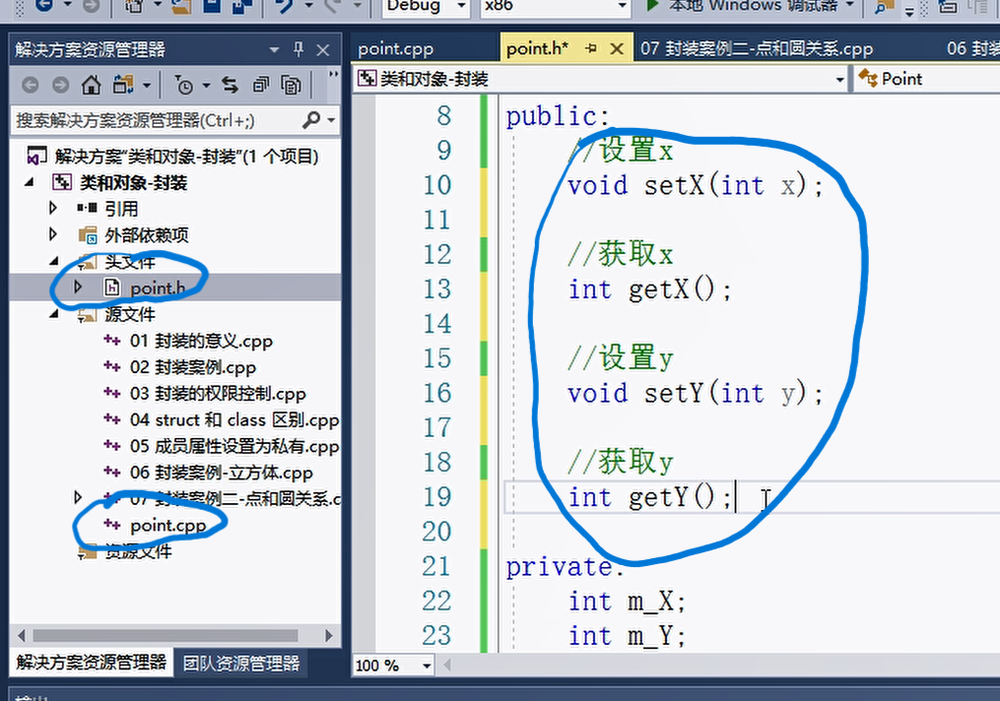

5. .cpp文件中写入 #include "point.h" , 把复制的代码再粘贴过来，把class删掉（例如：class Point和“{”), public，下面的private,变量和最后的“}”也删掉,只需要留住函数的所有实现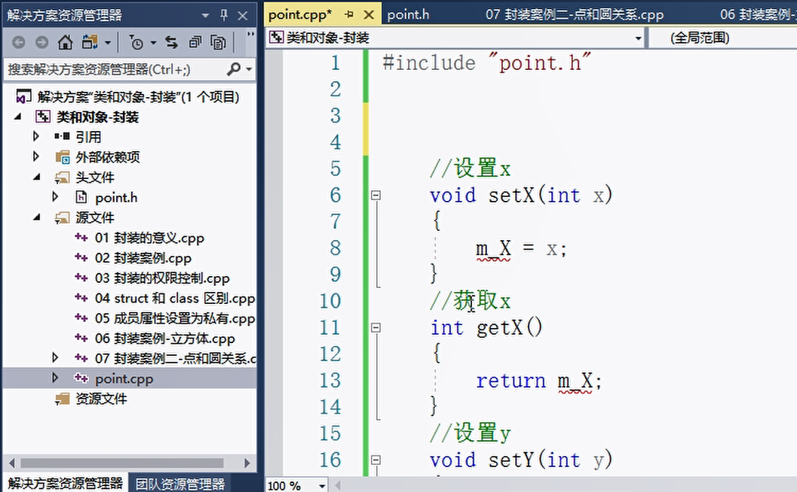

6. 完后会报错，因为void setX在这里是全局函数，但是我们的setX,getX这些都是成员函数，因此我们需要告诉他这是Point作用域下的setX函数，告诉他是成员函数（如图）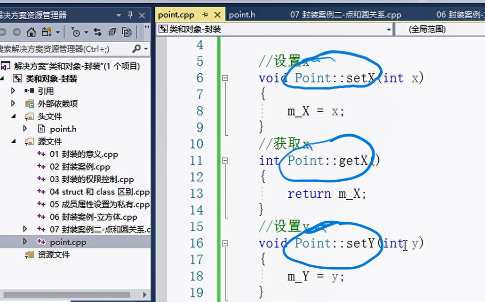

7. 再把Circle类作拆分。（类似上面步骤）

8. 注意1：在一个类用到另一个类时（在Circle中用到Point类）会报错，只需要在circle.h中添加#include “point.h”头文件即可。 在circle.cpp中不要忘了告诉他是成员函数：（例如：Circle::setR）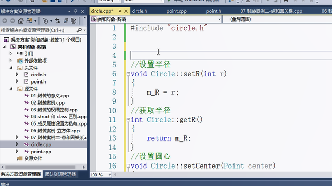

9. 注意2：最后在mainc.cpp中，加入点类#include "point.h" 和圆类#include "circle.h"头文件即可


### 4.2 对象的初始化和清理

- 生活中我们买的电子产品都基本会有出厂设置，在某一天我们不用时候也会删除一些自己信息数据保证安全
- C++中的面向对象来源于生活，每个对象也都会有初始设置以及 对象销毁前的清理数据的设置。

#### 4.2.1 构造函数和析构函数

对象的**初始化和清理**也是两个非常重要的安全问题

 一个对象或者变量没有初始状态，对其使用后果是未知

 同样的使用完一个对象或变量，没有及时清理，也会造成一定的安全问题

c++利用了**构造函数**和**析构函数**解决上述问题，这两个函数将会被编译器自动调用，完成对象初始化和清理工作。

对象的初始化和清理工作是编译器强制要我们做的事情，因此如果**我们不提供构造和析构，编译器会提供**

**编译器提供的构造函数和析构函数是空实现。**

- 构造函数：主要作用在于创建对象时为对象的成员属性赋值，构造函数由编译器自动调用，无须手动调用。
- 析构函数：主要作用在于对象**销毁前**系统自动调用，执行一些清理工作。

**构造函数语法：**`类名(){}`

1. 构造函数，没有返回值也不写void
2. 函数名称与类名相同
3. 构造函数可以有参数，因此可以发生重载
4. 程序在调用对象时候会自动调用构造，无须手动调用,而且只会调用一次

**析构函数语法：** `类名(){}`

1. 析构函数，没有返回值也不写void
2. 函数名称与类名相同,在名称前加上符号 ~
3. 析构函数不可以有参数，因此不可以发生重载
4. 程序在对象销毁前会自动调用析构，无须手动调用,而且只会调用一次

```cpp
class Person
{
public:   //如果想在外部调用它，要写一个pubilc
	//1.构造函数
	Person()
	{
		cout << "Person的构造函数调用" << endl;   //相当于初始化，
	}
	//2.析构函数
	~Person()
	{
		cout << "Person的析构函数调用" << endl;
	}

};

//构造和析构都是必须有的实现，如果我们自己不提供，编译器会提供一个空实现的构造和析构
void test01()
{
	Person p;   //局部变量，放在栈区，test01执行完后，就会释放这个对象（调用析构函数）
}

int main() {
	
	test01();   //我只创建了一个对象，但是他会自动调用构造函数。如果不写，就是空实现
	//Person p;
	system("pause");

	return 0;
}

```

- main函数中写test01();结果如下

- 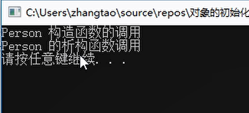 

- main函数中写Person p; 结果如下

- 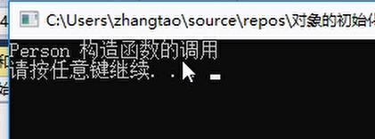 

  原因是执行了这句之后，会执行system("pause")，让你输任意键继续，在return 0之前，并不会释放这个对象。如果按下任意键之后，会瞬间出现析构函数调用然后瞬间关闭程序


#### 4.2.2 构造函数的分类及调用

两种分类方式：

 按参数分为： 有参构造和无参构造

 按类型分为： 普通构造和拷贝构造

三种调用方式：

 括号法

 显示法

 隐式转换法

**示例：**

```cpp
//1、构造函数分类
// 按照参数分类分为 有参和无参构造   无参构造又称为默认构造
// 按照类型分类分为 普通构造和拷贝构造

class Person {
public:
	//无参（默认）构造函数
	Person() {
		cout << "无参构造函数!" << endl;
	}
	//有参构造函数
	Person(int a) {
		age = a;
		cout << "有参构造函数!" << endl;
	}
	//拷贝构造函数
	Person(const Person& p) {
        //将传入的人身上的所有属性，拷贝到我身上
		age = p.age;
		cout << "拷贝构造函数!" << endl;
	}
	//析构函数
	~Person() {
		cout << "析构函数!" << endl;
	}
public:
	int age;
};

//2、构造函数的调用
//调用无参构造函数
void test01() {
	Person p; //调用无参构造函数
}

//调用有参的构造函数
void test02() {

	//2.1  括号法，常用
    Person p1;    //默认构造函数调用
	Person p2(10);//有参构造函数
    Person p3(p2);//拷贝构造函数
    
	//注意事项1：调用无参构造函数不能加括号，如果加了编译器认为这是一个函数声明，不会认为在创建对象
	//Person p2();

	//2.2 显式法
    Person p1;              //默认构造
	Person p2 = Person(10); //有参构造
	Person p3 = Person(p2); //拷贝构造
	//Person(10)；单独写就是匿名对象  当前行结束之后，系统会立即回收掉匿名对象（析构）
    //注意事项2：不能利用 拷贝构造函数 初始化匿名对象 编译器认为Person(p3) === Person p3(对象声明),与上面的Person p3 = Person(p2);编译器会报错显示p3重定义
	
    //2.3 隐式转换法
	Person p4 = 10; // Person p4 = Person(10); //有参构造
	Person p5 = p4; // Person p5 = Person(p4); //拷贝构造 

	
	//Person p5(p4);
}

int main() {

	test01();
	//test02();

	system("pause");

	return 0;
}

```

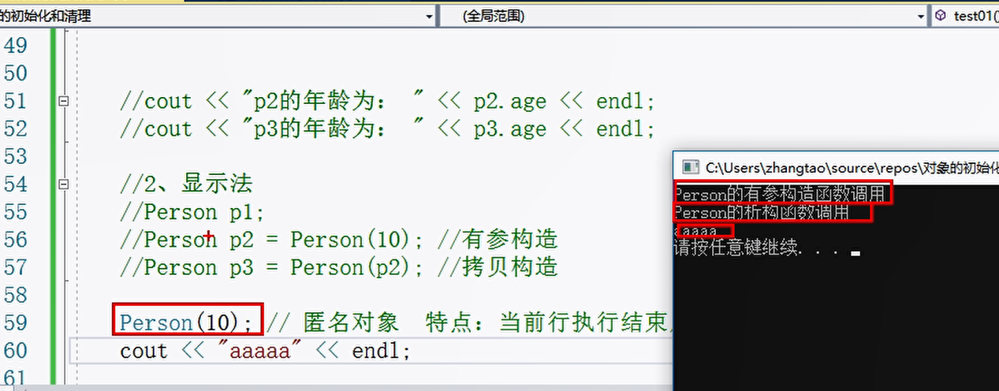 

`注释： 如图：匿名对象创建完之后，执行完这一句，会立马析构，再输出aaaaa`

#### 4.2.3 拷贝构造函数调用时机

C++中拷贝构造函数调用时机通常有三种情况

- 使用一个已经创建完毕的对象来初始化一个新对象
- 值传递的方式给函数参数传值
- 以值方式返回局部对象

**示例：**

```cpp
class Person {
public:
	Person() {
		cout << "无参（默认）构造函数!" << endl;
		m_Age = 0;
	}
	Person(int age) {
		cout << "有参构造函数!" << endl;
		m_Age = age;
	}
	Person(const Person& p) {
		cout << "拷贝构造函数!" << endl;
		m_Age = p.m_Age;
	}
	//析构函数在释放内存之前调用
	~Person() {
		cout << "析构函数!" << endl;
	}
public:
	int m_Age;
};

//1. 使用一个已经创建完毕的对象来初始化一个新对象
void test01() {

	Person p1(20); //p对象已经创建完毕
	Person p2(p1); //拷贝构造显式
	Person p2 = p1; //拷贝构造的隐式

	//Person p3;
	//p3 = p1; //不是调用拷贝构造函数，而是赋值操作
}


//2. 值传递的方式给函数参数传值
//相当于Person p1 = p;(下面调用doWork(p)的时候，相当于把p值传递给Person p1)
void doWork(Person p1) {
    //p1.age = 1000;  因为是值传递（临时副本），并不会修改p的值
}
void test02() {
	Person p; //无参构造函数
	doWork(p); //值传递，本质是调用拷贝函数
}


//3. 以值方式返回局部对象
Person doWork2()
{
	Person p1;   //局部对象，函数执行完毕后会销毁
	cout << (int *)&p1 << endl;    //打印他的地址
	return p1;   //返回的不是p1本身，而是值传递根据p1创建一个新的对象返回
}
void test03()
{
	Person p = doWork2();     //用p来接收返回的p1
	cout << (int *)&p << endl;   //再次打印地址，此时这个p不是dowork2里局部对象p1，而是一个新的p1(见下图)
}


int main() {

	//test01();
	//test02();
	test03();

	system("pause");

	return 0;
}

```

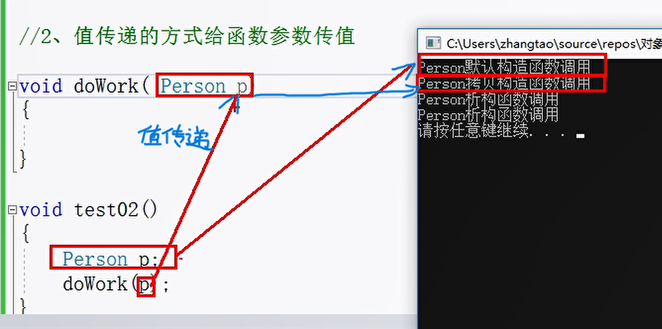 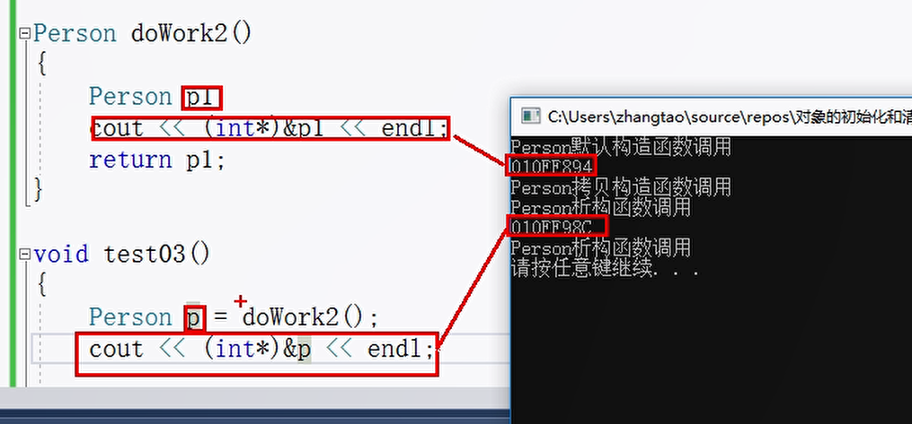 

#### 4.2.4 构造函数调用规则

默认情况下，c++编译器至少给一个类添加3个函数

1．默认构造函数(无参，函数体为空)    //空实现

2．默认析构函数(无参，函数体为空)    //空实现

3．默认拷贝构造函数，对属性进行值拷贝    //值拷贝

构造函数调用规则如下：

- 如果用户定义有参构造函数，c++不在提供默认无参构造，但是会提供默认拷贝构造
- 如果用户定义拷贝构造函数，c++不会再提供其他构造函数

示例：

```cpp
class Person {
public:
	//无参（默认）构造函数
	Person() {
		cout << "无参构造函数!" << endl;
	}
	//有参构造函数
	Person(int a) {
		age = a;
		cout << "有参构造函数!" << endl;
	}
	//拷贝构造函数	
	Person(const Person& p) {
		age = p.age;
		cout << "拷贝构造函数!" << endl;
	}
	//析构函数
	~Person() {
		cout << "析构函数!" << endl;
	}
public:
	int age;
};	

void test01()
{
	Person p1(18);
	//如果不写拷贝构造，编译器会自动添加拷贝构造，并且做浅拷贝操作(见下图)
	Person p2(p1);

	cout << "p2的年龄为： " << p2.age << endl;
}

void test02()
{
	//如果用户提供有参构造，编译器不会提供默认构造，但依然会提供拷贝构造（可以只保留有参构造函数试一下）
	Person p1; //此时如果用户自己没有提供默认构造，会出错
	Person p2(10); //用户提供的有参
	Person p3(p2); //此时如果用户没有提供拷贝构造，编译器会提供

	//如果用户提供拷贝构造，编译器不会提供其他构造函数 （可以只保留拷贝构造函数试一下）
	Person p4; //此时如果用户自己没有提供默认构造，会出错
	Person p5(10); //此时如果用户自己没有提供有参，会出错
	Person p6(p5); //用户自己提供拷贝构造
}

int main() {

	test01();

	system("pause");

	return 0;
}

```

 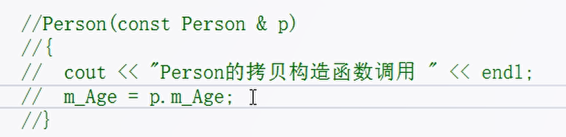  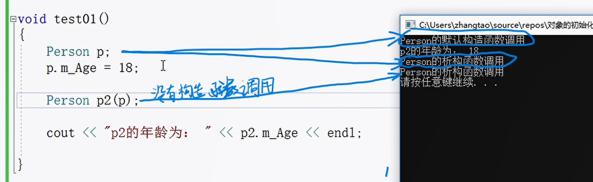 

#### 4.2.5 深拷贝与浅拷贝

深浅拷贝是面试经典问题，也是常见的一个坑

浅拷贝：简单的赋值拷贝操作

深拷贝：在堆区重新申请空间，进行拷贝操作

**示例：**

```cpp
class Person {
public:
	//无参（默认）构造函数
	Person() {
		cout << "无参构造函数!" << endl;
	}
	//有参构造函数
	Person(int age ,int height) {
		
		cout << "有参构造函数!" << endl;

		m_age = age;
		m_height = new int(height);  //身高这个数据创建在堆区。int返回的是int*类型。而m_height是int*类型
		
	}
	//自己实现一个拷贝构造函数来解决浅拷贝带来的问题 
	Person(const Person& p) {
		cout << "拷贝构造函数!" << endl;
		//如果不利用深拷贝在堆区创建新内存，会导致浅拷贝带来的重复释放堆区问题
		m_age = p.m_age;
		m_height = new int(*p.m_height); //深拷贝（把m_height)解引用(180)并为它在堆区申请一块新的空间，再用自己的m_height指向它
        //m_height = p.m_height;  //编译器默认实现就是这行代码（浅拷贝），会抛出异常
	}

	//析构函数
	~Person() {
		cout << "析构函数!" << endl;
        //析构代码：堆区开辟的数据，需要我们释放
		if (m_height != NULL)
		{
			delete m_height;
             m_height = NULL;  //把他置空，防止野指针出现
		}
	}
public:
	int m_age;
	int* m_height;    //注意，这里是一个指针
};

void test01()
{
	Person p1(18, 180);

	Person p2(p1);

	cout << "p1的年龄： " << p1.m_age << " 身高： " << *p1.m_height << endl;  //p1的身高是指针所以解引用

	cout << "p2的年龄： " << p2.m_age << " 身高： " << *p2.m_height << endl;
}

int main() {

	test01();

	system("pause");

	return 0;
}

```

> 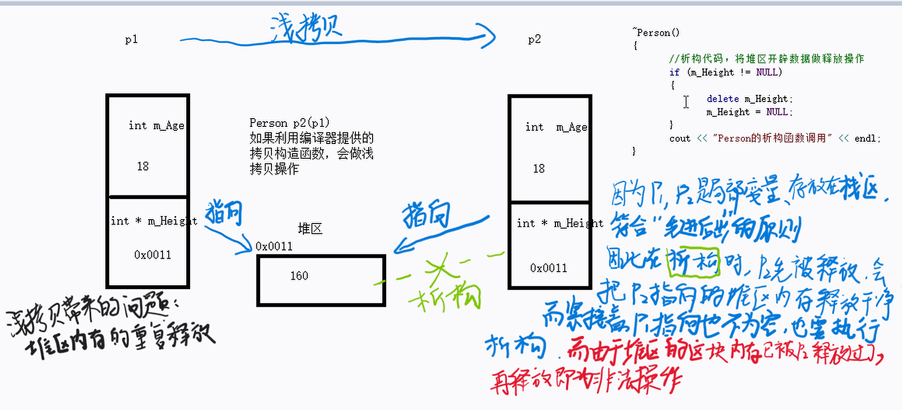  
>
> ​      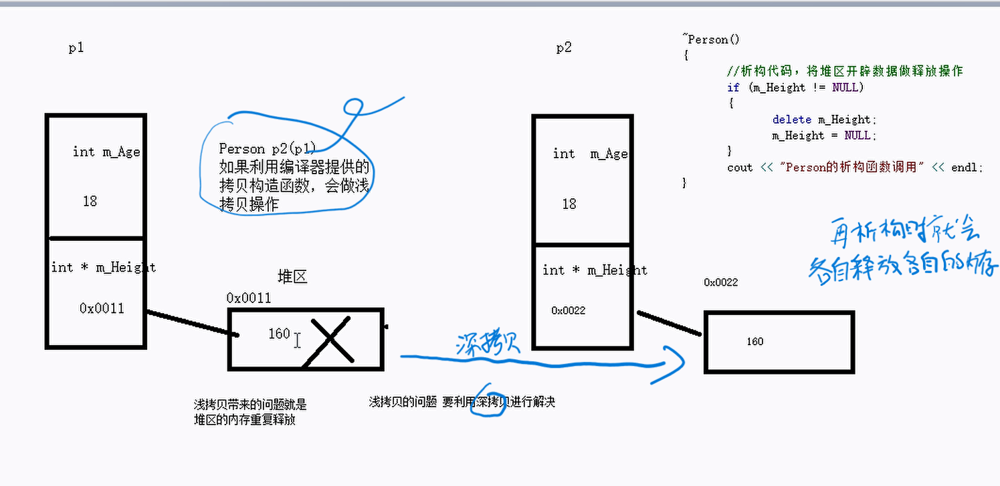 
>
> ​      总结：如果属性有在堆区开辟的，一定要自己提供拷贝构造函数，防止浅拷贝带来的问题

#### 4.2.6 初始化列表

**作用：**

C++提供了初始化列表语法，用来初始化属性

**语法：**`构造函数()：属性1(值1),属性2（值2）... {}`

**示例：**

```cpp
class Person {
public:

	//传统方式初始化
	//Person(int a, int b, int c) {
	//	m_A = a;
	//	m_B = b;
	//	m_C = c;
	//}

	//初始化列表方式初始化
	Person(int a, int b, int c) : m_A(a), m_B(b), m_C(c) {}
	void PrintPerson() {
		cout << "m_A:" << m_A << endl;
		cout << "m_B:" << m_B << endl;
		cout << "m_C:" << m_C << endl;
	}
private:
	int m_A;
	int m_B;
	int m_C;
};

int main() {

	Person p(1, 2, 3);
	p.PrintPerson();


	system("pause");

	return 0;
}

```

#### 4.2.7 类对象作为类成员

C++类中的成员可以是另一个类的对象，我们称该成员为 对象成员

例如：

```cpp
class A {}
class B
{
    A a；
}
```

B类中有对象A作为成员，A为对象成员

那么当创建B对象时，A与B的构造和析构的顺序是谁先谁后？

**示例：**

```cpp
//手机类
class Phone
{
public:
	Phone(string pName)
	{
		m_pName = pName;
		cout << "Phone构造" << endl;
	}

	~Phone()
	{
		cout << "Phone析构" << endl;
	}

	string m_pName;

}; 

//人类
class Person
{
public:

	//初始化列表可以告诉编译器调用哪一个构造函数
	Person(string name, string pName) : m_Name(name), m_Phone(pName)//这里的m_Name是一个变量，而m_Phone是一个对象。  string类型的pName可以给m_Phone(对象）赋初值 相当于编译器提供了：Phone m_Phone = pName(隐式转换法)
	{
		cout << "Person构造" << endl;
	}

	~Person()
	{
		cout << "Person析构" << endl;
	}

	void playGame()
	{
		cout << m_Name << " 使用" << m_Phone.m_pName << " 牌手机! " << endl;
	}
    
	string m_Name; 
	Phone m_Phone;  

};
void test01()
{
	//当类中成员是其他类对象时，我们称该成员为 对象成员
	//构造的顺序是 ：先调用对象成员的构造，再调用本类构造
	//析构顺序与构造相反
	Person p("张三" , "苹果Max");
	p.playGame();

}


int main() {

	test01();

	system("pause");

	return 0;
}

```

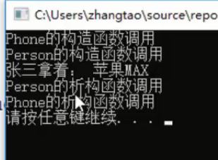 

#### 4.2.8 静态成员

静态成员就是在成员变量和成员函数前加上关键字static，称为静态成员

静态成员分为：

- 静态成员变量   
  - 所有对象共享同一份数据
  - 在编译阶段分配内存
  - 类内声明，类外初始化
- 静态成员函数   
  - 所有对象共享同一个函数
  - 静态成员函数只能访问静态成员变量

**示例1 ：**静态成员变量

```cpp
class Person
{
		//静态成员变量特点：
	//1 在编译阶段分配内存（全局区）
	//2 类内声明，类外初始化
	//3 所有对象共享同一份数据
public:
	static int m_A; //静态成员变量

private:
	static int m_B; //静态成员变量也是有访问权限的
};

int Person::m_A = 10;
int Person::m_B = 10;

void test01()
{
	//静态成员变量两种访问方式

	//1、通过对象
	Person p1;
	p1.m_A = 100;
	cout << "p1.m_A = " << p1.m_A << endl;

	Person p2;
	p2.m_A = 200;
	cout << "p1.m_A = " << p1.m_A << endl; //共享同一份数据，修改p2,的m_A，p1的m_A也变为200
	cout << "p2.m_A = " << p2.m_A << endl;

	//2、通过类名
	cout << "m_A = " << Person::m_A << endl;
	cout << "m_B = " << Person::m_B << endl; //错误，类外访问不到私有成员变量
}

int main() {

	test01();

	system("pause");

	return 0;
}

```

**示例2：**静态成员函数

```cpp
class Person
{

public:

	//静态成员函数特点：
	//1 程序共享一个函数
	//2 静态成员函数只能访问静态成员变量
	
    
    //静态成员函数
	static void func()
	{
		cout << "func调用" << endl;
		m_A = 100;   //正确，静态成员函数可以访问 静态成员变量
		m_B = 100;   //错误，静态成员函数不可以访问 非静态成员变量（无法区分是哪个对象的m_B属性)
	}             //m_B要有特定对象，而m_A是大家共享的

    

	static int m_A;     //静态成员变量
	int m_B;            // 非静态成员变量

   
	//静态成员函数也是有访问权限的
 private:
	static void func2()
	{
		cout << "func2调用" << endl;
	}
};
int Person::m_A = 10; //静态成员变量在类内声明它，但是类外要初始化它


void test01()
{
	//静态成员函数两种访问方式

	//1、通过对象
	Person p1;
	p1.func();

	//2、通过类名
	Person::func();
    Person::func2(); //错误，类外访问不到私有静态成员函数
}

int main() {

	test01();

	system("pause");

	return 0;
}

```

### 4.3 C++对象模型和this指针

#### 4.3.1 成员变量和成员函数分开存储

在C++中，类内的成员变量和成员函数分开存储

只有非静态成员变量才属于类的对象上

```cpp
class Person {
public:
	Person() {
		m_A = 0;
	}
	
	int m_A;         //非静态成员变量 占对象空间(4个字节)，属于类的对象上
	static int m_B;  //静态成员变量 不占对象空间(0个字节)，不属于类的对象上
	
    void func() {}    //非静态成员函数 不占对象空间（0个字节），所有函数共享一个函数实例 不属于类的对象上
    static void sfunc() {}   //静态成员函数也不占对象空间（0个字节） 不属于类的对象上
};

int Person::m_B = 0;  //别忘了静态成员变量类外初始化

int main() {
	
    Person p;
	cout << sizeof(p) << endl;     //输出结果应该是4+0+0+0 = 4

	system("pause");

	return 0;
}

```

`补充知识：空对象(class Person(){};Person p;cout<< sizeof(p) << endl;)占用的内存空间为1 。C++编译器会给每个空对象也分配一个字节空间,是为了区分空对象占内存的位置。每个空对象也应该有一个独一无二的内存地址` ==即空类的大小是1==

#### 4.3.2 this指针概念

通过4.3.1我们知道在C++中成员变量和成员函数是分开存储的

每一个非静态成员函数只会诞生一份函数实例，也就是说多个同类型的对象会共用一块代码

那么问题是：这一块代码是如何区分那个对象调用自己的呢？

c++通过提供特殊的对象指针，this指针，解决上述问题。**this指针指向被调用的成员函数所属的对象**

this指针是隐含每一个非静态成员函数内的一种指针

this指针不需要定义，直接使用即可

this指针的用途：

- 当形参和成员变量同名时，可用this指针来区分（解决名称冲突）
- 在类的非静态成员函数中返回对象本身，可使用return *this

```cpp
class Person
{
public:

	Person(int age)
	{
		//1、当形参和成员变量同名时，可用this指针来区分  this指针指向 被调用的成员函数 所属的对象
		this->age = age;
	}

	Person & PersonAddPerson(Person p)    //注意：用引用的方式返回，这样做链式的时候，p2才是真正的p2
	{
		this->age += p.age;
		//this是指向p2的指针，而*this指向的就是p2这个对象本体
		return *this;  //有了*this就可以做下面的链式编程
	}

	int age;
};

void test01()
{
	Person p1(10);
	cout << "p1.age = " << p1.age << endl;

	Person p2(10);
	p2.PersonAddPerson(p1).PersonAddPerson(p1).PersonAddPerson(p1);   //链式编程思想
	cout << "p2.age = " << p2.age << endl; 
}

int main() {

	test01();

	system("pause");

	return 0;
}

```

#### 4.3.3 空指针访问成员函数

C++中空指针也是可以调用成员函数的，但是也要注意有没有用到this指针

如果用到this指针，需要加以判断保证代码的健壮性

**示例：**

```cpp
//空指针访问成员函数
class Person {
public:

	void ShowClassName() {
		cout << "我是Person类!" << endl;
	}

	void ShowPersonAge() {
		if (this == NULL) {
			return;
		}
		cout << "Person的年龄是：" << m_Age << endl;
	}

public:
	int m_Age;
};

void test01()
{
	Person * p = NULL;
	p->ShowClassName(); //空指针，可以调用成员函数
	p->ShowPerson();  //报错。报错原因是因为传入的指针为NULL。因此要考虑健壮性，判断this如果为空就跳出
}

int main() {

	test01();

	system("pause");

	return 0;
}

```

#### 4.3.4 const修饰成员函数

**常函数：**

- 成员函数后加const后我们称为这个函数为**常函数**
- 常函数内不可以修改成员属性（只读）
- 成员属性声明时加关键字mutable后，在常函数中依然可以修改

**常对象：**

- 声明对象前加const称该对象为常对象
- 常对象只能调用常函数

**示例：**

```cpp
class Person {
public:
	Person() {
		m_A = 0;
		m_B = 0;
	}
/*常函数*/
	//this指针的本质是一个指针常量，指针的指向不可修改
	//在成员函数后加const，修饰的是this指向，让指针指向的值也不可以修改
	void ShowPerson() const {   //这个const就相当于下面那行的第一个const
		//就相当于const Type * const pointer; 
		//this = NULL; //不能修改指针的指向 Person * const this（this是指针常量,调用p则指向p）;
		//this->m_A = 100; //加了const之后，this指针指向的对象的数据是也不可以修改

		//const修饰成员函数，表示指针指向的内存空间的数据不能修改，除了mutable修饰的变量
		this->m_B = 100;
	}

	void func() {
		m_A = 10000;
	}

public:
	int m_A;
	mutable int m_B; //特殊变量，即使在常函数中，也可以修改这个值，加mutable 
};


/*常对象*/
void test01() {

	const Person p; //常量对象  
    //常对象不能修改成员变量的值,但是可以访问
	cout << p.m_A << endl;
	p.m_A = 100;   //报错，不能改
	p.m_B = 100; //但是常对象可以修改mutable修饰成员变量
 
	//常对象只能调用常函数
    p.ShowPerson();   //常对象可以调用常函数
	p.func(); //报错，常对象不能调用普通的成员函数，因为普通成员函数可以修改属性，而常对象不允许修改属性

}

int main() {

	test01();

	system("pause");

	return 0;
}

```

### 4.4 友元

生活中你的家有客厅(Public)，有你的卧室(Private)

客厅所有来的客人都可以进去，但是你的卧室是私有的，也就是说只有你能进去

但是呢，你也可以允许你的好闺蜜好基友进去。

在程序里，有些私有属性 也想让类外特殊的一些函数或者类进行访问，就需要用到友元的技术

友元的目的就是让一个函数或者类 访问另一个类中私有成员

友元的关键字为 ==friend==

友元的三种实现

- 全局函数做友元
- 类做友元
- 成员函数做友元

#### 4.4.1 全局函数做友元

```cpp
class Building
{
	//告诉编译器 goodGay全局函数是 Building类的好朋友，可以访问类中的私有内容(把全局函数的声明粘贴过来)
	friend void goodGay(Building * building);

public:

	Building()
	{
		this->m_SittingRoom = "客厅";
		this->m_BedRoom = "卧室";
	}


public:
	string m_SittingRoom; //客厅

private:
	string m_BedRoom; //卧室
};

//全局函数
void goodGay(Building * building)
{
	cout << "好基友正在访问： " << building->m_SittingRoom << endl;
	cout << "好基友正在访问： " << building->m_BedRoom << endl;
}


void test01()
{
	Building b;
	goodGay(&b);   //因为是指针所以要传入地址
}

int main(){

	test01();

	system("pause");
	return 0;
}

```

#### 4.4.2 类做友元

```cpp
class Building;  //告诉编译器遇到Building先不要报错，一会儿我会写这个类
class goodGay
{
public:

	goodGay();    //构造函数（等待类外实现）
	void visit();  //参观函数（等待类外实现）

private:
	Building *building;   //类内声明，等待类外写实现函数。一个类声明却不做定义的话使用方式只能是指针或者引用，且不能解引用
};


class Building
{
	//告诉编译器 goodGay类是Building类的好朋友，可以访问到Building类中私有内容
	friend class goodGay;

public:
	Building();    //构造函数

public:
	string m_SittingRoom;   //客厅
private:
	string m_BedRoom;       //卧室
};


/*类外写成员函数的方法：*/
Building::Building()  //构造函数（Building作用域下的Building构造函数）
{
	this->m_SittingRoom = "客厅";
	this->m_BedRoom = "卧室";
}


goodGay::goodGay()  //构造函数
{
	building = new Building;   //创建建筑物对象（堆区），反回的是指针，用building接收
}

void goodGay::visit()
{
	cout << "好基友正在访问" << building->m_SittingRoom << endl;
	cout << "好基友正在访问" << building->m_BedRoom << endl;
}

void test01()
{
	goodGay gg;
	gg.visit();

}

int main(){

	test01();

	system("pause");
	return 0;
}

```

#### 4.4.3 成员函数做友元

```cpp
class Building;
class goodGay
{
public:

	goodGay();
	void visit(); //让visit函数作为Building的好朋友，可以访问Building中私有成员
	void visit2();  //让visit2函数不可以访问Building中的私有成员

private:
	Building *building;
};


class Building
{
	//告诉编译器  goodGay类中的visit成员函数 是Building好朋友，可以访问私有内容
	friend void goodGay::visit();

public:
	Building();

public:
	string m_SittingRoom; //客厅
private:
	string m_BedRoom;//卧室
};


/*类外实现成员函数*/
Building::Building()
{
	this->m_SittingRoom = "客厅";
	this->m_BedRoom = "卧室";
}

goodGay::goodGay()
{
	building = new Building;
}

void goodGay::visit()
{
	cout << "好基友正在访问" << building->m_SittingRoom << endl;
	cout << "好基友正在访问" << building->m_BedRoom << endl;
}

void goodGay::visit2()
{
	cout << "好基友正在访问" << building->m_SittingRoom << endl;
	//cout << "好基友正在访问" << building->m_BedRoom << endl;
}

void test01()
{
	goodGay gg;
	gg.visit();

}

int main(){
    
	test01();

	system("pause");
	return 0;
}

```

### 4.5 运算符重载

运算符重载概念：对已有的运算符重新进行定义，赋予其另一种功能，以适应不同的数据类型

#### 4.5.1 加号运算符重载

作用：实现两个自定义数据类型相加的运算

```cpp
class Person {
public:
	Person() {};   //无参构造函数
	Person(int a, int b)    //有参构造函数
	{
		this->m_A = a;
		this->m_B = b;
	}
	//成员函数实现 + 号运算符重载 (成员函数写在类里面)
	Person operator+(const Person& p) {
		Person temp;
		temp.m_A = this->m_A + p.m_A;
		temp.m_B = this->m_B + p.m_B;
		return temp;
	}


public:
	int m_A;
	int m_B;
};

//全局函数实现 + 号运算符重载（全局函数写在类外面）
//Person operator+(const Person& p1, const Person& p2) {
//	Person temp(0, 0);
//	temp.m_A = p1.m_A + p2.m_A;
//	temp.m_B = p1.m_B + p2.m_B;
//	return temp;
//}

//运算符重载 也可以发生函数重载    ：person + int
Person operator+(const Person& p2, int val)  
{
	Person temp;
	temp.m_A = p2.m_A + val;
	temp.m_B = p2.m_B + val;
	return temp;
}

void test() {

	Person p1(10, 10);
	Person p2(20, 20);

	//成员函数方式
	Person p3 = p2 + p1;  //相当于 p2.operator+(p1) 成员函数本质调用
	cout << "m_A:" << p3.m_A << " m_B:" << p3.m_B << endl;

    
	Person p4 = p3 + 10; //相当于 operator+(p3,10) 全局函数本质调用
	cout << "m_A:" << p4.m_A << " m_B:" << p4.m_B << endl;

}

int main() {

	test();

	system("pause");

	return 0;
}

```

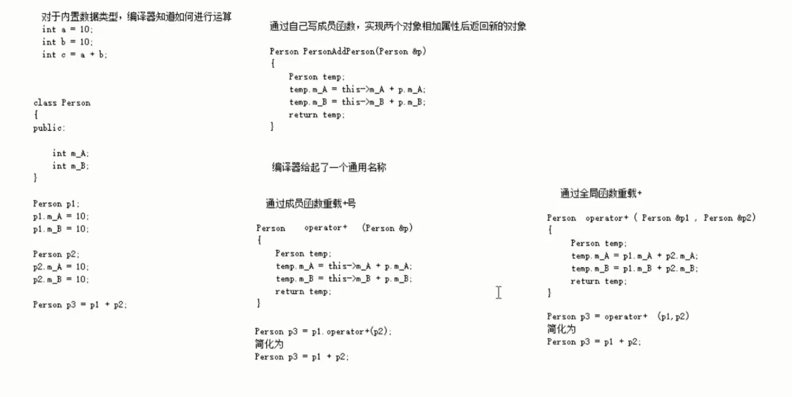   

> 总结1：对于内置的数据类型的表达式的的运算符是不可能改变的

> 总结2：不要滥用运算符重载

#### 4.5.2 左移运算符重载

作用：可以输出自定义数据类型

```cpp
class Person {
    //友元，可以访问私有属性
	friend ostream & operator<<(ostream& out, Person& p);

public:

	Person(int a, int b)   //构造函数
	{
		this->m_A = a;
		this->m_B = b;
	}
   
    //不会利用成员函数重载<<运算符，因为无法实现cout在左侧
	//void operator<<(Person& p){    //简化结果为  p << cout 不是我们想要的效果
	//}

private:
	int m_A;
	int m_B;
};

//只能用全局函数实现左移重载： void operator<<(cout,p)   //本质opertor<<(cout,p) 简化cout << p
//ostream对象只能有一个
ostream & operator<<(ostream & cout, Person & p) {    //cout的数据类型是ostream（标准输出流）
	cout << "m_A:" << p.m_A << " m_B:" << p.m_B;
	return cout;
}

void test() {

	Person p1(10, 20);

	cout << p1 << "hello world" << endl;    //链式编程（返回的是cout）
}

int main() {

	test();

	system("pause");

	return 0;
}

```

> 总结：重载左移运算符配合友元可以实现输出自定义数据类型

#### 4.5.3 递增运算符重载

作用： 通过重载递增运算符，实现自己的整型数据

```cpp
class MyInteger {

	friend ostream& operator<<(ostream& out, MyInteger myint);

public:
	MyInteger() {
		m_Num = 0;
	}
    
/*重载++运算符*/
	//前置++
	MyInteger & operator++() {   //返回引用是为了一直对一个数据进行递增操作
		//先++
		m_Num++;
		//再返回
		return *this;    //this是指向它的指针，*是解引用返回他自己本身
	}

	//后置++
	MyInteger operator++(int) {   //int代表占位参数，可以用于区分前置和后置递增
		//先记录当时结果
		MyInteger temp = *this; //然后让本身的值加1，但是返回的是以前的值，达到先返回后++；
        //后递增
		m_Num++;
        //最后将记录结果返回
		return temp; //返回的是值而不是引用，因为temp是局部对象，函数执行完后会释放掉，再返回它的引用即非法
	}
/*重载++运算符结束*/
    
private:
	int m_Num;
};

//重载<<运算符
ostream & operator<<(ostream & cout, MyInteger myint) {
	cout << myint.m_Num;
	return cout;
}


//前置++ 先++ 再返回
void test01() {
	MyInteger myInt;
	cout << ++myInt << endl;
	cout << myInt << endl;
}

//后置++ 先返回 再++
void test02() {

	MyInteger myInt;
	cout << myInt++ << endl;
	cout << myInt << endl;
}

int main() {

	test01();
	//test02();

	system("pause");

	return 0;
}

```

> 总结： 前置递增返回引用，后置递增返回值

#### 4.5.4 赋值运算符重载

c++编译器至少给一个类添加4个函数

1. 默认构造函数(无参，函数体为空)
2. 默认析构函数(无参，函数体为空)
3. 默认拷贝构造函数，对属性进行值拷贝
4. 赋值运算符 operator=, 对属性进行值拷贝

如果类中有属性指向堆区，做赋值操作时也会出现深浅拷贝问题

**示例：**

```cpp
class Person
{
public:

	Person(int age)
	{
		//将年龄数据开辟到堆区，记得在析构时释放
		m_Age = new int(age);
	}

    ~Person()
	{
		if (m_Age != NULL)
		{
			delete m_Age;
			m_Age = NULL;
		}
	}
    
	//重载赋值运算符 
	Person & operator=(Person &p)
	{
        //编译器提供的代码是浅拷贝  
        //m_Age = p.m_Age;
        //我们需要提供深拷贝 解决浅拷贝的问题（堆区内存重复释放）
        
        //应该先判断是否有属性在堆区，如果有先释放干净，然后再深拷贝
		if (m_Age != NULL)
		{
			delete m_Age;
			m_Age = NULL;
		}
		
         //深拷贝
		m_Age = new int(*p.m_Age);

		//返回自身
		return *this;   //因为赋值操作允许a=b=c这样，因此返回类型为自己本身
	}

    //年龄的指针
	int *m_Age;

};


void test01()
{
	Person p1(18);

	Person p2(20);

	Person p3(30);

	p3 = p2 = p1; //赋值操作

	cout << "p1的年龄为：" << *p1.m_Age << endl;

	cout << "p2的年龄为：" << *p2.m_Age << endl;

	cout << "p3的年龄为：" << *p3.m_Age << endl;
}

int main() {

	test01();

	system("pause");

	return 0;
}

```

#### 4.5.5 关系运算符重载

**作用：**重载关系运算符，可以让两个自定义类型对象进行对比操作

**示例：**

```cpp
class Person
{
public:
	Person(string name, int age)   //构造函数
	{
		this->m_Name = name;
		this->m_Age = age;
	};

/*重载关系运算符*/
	bool operator==(Person & p)
	{
		if (this->m_Name == p.m_Name && this->m_Age == p.m_Age)
		{
			return true;
		}
		return false;
	}

	bool operator!=(Person & p)
	{
		if (this->m_Name == p.m_Name && this->m_Age == p.m_Age)
		{
			return false;
		}
		return true;
	}    
/*重载关系运算符结束*/
    
	string m_Name;
	int m_Age;
};

void test01()
{
	
    Person p1("Tom", 18);
	Person p2("Jerry", 18);

	if (p1 == p2)
	{
		cout << "p1和p2相等" << endl;
	}
	else
	{
		cout << "p1和p2不相等" << endl;
	}

	if (p1 != p2)
	{
		cout << "p1和p2不相等" << endl;
	}
	else
	{
		cout << "p1和p2相等" << endl;
	}
}


int main() {

	test01();

	system("pause");

	return 0;
}

```

#### 4.5.6 函数调用运算符重载

- 函数调用运算符 () 也可以重载
- 由于重载后使用的方式非常像函数的调用，因此称为仿函数
- 仿函数没有固定写法，非常灵活

**示例：**

```cpp
class MyPrint
{
public:
    //重载函数调用运算符（）
	void operator()(string text) 
    {
		cout << text << endl;
	}
};

void test01()
{
	MyPrint myFunc;
	myFunc("hello world");   //由于使用起来非常类似于函数调用，因此称为仿函数
}

//仿函数非常灵活，没有固定的写法  例如下面的加法类
class MyAdd
{
public:
	int operator()(int num1, int num2)
	{
		return num1 + num2;
	}
};

void test02()
{
	MyAdd add;
	int ret = add(10, 10);
	cout << "ret = " << ret << endl;

	//匿名函数对象调用（函数执行完了会当场释放）
	cout << "MyAdd()(100,100) = " << MyAdd()(100, 100) << endl;
}

int main() {

	test01();
	test02();

	system("pause");

	return 0;
}

```

### 4.6 继承

**继承是面向对象三大特性之一**

有些类与类之间存在特殊的关系，例如下图中：

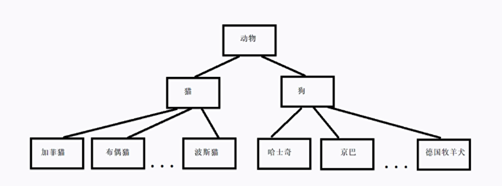  

我们发现，定义这些类时，下级别的成员除了拥有上一级的共性，还有自己的特性。

这个时候我们就可以考虑利用继承的技术，减少重复代码

#### 4.6.1 继承的基本语法

例如我们看到很多网站中，都有公共的头部，公共的底部，甚至公共的左侧列表，只有中心内容不同

接下来我们分别利用普通写法和继承的写法来实现网页中的内容，看一下继承存在的意义以及好处

**普通实现：**

```cpp
//Java页面
class Java 
{
public:
	void header()
	{
		cout << "首页、公开课、登录、注册...（公共头部）" << endl;
	}
	void footer()
	{
		cout << "帮助中心、交流合作、站内地图...(公共底部)" << endl;
	}
	void left()
	{
		cout << "Java,Python,C++...(公共分类列表)" << endl;
	}
	void content()
	{
		cout << "JAVA学科视频" << endl;
	}
};
//Python页面
class Python
{
public:
	void header()
	{
		cout << "首页、公开课、登录、注册...（公共头部）" << endl;
	}
	void footer()
	{
		cout << "帮助中心、交流合作、站内地图...(公共底部)" << endl;
	}
	void left()
	{
		cout << "Java,Python,C++...(公共分类列表)" << endl;
	}
	void content()
	{
		cout << "Python学科视频" << endl;
	}
};
//C++页面
class CPP 
{
public:
	void header()
	{
		cout << "首页、公开课、登录、注册...（公共头部）" << endl;
	}
	void footer()
	{
		cout << "帮助中心、交流合作、站内地图...(公共底部)" << endl;
	}
	void left()
	{
		cout << "Java,Python,C++...(公共分类列表)" << endl;
	}
	void content()
	{
		cout << "C++学科视频" << endl;
	}
};

void test01()
{
	//Java页面
	cout << "Java下载视频页面如下： " << endl;
	Java ja;
	ja.header();
	ja.footer();
	ja.left();
	ja.content();
	cout << "--------------------" << endl;

	//Python页面
	cout << "Python下载视频页面如下： " << endl;
	Python py;
	py.header();
	py.footer();
	py.left();
	py.content();
	cout << "--------------------" << endl;

	//C++页面
	cout << "C++下载视频页面如下： " << endl;
	CPP cp;
	cp.header();
	cp.footer();
	cp.left();
	cp.content();

}

int main() {

	test01();

	system("pause");

	return 0;
}

```

**继承实现：**

```cpp
//公共页面类
class BasePage
{
public:
	void header()
	{
		cout << "首页、公开课、登录、注册...（公共头部）" << endl;
	}

	void footer()
	{
		cout << "帮助中心、交流合作、站内地图...(公共底部)" << endl;
	}
	void left()
	{
		cout << "Java,Python,C++...(公共分类列表)" << endl;
	}

};

//Java页面
class Java : public BasePage   //继承公共页面（继承方式是pubilc）
{
public:
	void content()
	{
		cout << "JAVA学科视频" << endl;
	}
};
//Python页面
class Python : public BasePage  //继承公共页面（继承方式是pubilc）
{
public:
	void content()
	{
		cout << "Python学科视频" << endl;
	}
};
//C++页面
class CPP : public BasePage  //继承公共页面（继承方式是pubilc）
{
public:
	void content()
	{
		cout << "C++学科视频" << endl;
	}
};

void test01()
{
	//Java页面
	cout << "Java下载视频页面如下： " << endl;
	Java ja;
	ja.header();
	ja.footer();
	ja.left();
	ja.content();
	cout << "--------------------" << endl;

	//Python页面
	cout << "Python下载视频页面如下： " << endl;
	Python py;
	py.header();
	py.footer();
	py.left();
	py.content();
	cout << "--------------------" << endl;

	//C++页面
	cout << "C++下载视频页面如下： " << endl;
	CPP cpp;
	cpp.header();
	cpp.footer();
	cpp.left();
	cpp.content();


}

int main() {

	test01();

	system("pause");

	return 0;
}

```

**总结：**

继承的好处：==可以减少重复的代码==

class A : public B;

A 类称为子类 或 派生类

B 类称为父类 或 基类

**派生类中的成员，包含两大部分**：

一类是从基类继承过来的，一类是自己增加的成员。

从基类继承过过来的表现其共性，而新增的成员体现了其个性。


#### 4.6.2 继承方式

继承的语法：`class 子类 : 继承方式 父类`

注意：如果不写继承方式，那么默认继承方式为私有继承

**继承方式一共有三种：**

- 公共继承
- 保护继承
- 私有继承

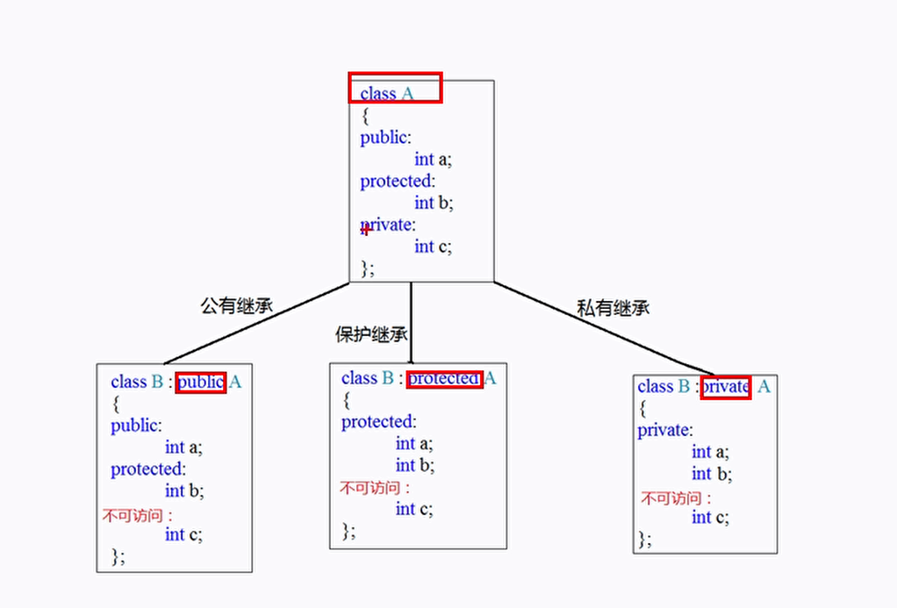  

**示例：**

```cpp
class Base1   //第一个父类
{
public: 
	int m_A;
protected:
	int m_B;
private:
	int m_C;
};

//公共继承
class Son1 :public Base1   //继承了父类，且自身还有func函数
{
public:
	void func()
	{
		m_A = 10; //可访问 public权限
		m_B = 10; //可访问 protected权限
		//m_C = 10; //不可访问
	}
};

void test01()	
{
	Son1 s1;
	s1.m_A = 100; //类外只能访问到公共权限
    //s1.m_B = 100;  类外不能访问保护权限
}

//保护继承
class Base2  //第二个父类
{
public:
	int m_A;
protected:
	int m_B;
private:
	int m_C;
};

class Son2:protected Base2
{
public:
	void func()
	{
		m_A = 100; //可访问 protected权限
		m_B = 100; //可访问 protected权限
		//m_C = 100;  //不可访问，private权限
	}
};

void test02()
{
	Son2 s1;
	//s1.m_A = 1000; //不可访问，在son2中变为保护权限，因此类外访问不到
    //s.m_B = 1000; //不可访问，在son2中变为保护权限，因此类外访问不到
}

//私有继承
class Base3   //第三个父类
{
public:
	int m_A;
protected:
	int m_B;
private:
	int m_C;
};

class Son3:private Base3
{
public:
	void func()
	{
		m_A = 100; //可访问 private权限
		m_B = 100; //可访问 private权限
		//m_C = 100; //不可访问
	}
};

void test03()	
{
	Son3 s1;
	//s1.m_A = 1000; //变为私有，类外访问不到
    //s1.m_B = 1000;  //变为私有，类外访问不到
}

class GrandSon3:public Son3   //孙子类
{
public:
	void func()
	{
		//Son3是私有继承，所以继承Son3的属性在GrandSon3中都无法访问到
		//m_A = 1000;
		//m_B = 1000;
		//m_C = 1000;
	}
};

```

#### 4.6.3 继承中的对象模型

**问题：**从父类继承过来的成员，哪些属于子类对象中？

**示例：**

```cpp
class Base
{
public:
	int m_A;
protected:
	int m_B;
private:
	int m_C; //私有成员只是被隐藏了，但是还是会继承下去
};

//公共继承
class Son :public Base
{
public:
	int m_D;
};

void test01()
{
    //父类中所有非静态成员属性都会被子类继承下去
    //父类中的私有成员属性只是被编译器隐藏了，因此访问不到，但确实被继承下去了
	cout << "sizeof Son = " << sizeof(Son) << endl;  //16
}

int main() {

	test01();

	system("pause");

	return 0;
} 

```

利用工具查看：

  

打开工具窗口后，定位到当前CPP文件的盘符：盘符加冒号加回车

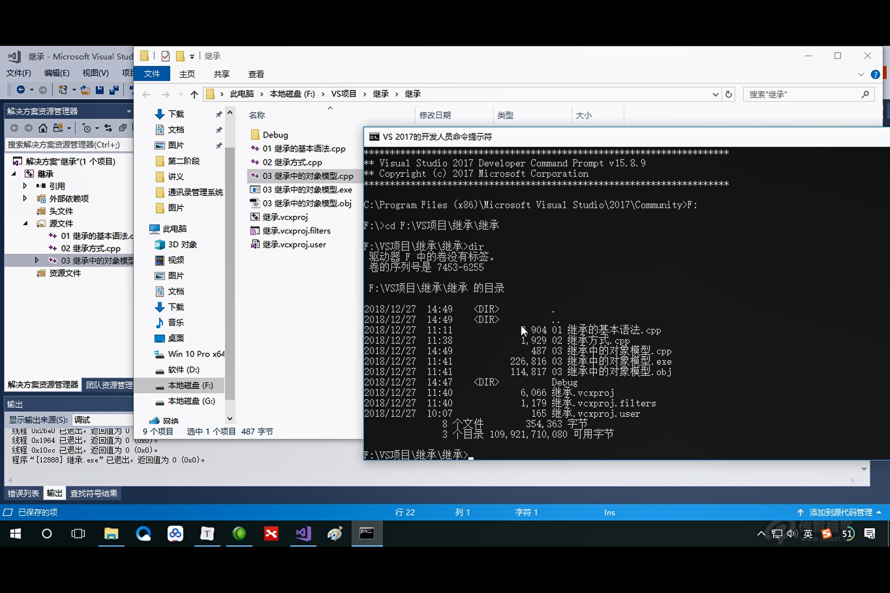   

dir回车查看目录下的内容

然后输入：` cl /d1 reportSingleClassLayout查看的类名 所属文件名`（翻译：报告单个类的布局）所属文件名可以按Tab自动补齐

效果如下图：

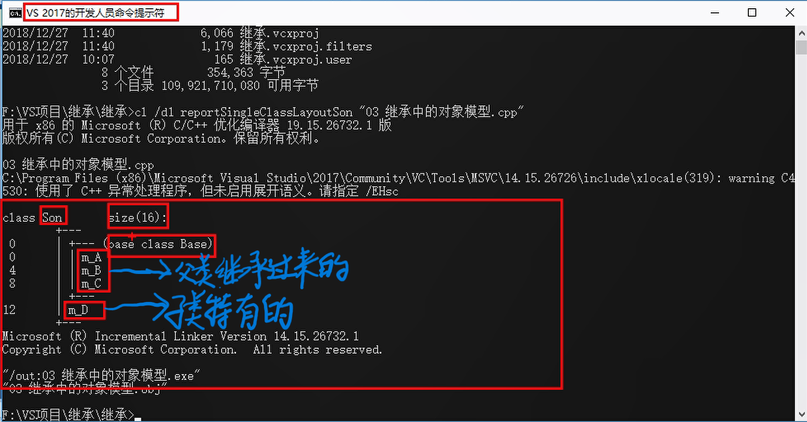   

> 结论： 父类中私有成员也是被子类继承下去了，只是由编译器给隐藏后访问不到

#### 4.6.4 继承中构造和析构顺序

子类继承父类后，当创建子类对象，也会调用父类的构造函数

问题：父类和子类的构造和析构顺序是谁先谁后？

**示例：**

```cpp
class Base 
{
public:
	Base()
	{
		cout << "Base构造函数!" << endl;
	}
	~Base()
	{
		cout << "Base析构函数!" << endl;
	}
};

class Son : public Base
{
public:
	Son()
	{
		cout << "Son构造函数!" << endl;
	}
	~Son()
	{
		cout << "Son析构函数!" << endl;
	}

};


void test01()
{
	//继承中 先调用父类构造函数，再调用子类构造函数，析构顺序与构造相反
	Son s;
}

int main() {

	test01();

	system("pause");

	return 0;
}

```

> 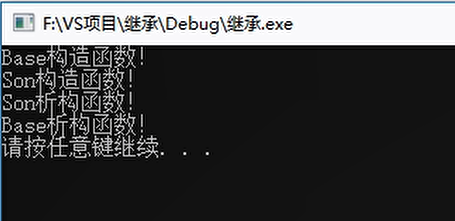 
>
> 总结：继承中 先调用父类构造函数，再调用子类构造函数，析构顺序与构造相反

#### 4.6.5 继承同名成员处理方式

问题：当子类与父类出现同名的成员，如何通过子类对象，访问到子类或父类中同名的数据呢？

- 访问子类同名成员 直接访问即可
- 访问父类同名成员 需要加作用域

**示例：**

```cpp
class Base {
public:
	Base()
	{
		m_A = 100;
	}

	void func()
	{
		cout << "Base - func()调用" << endl;
	}

	void func(int a)
	{
		cout << "Base - func(int a)调用" << endl;
	}

public:
	int m_A;
};


class Son : public Base {
public:
	Son()
	{
		m_A = 200;
	}

	//当子类与父类拥有同名的成员函数，子类会隐藏父类中所有版本的同名成员函数
	//如果想访问父类中被隐藏的同名成员函数，需要加父类的作用域
	void func()  //与父类的func同名
	{
		cout << "Son - func()调用" << endl;
	}
public:
	int m_A;
};

/*同名成员属性处理*/
void test01()
{
    Son s;
	cout << "Son下的m_A = " << s.m_A << endl;    //子类的m_A 200
    //如果通过子类对象 访问到父类中的同名成员，需要加作用域
	cout << "Base下的m_A = " << s.Base::m_A << endl;   //100

/*同名成员函数处理*/	
void test02()
{
    Son s;
    s.func();
	s.Base::func();
	s.Base::func(10);
}

    int main() {

	test01();
    //test02();

	system("pause");
	return EXIT_SUCCESS;
}
    
```

总结：

1. 子类对象可以直接访问到子类中同名成员
2. 子类对象加作用域可以访问到父类同名成员
3. 当子类与父类拥有同名的成员函数，子类会隐藏父类中同名成员函数，加作用域可以访问到父类中同名函数

#### 4.6.6 继承同名静态成员处理方式

问题：继承中同名的静态成员在子类对象上如何进行访问？

静态成员和非静态成员出现同名，处理方式一致

- 访问子类同名成员 直接访问即可
- 访问父类同名成员 需要加作用域

**示例：**

```cpp
class Base {
public:
	static void func()
	{
		cout << "Base - static void func()" << endl;
	}
	static void func(int a)
	{
		cout << "Base - static void func(int a)" << endl;
	}

	static int m_A;
};

int Base::m_A = 100;

class Son : public Base {
public:
	static void func()
	{
		cout << "Son - static void func()" << endl;
	}
	static int m_A;
};

int Son::m_A = 200;

//同名静态成员属性
void test01()
{
	//1.通过对象访问
	cout << "通过对象访问： " << endl;
	Son s;
	cout << "Son  下 m_A = " << s.m_A << endl;
	cout << "Base 下 m_A = " << s.Base::m_A << endl;

	//2.通过类名访问
	cout << "通过类名访问： " << endl;
	cout << "Son  下 m_A = " << Son::m_A << endl;
	cout << "Base 下 m_A = " << Son::Base::m_A << endl; 
    //第一个::代表通过类名的方式访问   第二个::代表父类作用域下
    
}

//同名静态成员函数
void test02()
{
	//1.通过对象访问
	cout << "通过对象访问： " << endl;
	Son s;
	s.func();
	s.Base::func();

    //2.通过类名访问
	cout << "通过类名访问： " << endl;
	Son::func();
	Son::Base::func();
	
    //重要：出现同名，子类会隐藏掉父类中所有同名成员函数，需要加作用域访问
	Son::Base::func(100);   //Son::func(100)则不行，因为父类同名函数被隐藏了
}

int main() {

	//test01();
	test02();

	system("pause");

	return 0;
}

```

> 总结：同名静态成员处理方式和非静态处理方式一样，只不过有两种访问的方式（通过对象 和 通过类名）

#### 4.6.7 多继承语法

C++允许**一个类继承多个类**

语法：`class 子类 ：继承方式 父类1 ， 继承方式 父类2...`

多继承可能会引发父类中有同名成员出现，需要加作用域区分

**C++实际开发中不建议用多继承**

**示例：**

```cpp
class Base1 {
public:
	Base1()
	{
		m_A = 100;
	}
public:
	int m_A;
};

class Base2 {
public:
	Base2()
	{
		m_A = 200;  //开始是m_B 不会出问题，但是改为m_A，后面访问m_A时就会出现不明确是父类1的还是父类2的
	}
public:
	int m_A;
};

//语法：class 子类：继承方式 父类1 ，继承方式 父类2 
class Son : public Base1, public Base2
{
public:
	Son()
	{
		m_C = 300;
		m_D = 400;
	}
public:
	int m_C;
	int m_D;
};


//多继承容易产生成员同名的情况
//通过使用类名作用域可以区分调用哪一个基类的成员
void test01()
{
	Son s;
	cout << "sizeof Son = " << sizeof(s) << endl;  //16
	cout << s.Base1::m_A << endl;  //加了作用域就不会不明确了
	cout << s.Base2::m_A << endl;
}

int main() {

	test01();

	system("pause");

	return 0;
}

```

> 总结： 多继承中如果父类中出现了同名情况，子类使用时候要加作用域

#### 4.6.8 菱形继承

**菱形继承概念：**

 两个派生类继承同一个基类

 又有某个类同时继承者两个派生类

 这种继承被称为菱形继承，或者钻石继承

**典型的菱形继承案例：**

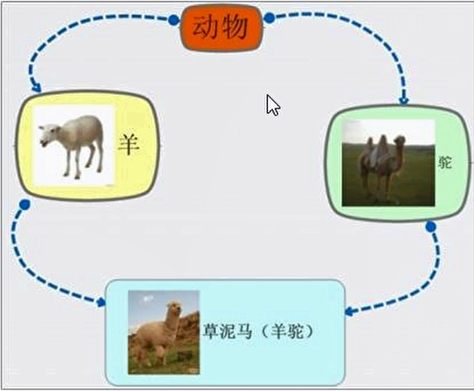  

**菱形继承问题：**

1. 羊继承了动物的数据，驼同样继承了动物的数据，当草泥马使用数据时，就会产生二义性。
2. 草泥马继承自动物的数据继承了两份，其实我们应该清楚，这份数据我们只需要一份就可以。

**示例：**

```cpp
class Animal
{
public:
	int m_Age;
};

//继承前加virtual关键字后，变为虚继承
//此时公共的父类Animal称为虚基类

//羊类
class Sheep : virtual public Animal {};
//驼类
class Tuo   : virtual public Animal {};
//羊驼类
class YangTuo : public Sheep, public Tuo {};

void test01()
{
	YangTuo yt;
	yt.Sheep::m_Age = 18;
	yt.Tuo::m_Age = 28;

    //菱形继承时，两个父类拥有相同数据，需要加以作用域区分
	cout << "yt.Sheep::m_Age = " << yt.Sheep::m_Age << endl; //28  因为虚继承，m_Age只有一个（共享的），先继承了18又继承了28
	cout << "yt.Tuo::m_Age = " <<  yt.Tuo::m_Age << endl;  //28
	cout << "yt.m_Age = " << yt.m_Age << endl;    //28
    
    //因为年龄只有一个，这份数据我们只需要一份就可以了，菱形继承导致数据有两份，资源浪费
}


int main() {

	test01();

	system("pause");

	return 0;
}

```

资源浪费如图：

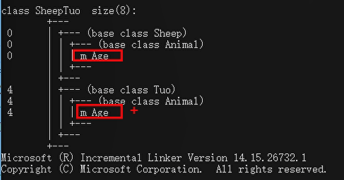 

虚继承底层：不是继承数据，而是继承指针vbptr：virtual base pointer(虚基类指针)指向一个vbtable(虚基类表)，这个表中记录了一个数据：==偏移量==。如图，Sheep的vbptr加上偏移量8就能找到m_Age, 而Tuo类的vbptr加上他的偏移量4也能找到m_Age。而m_Age只有一个，减少浪费

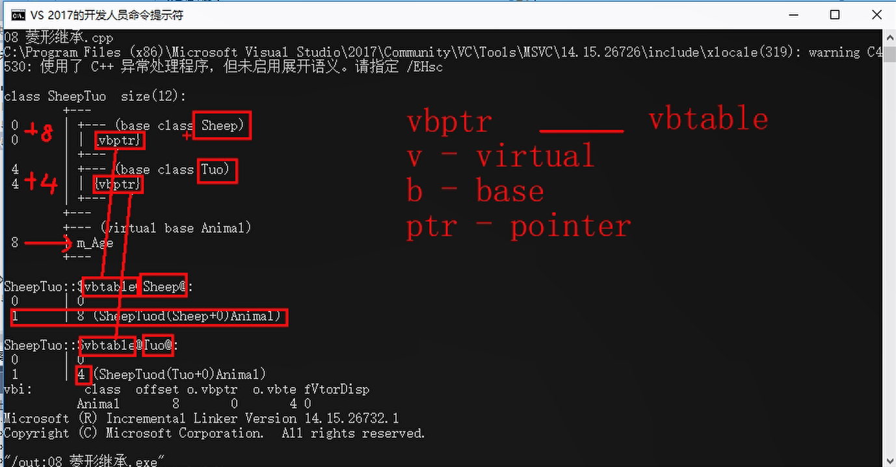   

总结：

- 菱形继承带来的主要问题是子类继承两份相同的数据，导致资源浪费以及毫无意义
- 利用虚继承可以解决菱形继承问题

### 4.7 多态

#### 4.7.1 多态的基本概念

**多态是C++面向对象三大特性之一**·

多态分为两类

- 静态多态: 函数重载 和 运算符重载属于静态多态，复用函数名
- 动态多态: 派生类和虚函数实现运行时多态

静态多态和动态多态区别：

- 静态多态的函数地址早绑定 - 编译阶段确定函数地址
- 动态多态的函数地址晚绑定 - 运行阶段确定函数地址

下面通过案例进行讲解多态

```cpp
class Animal
{
public:
	//Speak函数就是虚函数
	//函数前面加上virtual关键字，变成虚函数，那么编译器在编译的时候就不能确定函数调用了。
	virtual void speak()
	{
		cout << "动物在说话" << endl;
	}
};

class Cat :public Animal
{
public:
	void speak()
	{
		cout << "小猫在说话" << endl;
	}
};

class Dog :public Animal
{
public:

	void speak()
	{
		cout << "小狗在说话" << endl;
	}

};

//我们希望传入什么对象，那么就调用什么对象的函数
//如果函数地址在编译阶段就能确定，那么静态联编
//如果函数地址在运行阶段才能确定，就是动态联编
/*地址早绑定：在编译阶段确定函数地址。如果想执行让猫说话而不是动物，那么这个函数地址就不能提前绑定，需要在运行阶段绑定，即地址晚绑定*/
void DoSpeak(Animal & animal)
{
	animal.speak();
}

void test01()
{
	Cat cat;
	DoSpeak(cat);


	Dog dog;
	DoSpeak(dog);
}


int main() {

	test01();

	system("pause");

	return 0;
}

```

总结：

动态多态满足条件

- 有继承关系
- 子类重写父类中的虚函数

动态多态使用条件

- 父类指针或引用指向子类对象

重写：函数返回值类型 函数名 参数列表 完全一致称为重写，重写不是重载

####  4.7.1 多态的原理剖析（补充）

动物类不加virtual时，sizeof(Animal) = 1， 而动物类添加virtual时，sizeof(Animal)=4. 多了一个指针vfptr（虚函数指针），指向虚函数表

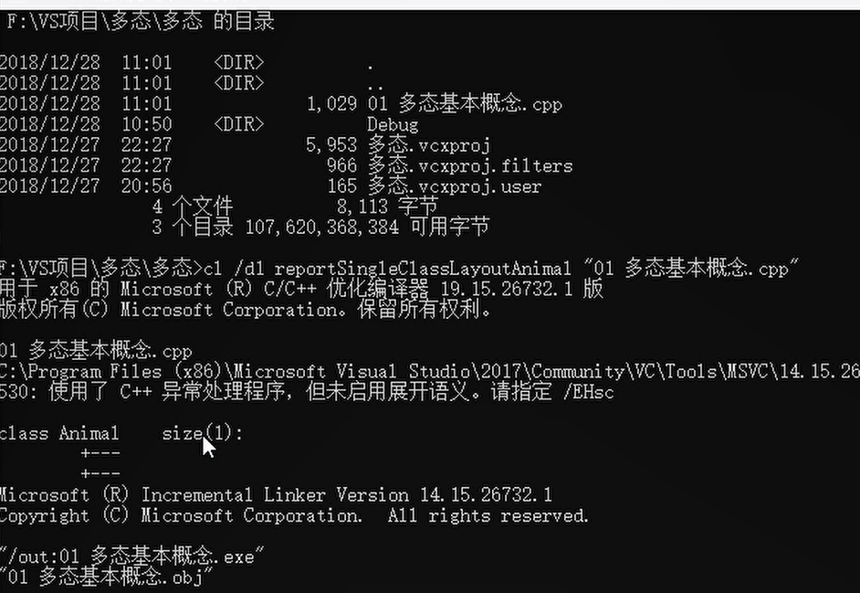 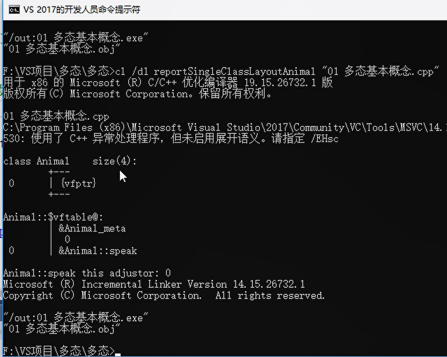 

当猫类仅仅继承而不重写时，

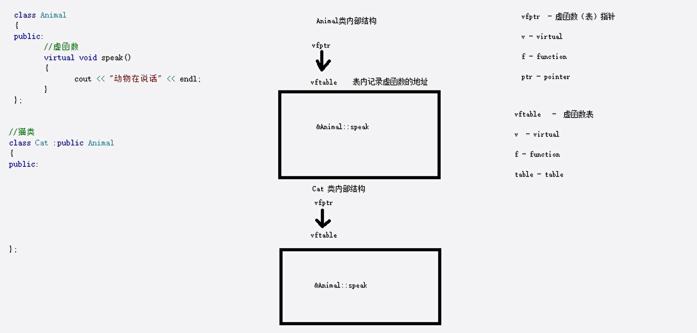   

而当重写时，

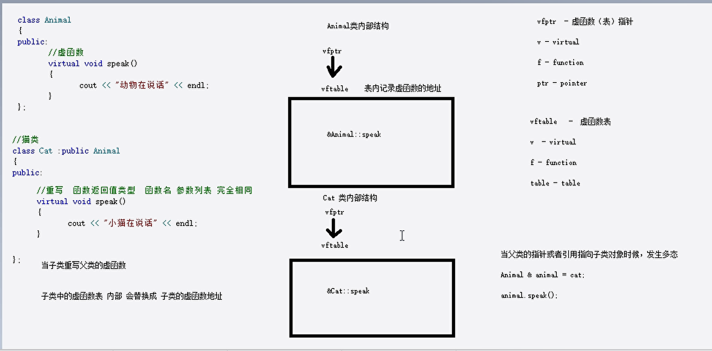 

#### 4.7.2 多态案例一-计算器类

案例描述：

分别利用普通写法和多态技术，设计实现两个操作数进行运算的计算器类

多态的优点：

- 代码组织结构清晰
- 可读性强
- 利于前期和后期的扩展以及维护

**示例：**

```cpp
//普通实现
class Calculator {
public:
	int getResult(string oper)    //operator(操作符)
	{
		if (oper == "+") {
			return m_Num1 + m_Num2;
		}
		else if (oper == "-") {
			return m_Num1 - m_Num2;
		}
		else if (oper == "*") {
			return m_Num1 * m_Num2;
		}
		//如果要提供新的运算，需要修改源码
	}
public:
	int m_Num1;
	int m_Num2;
};

void test01()
{
	//普通实现测试
	Calculator c;
	c.m_Num1 = 10;
	c.m_Num2 = 10;
	cout << c.m_Num1 << " + " << c.m_Num2 << " = " << c.getResult("+") << endl;

	cout << c.m_Num1 << " - " << c.m_Num2 << " = " << c.getResult("-") << endl;

	cout << c.m_Num1 << " * " << c.m_Num2 << " = " << c.getResult("*") << endl;
}

//如果想扩展新的功能，则需修改源码。在真实开发中，提倡开闭原则：对扩展进行开放，对修改进行关闭

//多态实现
//抽象计算器类
//多态优点：代码组织结构清晰，可读性强，利于前期和后期的扩展以及维护
class AbstractCalculator
{
public :

	virtual int getResult()
	{
		return 0;
	}

	int m_Num1;
	int m_Num2;
};

//加法计算器
class AddCalculator :public AbstractCalculator
{
public:
	int getResult()
	{
		return m_Num1 + m_Num2;
	}
};

//减法计算器
class SubCalculator :public AbstractCalculator
{
public:
	int getResult()
	{
		return m_Num1 - m_Num2;
	}
};

//乘法计算器
class MulCalculator :public AbstractCalculator
{
public:
	int getResult()
	{
		return m_Num1 * m_Num2;
	}
};


void test02()    //多态使用条件，父类指针或者引用指向子类对象
{
	//创建加法计算器
	AbstractCalculator *abc = new AddCalculator;
	abc->m_Num1 = 10;
	abc->m_Num2 = 10;
	cout << abc->m_Num1 << " + " << abc->m_Num2 << " = " << abc->getResult() << endl;
	delete abc;  //用完了记得销毁

	//创建减法计算器
	abc = new SubCalculator;
	abc->m_Num1 = 10;
	abc->m_Num2 = 10;
	cout << abc->m_Num1 << " - " << abc->m_Num2 << " = " << abc->getResult() << endl;
	delete abc;  

	//创建乘法计算器
	abc = new MulCalculator;
	abc->m_Num1 = 10;
	abc->m_Num2 = 10;
	cout << abc->m_Num1 << " * " << abc->m_Num2 << " = " << abc->getResult() << endl;
	delete abc;
}

int main() {

	//test01();

	test02();

	system("pause");

	return 0;
}

```

> 总结：C++开发提倡利用多态设计程序架构，因为多态优点很多

#### 4.7.3 纯虚函数和抽象类

在多态中，通常父类中虚函数的实现是毫无意义的，主要都是调用子类重写的内容

因此可以将虚函数改为**纯虚函数**

纯虚函数语法：`virtual 返回值类型 函数名 （参数列表）= 0 ;`

当类中有了纯虚函数，这个类也称为 ==抽象类==

**抽象类特点**：

- 无法实例化对象
- 子类必须重写抽象类中的纯虚函数，否则也属于抽象类

**示例：**

```cpp
class Base
{
public:
	//纯虚函数
	//类中只要有一个纯虚函数就称为抽象类
	//抽象类无法实例化对象
	//子类必须重写父类中的纯虚函数，否则也属于抽象类
	virtual void func() = 0;
};

class Son :public Base
{
public:
	virtual void func() 
	{
		cout << "func调用" << endl;
	};
};

void test01()
{
    //Base b;          //错误，抽象类无法实例化对象，栈区不行
    //base = new Base; // 错误，抽象类无法实例化对象，堆区也不行
	
    //父类指针指向子类对象（两句可以合为一句 Base * base = new Son;）
    Base * base = NULL;    
    base = new Son;
	
    base->func();
	delete base;    //记得销毁
}

int main() {

	test01();

	system("pause");

	return 0;
}

```

#### 4.7.4 多态案例二-制作饮品

**案例描述：**

制作饮品的大致流程为：煮水 - 冲泡 - 倒入杯中 - 加入辅料

利用多态技术实现本案例，提供抽象制作饮品基类，提供子类制作咖啡和茶叶

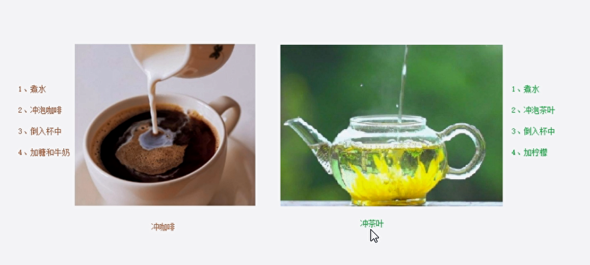  

**示例：**

```cpp
//抽象制作饮品
class AbstractDrinking {
public:
	//烧水
	virtual void Boil() = 0;
	//冲泡
	virtual void Brew() = 0;
	//倒入杯中
	virtual void PourInCup() = 0;
	//加入辅料
	virtual void PutSomething() = 0;
    
	//规定流程
	void MakeDrink() {
		Boil();
		Brew();
		PourInCup();
		PutSomething();
	}
};

//制作咖啡
class Coffee : public AbstractDrinking {
public:
	//烧水
	virtual void Boil() {
		cout << "煮农夫山泉!" << endl;
	}
	//冲泡
	virtual void Brew() {
		cout << "冲泡咖啡!" << endl;
	}
	//倒入杯中
	virtual void PourInCup() {
		cout << "将咖啡倒入杯中!" << endl;
	}
	//加入辅料
	virtual void PutSomething() {
		cout << "加入牛奶!" << endl;
	}
};

//制作茶水
class Tea : public AbstractDrinking {
public:
	//烧水
	virtual void Boil() {
		cout << "煮自来水!" << endl;
	}
	//冲泡
	virtual void Brew() {
		cout << "冲泡茶叶!" << endl;
	}
	//倒入杯中
	virtual void PourInCup() {
		cout << "将茶水倒入杯中!" << endl;
	}
	//加入辅料
	virtual void PutSomething() {
		cout << "加入枸杞!" << endl;
	}
};

//业务函数
void DoWork(AbstractDrinking* drink) {  //AbstractDrinking* drink = new Coffee;父类指针指向子对象
	drink->MakeDrink();
	delete drink;
}

void test01() {
	DoWork(new Coffee);
	cout << "--------------" << endl;
	DoWork(new Tea);
}


int main() {

	test01();

	system("pause");

	return 0;
}

```

#### 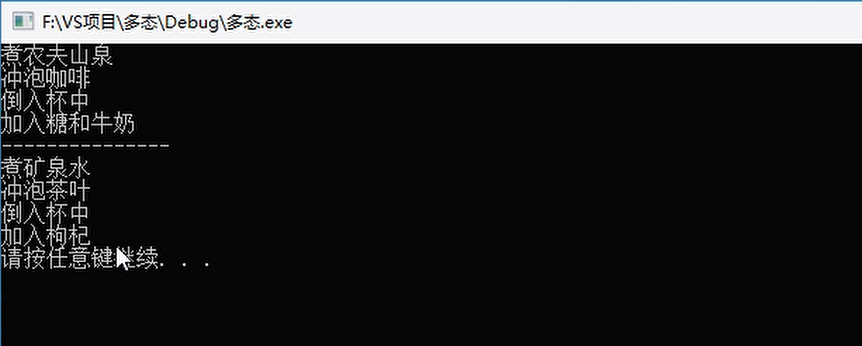  

#### 4.7.5 虚析构和纯虚析构

多态使用时，如果子类中有属性开辟到堆区，那么父类指针在释放时无法调用到子类的析构代码

解决方式：将父类中的析构函数改为**虚析构**或者**纯虚析构**

虚析构和纯虚析构共性：

- 可以解决父类指针释放子类对象
- 都需要有具体的函数实现

虚析构和纯虚析构区别：

- 如果是纯虚析构，该类属于抽象类，无法实例化对象

虚析构语法：

```
virtual ~类名(){}
```

纯虚析构语法：

```
virtual ~类名() = 0;
类名::~类名(){}
```

**示例：**

```cpp
class Animal {
public:
	//构造函数
	Animal()
	{
		cout << "Animal 构造函数调用！" << endl;
	}

	virtual void Speak() = 0;	//纯虚函数，仅声明即可
	virtual ~Animal() = 0;   //纯虚析构，类内声明，也需要类外实现
    
    //虚析构函数
	//virtual ~Animal()
	//{
	//	cout << "Animal虚析构函数调用！" << endl;
	//}
};

/*类外写纯虚析构函数实现*/
Animal::~Animal()
{
	cout << "Animal 纯虚析构函数调用！" << endl;
}

//和包含普通纯虚函数的类一样，包含了纯虚析构函数的类也是一个抽象类。不能够被实例化。

class Cat : public Animal {
public:
    //构造函数
	Cat(string name)
	{
		cout << "Cat构造函数调用！" << endl;
		m_Name = new string(name);
	}
    
    //成员函数
	virtual void Speak()
	{
		cout << *m_Name <<  "小猫在说话!" << endl;
	}
    
    //析构函数
	~Cat()
	{
		cout << "Cat析构函数调用!" << endl;
		if (this->m_Name != NULL) {   //this->可忽略不写
			delete m_Name;
			m_Name = NULL;
		}
	}

public:
	string *m_Name;    //创建在堆区
};

void test01()
{
	Animal *animal = new Cat("Tom");    //父类指针指向子类对象
	animal->Speak();

	//通过父类指针去释放，会导致子类对象可能清理不干净，造成内存泄漏
	//怎么解决？给基类增加一个虚析构函数
	//虚析构函数就是用来解决通过父类指针释放子类对象
	delete animal;
}

int main() {

	test01();

	system("pause");

	return 0;
}

```

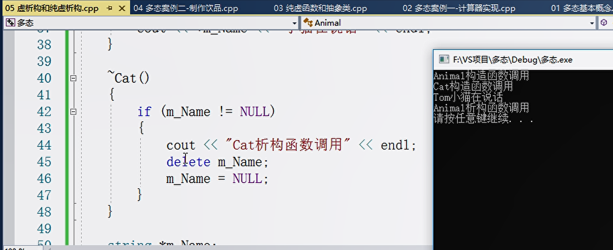 

父类指针指向子类对象，所以当delete父类指针时，并不会走子类的析构代码。导致子类如果有堆区数据，会出现内存泄漏。解决方法：把~Animal()改为virtual ~Animal() 虚析构。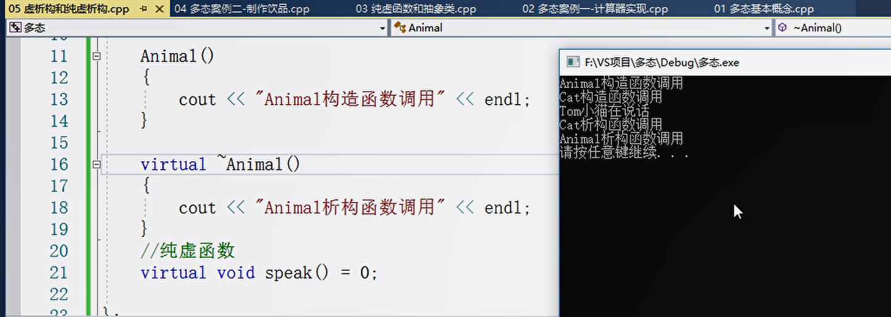  

总结：

  1. 虚析构或纯虚析构就是用来解决通过父类指针释放子类对象

  2. 如果子类中没有堆区数据，可以不写为虚析构或纯虚析构

  3. 拥有纯虚析构函数的类也属于抽象类

#### 4.7.6 多态案例三-电脑组装

**案例描述：**

电脑主要组成部件为 CPU（用于计算），显卡（用于显示），内存条（用于存储）

将每个零件封装出抽象基类，并且提供不同的厂商生产不同的零件，例如Intel厂商和Lenovo厂商

创建电脑类提供让电脑工作的函数，并且调用每个零件工作的接口

测试时组装三台不同的电脑进行工作

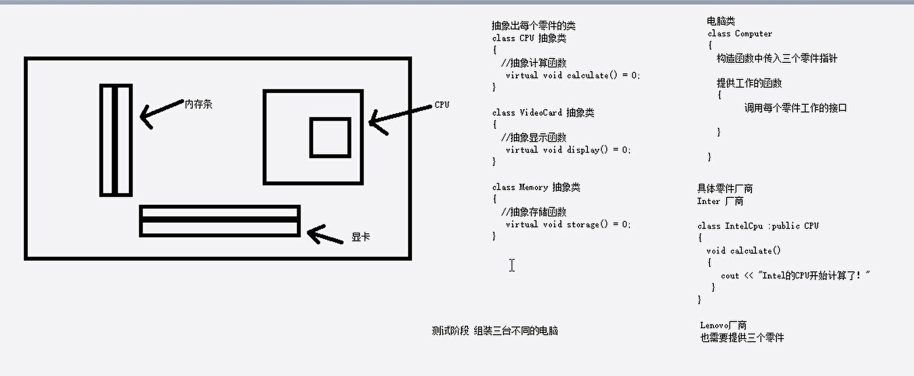  

**示例：**

```cpp
#include<iostream>
using namespace std;

//抽象CPU类
class CPU
{
public:
	//抽象的计算函数
	virtual void calculate() = 0;
};

//抽象显卡类
class VideoCard
{
public:
	//抽象的显示函数
	virtual void display() = 0;
};

//抽象内存条类
class Memory
{
public:
	//抽象的存储函数
	virtual void storage() = 0;
};

//电脑类
class Computer
{
public:
	Computer(CPU * cpu, VideoCard * vc, Memory * mem)
	{
		m_cpu = cpu;
		m_vc = vc;
		m_mem = mem;
	}

	//提供工作的函数
	void work()
	{
		//让零件工作起来，调用接口
		m_cpu->calculate();

		m_vc->display();

		m_mem->storage();
	}

	//提供析构函数 释放3个电脑零件
	~Computer()
	{

		//释放CPU零件
		if (m_cpu != NULL)
		{
			delete m_cpu;
			m_cpu = NULL;
		}

		//释放显卡零件
		if (m_vc != NULL)
		{
			delete m_vc;
			m_vc = NULL;
		}

		//释放内存条零件
		if (m_mem != NULL)
		{
			delete m_mem;
			m_mem = NULL;
		}
	}

private:

	CPU * m_cpu; //CPU的零件指针
	VideoCard * m_vc; //显卡零件指针
	Memory * m_mem; //内存条零件指针
};

//具体厂商
//Intel厂商
class IntelCPU :public CPU
{
public:
	virtual void calculate()
	{
		cout << "Intel的CPU开始计算了！" << endl;
	}
};

class IntelVideoCard :public VideoCard
{
public:
	virtual void display()
	{
		cout << "Intel的显卡开始显示了！" << endl;
	}
};

class IntelMemory :public Memory
{
public:
	virtual void storage()
	{
		cout << "Intel的内存条开始存储了！" << endl;
	}
};

//Lenovo厂商
class LenovoCPU :public CPU
{
public:
	virtual void calculate()
	{
		cout << "Lenovo的CPU开始计算了！" << endl;
	}
};

class LenovoVideoCard :public VideoCard
{
public:
	virtual void display()
	{
		cout << "Lenovo的显卡开始显示了！" << endl;
	}
};

class LenovoMemory :public Memory
{
public:
	virtual void storage()
	{
		cout << "Lenovo的内存条开始存储了！" << endl;
	}
};


void test01()
{
	//第一台电脑零件
	CPU * intelCpu = new IntelCPU;
	VideoCard * intelCard = new IntelVideoCard;
	Memory * intelMem = new IntelMemory;

	cout << "第一台电脑开始工作：" << endl;
	//创建第一台电脑
	Computer * computer1 = new Computer(intelCpu, intelCard, intelMem);
	computer1->work();
	delete computer1;

	cout << "-----------------------" << endl;
	cout << "第二台电脑开始工作：" << endl;
	//第二台电脑组装
	Computer * computer2 = new Computer(new LenovoCPU, new LenovoVideoCard, new LenovoMemory);;
	computer2->work();
	delete computer2;

	cout << "-----------------------" << endl;
	cout << "第三台电脑开始工作：" << endl;
	//第三台电脑组装
	Computer * computer3 = new Computer(new LenovoCPU, new IntelVideoCard, new LenovoMemory);;
	computer3->work();
	delete computer3;

}

```

## 5 文件操作

程序运行时产生的数据都属于临时数据，程序一旦运行结束都会被释放

通过**文件可以将数据持久化**

C++中对文件操作需要包含头文件 ==< fstream >==

文件类型分为两种：

1. **文本文件** - 文件以文本的**ASCII码**形式存储在计算机中
2. **二进制文件** - 文件以文本的**二进制**形式存储在计算机中，用户一般不能直接读懂它们

操作文件的三大类:

1. ofstream：写操作
2. ifstream： 读操作
3. fstream ： 读写操作

### 5.1文本文件

#### 5.1.1写文件

写文件步骤如下：

1. 包含头文件

   \#include <fstream>

2. 创建流对象

   ofstream ofs;

3. 打开文件

   ofs.open(“文件路径”,打开方式);

4. 写数据

   ofs << “写入的数据”;

5. 关闭文件

   ofs.close();

   

文件打开方式：

| 打开方式    | 解释                       |
| ----------- | -------------------------- |
| ios::in     | 为读文件而打开文件         |
| ios::out    | 为写文件而打开文件         |
| ios::ate    | 初始位置：文件尾           |
| ios::app    | 追加方式写文件             |
| ios::trunc  | 如果文件存在先删除，再创建 |
| ios::binary | 二进制方式                 |

**注意：** 文件打开方式可以配合使用，利用|操作符

**例如：**用[二进制](https://so.csdn.net/so/search?q=二进制&spm=1001.2101.3001.7020)方式写文件 `ios::binary | ios:: out`

**示例：**

```cpp
//1.包含头文件（fstream:读写文件)
#include <fstream>

void test01()
{
     //2.创建流对象
	ofstream ofs; 
    
     //3.指定打开方式
	ofs.open("test.txt", ios::out);    //如果不指定路径，则创建在和你的这个.cpp文件的同级目录下
    
    //4.写内容
	ofs << "姓名：张三" << endl;
	ofs << "性别：男" << endl;
	ofs << "年龄：18" << endl;

    //5.关闭文件
	ofs.close();
}

int main() {

	test01();

	system("pause");

	return 0;
}

```

总结：

- 文件操作必须包含头文件 fstream
- 读文件可以利用 ofstream ，或者fstream类
- 打开文件时候需要指定操作文件的路径，以及打开方式
- 利用<<可以向文件中写数据
- 操作完毕，要关闭文件

#### 5.1.2读文件

读文件与写文件步骤相似，但是读取方式相对于比较多

读文件步骤如下：

1. 包含头文件

   \#include <fstream>

2. 创建流对象

   ifstream ifs;

3. 打开文件并判断文件是否打开成功

   ifs.open(“文件路径”,打开方式);

4. 读数据

   四种方式读取

5. 关闭文件

   ifs.close();

**示例：**

```cpp
//1.包含头文件（fstream:读写文件)
#include <fstream>
#include <string>
void test01()
{
    //2.创建流对象
	ifstream ifs;
	ifs.open("test.txt", ios::in);
	
    //3.打开文件，并判断是否打开成功
	if (!ifs.is_open())
	{
		cout << "文件打开失败" << endl;
		return;
	}

    //4.读数据
    
	//第一种方式（字符数组）
	char buf[1024] = { 0 };
	while (ifs >> buf)
	{
		cout << buf << endl;
	}

	//第二种
	//char buf[1024] = { 0 };
	//while (ifs.getline(buf,sizeof(buf)))
	//{
	//	cout << buf << endl;
	//}

	//第三种（字符串）
	//string buf;
	//while (getline(ifs, buf))
	//{
	//	cout << buf << endl;
	//}

    //第四种（一个一个字符读) 不推荐
	//char c;
	//while ((c = ifs.get()) != EOF)   //EOF:end of file
	//{
	//	cout << c;
	//}

    //5.关闭文件
	ifs.close();


}

int main() {

	test01();

	system("pause");

	return 0;
}

```

总结：

- 读文件可以利用 ifstream ，或者fstream类
- 利用is_open函数可以判断文件是否打开成功
- close 关闭文件

### 5.2 二进制文件

以二进制的方式对文件进行读写操作

打开方式要指定为 ==ios::binary==

#### 5.2.1 写文件

二进制方式写文件主要利用流对象调用成员函数write

函数原型 ：`ostream& write(const char * buffer,int len);`

参数解释：字符指针buffer指向内存中一段存储空间。len是读写的字节数

**示例：**

```cpp
#include <fstream>
#include <string>

class Person
{
public:
  //对文件操作时，不要用c++的string，会出现一些问题，我们采用c语言的字符串数组。因为底层是用c写的
	char m_Name[64]; 
	int m_Age;
};

//二进制文件  写文件
void test01()
{
	//1、包含头文件

	//2、创建输出流对象
	ofstream ofs("person.txt", ios::out | ios::binary);  // 2、3合成一步写
	
	//3、打开文件
	//ofs.open("person.txt", ios::out | ios::binary);

	//4、写文件
    Person p = {"张三"  , 18};
	ofs.write((const char *)&p, sizeof(p));

	//5、关闭文件
	ofs.close();
}

int main() {

	test01();

	system("pause");

	return 0;
}

```

总结：

- 文件输出流对象 可以通过write函数，以二进制方式写数据

#### 5.2.2 读文件

二进制方式读文件主要利用流对象调用成员函数read

函数原型：`istream& read(char *buffer,int len);`

参数解释：字符指针buffer指向内存中一段存储空间。len是读写的字节数

示例：

```cpp
#include <fstream>
#include <string>

class Person
{
public:
	char m_Name[64];
	int m_Age;
};

void test01()
{
    //1.包含头文件
    
	//2.创建流对象
	ifstream ifs;
    
    //3.打开文件，判断文件是否打开成功
    ifs.open("person.txt", ios::in | ios::binary);
	if (!ifs.is_open())
	{
		cout << "文件打开失败" << endl;
	}

    //4.读文件
	Person p;
	ifs.read((char *)&p, sizeof(p));

	cout << "姓名： " << p.m_Name << " 年龄： " << p.m_Age << endl;
}

int main() {

	test01();

	system("pause");

	return 0;
}

```

总结：

- 文件输入流对象 可以通过read函数，以二进制方式读数据

## 后记

相信能对着黑马视频学习到这里的人，已经迈出了万里长征的第一步，祝贺你