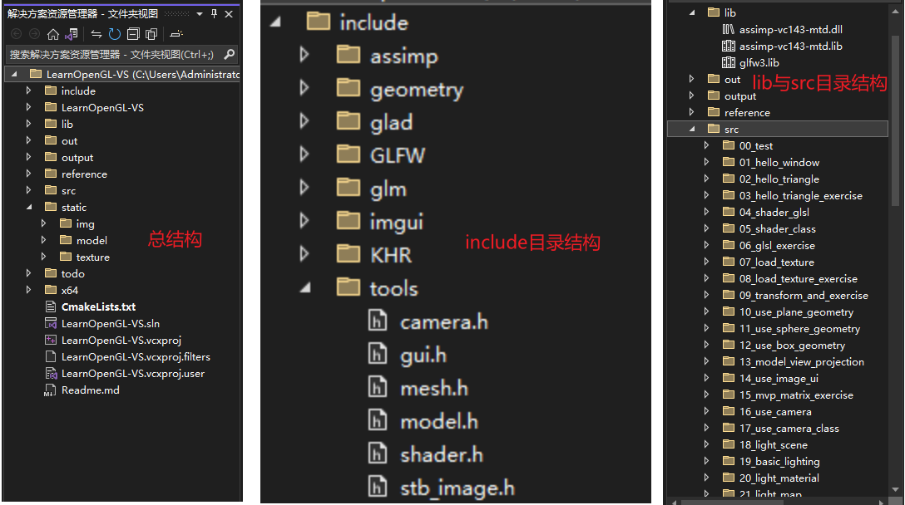
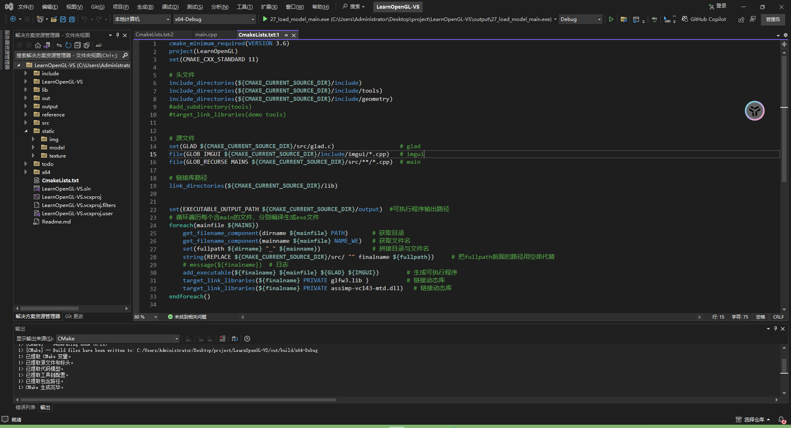
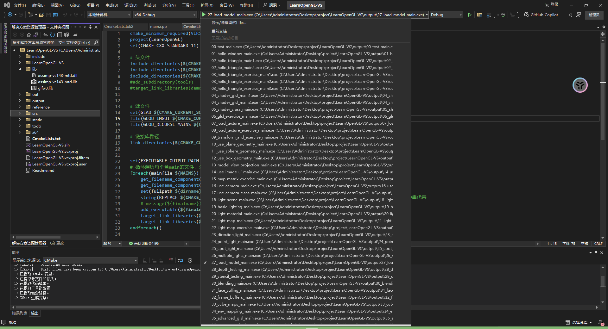
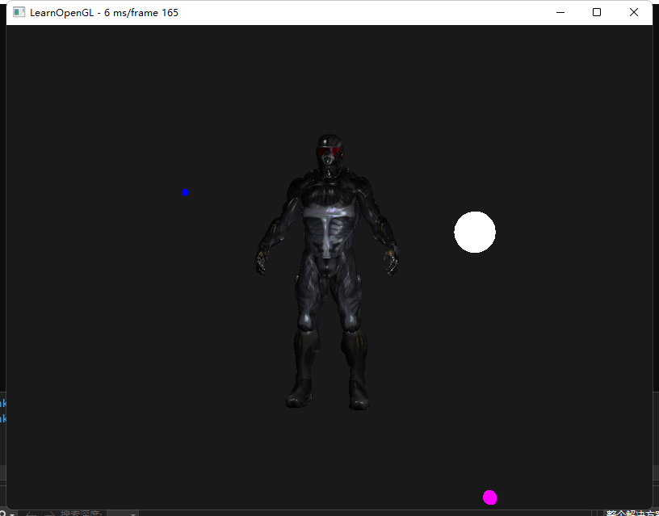

## OpenGL

### 总览

> 参考文档：https://learnopengl-cn.github.io/
>
> 学习视频：[LearnOpenGL文档学习【完结】- bilibili](https://www.bilibili.com/video/BV11Z4y1c7so/?spm_id_from=333.337.search-card.all.click&vd_source=b64addc069fb830079345fe5d6f118f9)
>
> 视频作者代码仓库：[yocover/start-learning-opengl](https://github.com/yocover/start-learning-opengl)
>
> 在学这个文档之前强烈建议学习一下cmake, 当然也可以跳过
>
> 我的cmake学习：先去[CMake 保姆级教程【C/C++】- bilibili ](https://www.bilibili.com/video/BV14s4y1g7Zj/?spm_id_from=333.337.search-card.all.click&vd_source=b64addc069fb830079345fe5d6f118f9)了解基本知识，再者就是各文档，csdn, 知乎等平台。遇到问题就去解决

### 环境配置踩坑

> **⭐ 总结**：直接用Visual Studio 减少很多配置成本，Vscode比较繁琐且容易出问题
>
> 开发环境：Win11 + Cmake + Visual Studio 2022
>
> 先前的开发环境：开始用win11 + Vscode + mingw64 + Cmake
>
> 最后到配置模型加载库assimp时，一直配置不好 编译assimp总是出问题。
>
> 花费了大量时间去百度谷歌CSDN知乎搜索，在这里发现了与自己相同的问题: [assimp-cmake-mingw-w64-vscode-win10 - Stackoverflow](https://stackoverflow.com/questions/61692793/assimp-cmake-mingw-w64-vscode-win10)
>
> 解决方案是去MSVC环境下编译。
>
> 最后得出结论：mingw64环境下编译assimp确实存在一定的问题，需要使用MSVC环境，于是在Vscode下使用MSVC环境重新搭建，折腾了几天，但还是失败。最终放弃了Vscode，转用Visual Studio，一次成功。
>
> VS+Cmake环境参考视频（7-11节学习一下cmake很有帮助）: [【B站最好OpenGL】7-工程管理-CMake初体验 - bilibili](https://www.bilibili.com/video/BV1we411n7Lh/?spm_id_from=333.788&vd_source=b64addc069fb830079345fe5d6f118f9)
>
> **目录结构：**
>
>  
>
> 其中glad.c也放在了src目录下
>
> reference与todo是我自己的参考资料与待做。
>
> **⭐重要：**要把assimp-vc143-mtd库文件同样copy一份放到可执行文件所在目录才可运行，这个地方也折腾了好久┭┮﹏┭┮


> 2024-08-14
>
> 由于我的源文件目录结构按照一小节一个文件夹的形式组成，我的需求是一次性cmake构建，生成多个可执行程序，并且为多个exe文件命名，不得不进一步学习cmake. 
>
> **CmakeLists.txt**
>
>  
>
> ```cmake
> cmake_minimum_required(VERSION 3.6)
> project(LearnOpenGL)
> set(CMAKE_CXX_STANDARD 11)
> 
> # 头文件
> include_directories(${CMAKE_CURRENT_SOURCE_DIR}/include)
> include_directories(${CMAKE_CURRENT_SOURCE_DIR}/include/tools)
> include_directories(${CMAKE_CURRENT_SOURCE_DIR}/include/geometry)
> #add_subdirectory(tools)
> #target_link_libraries(demo tools)
> 
> # 源文件
> set(GLAD ${CMAKE_CURRENT_SOURCE_DIR}/src/glad.c)                   # glad
> file(GLOB IMGUI ${CMAKE_CURRENT_SOURCE_DIR}/include/imgui/*.cpp)   # imgui
> file(GLOB_RECURSE MAINS ${CMAKE_CURRENT_SOURCE_DIR}/src/**/*.cpp)  # main
> 
> # 链接库路径
> link_directories(${CMAKE_CURRENT_SOURCE_DIR}/lib)
> 
> set(EXECUTABLE_OUTPUT_PATH ${CMAKE_CURRENT_SOURCE_DIR}/output)  #可执行程序输出路径
> # 循环遍历每个含main的文件，分别编译生成exe文件
> foreach(mainfile ${MAINS})
>     get_filename_component(dirname ${mainfile} PATH)       # 获取目录
>     get_filename_component(mainname ${mainfile} NAME_WE)   # 获取文件名
>     set(fullpath ${dirname} "_" ${mainname})               # 拼接目录与文件名
>     string(REPLACE ${CMAKE_CURRENT_SOURCE_DIR}/src/ "" finalname ${fullpath})     # 把fullpath前面的路径用空串代替
>     # message(${finalname})  # 日志
>     add_executable(${finalname} ${mainfile} ${GLAD} ${IMGUI})        # 生成可执行程序
>     target_link_libraries(${finalname} PRIVATE glfw3.lib )           # 链接动态库
>     target_link_libraries(${finalname} PRIVATE assimp-vc143-mtd.dll)   # 链接动态库
> endforeach()
> ```
>
> **构建结果：**
>
> 选择要运行的exe文件即可运行
>
>  
>
>  


参考文献：

1.[CMake String函数：如何巧妙地在cmake中操作字符串](https://blog.csdn.net/qq_21438461/article/details/131007260)

2.[cmake get_filename_component 使用](https://blog.csdn.net/qq_41221841/article/details/118027178)

3.[CMake中遍历元素的技巧：foreach命令详解](https://blog.csdn.net/qq_21438461/article/details/129734933)

