# 高等数学

## 函数极限连续

周期函数的导函数是周期函数，反之不一定。

有界性判断定义3：导函数在有限区间有界—>函数有界

无穷大×无穷大=无穷大    无界×无界≠无界

p16 重要极限x^n 和 e^nx

==泰勒公式p18==

根式除以-x   p24

> ==数列的极限== 
>
> 1.对数列求极限不能用洛必达法则，必须改成函数极限
>
> 2.递推关系数列xn+1=f(xn)常用方法：①单调有界，等式两端取极限   ②先斩后奏，令极限为A，两端取极限解出来，再证明极限是A，方法:n->∞，|xn-A|＜缩放因子*|xn-1 - A|=…=0
>
> 3.判断单调性：①若f(x)在I上单增，则数列{Xn}单调，当**x1≤X2**时，{Xn}单增，当x1≥X2时，{Xn}单减。②f(x)单减->{Xn}不单调

均值不等式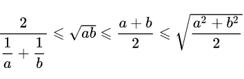 乘积开根号≤均值≤平方的均值开根号

## 一元函数微分学

> 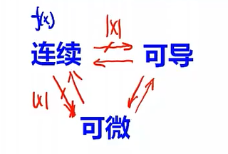 
>
> ①f(x) n阶可导–>洛必达最多洛到n-1阶
>
> ②f(x)n阶连续可导/有n阶连续导数–>可以洛到n阶

==cot导数-csc^2   csc导数-csccot==

arcsin,arccos,==arccot导数==

arctanx+arctan(1/x) = Π/2

p57

==微分中值定理大题专题==    ⭐构造辅助函数法p83

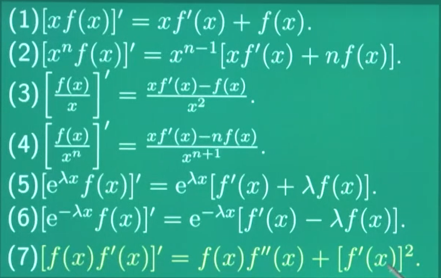 

极值和拐点的第三充分条件p68 p69

⭐罗尔定理推论：若在区间I上f(x)的n阶导数≠0，则方程f(x)=0在I上最多有n个实根

## 一元函数积分学

不定积分

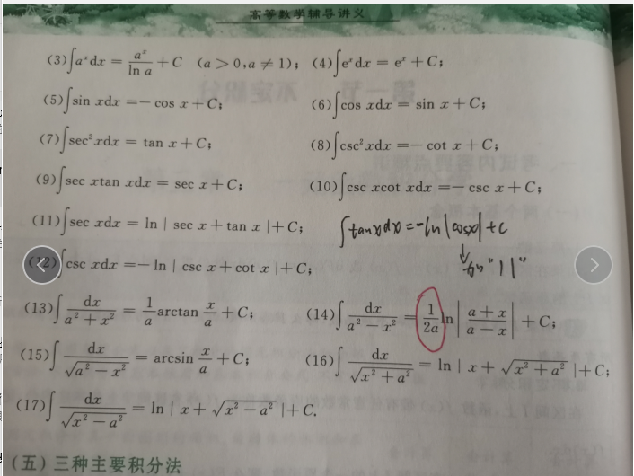 

万能代换 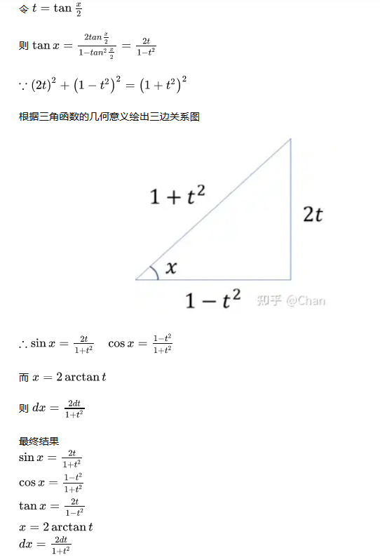 

> **定积分可积性**
>
> 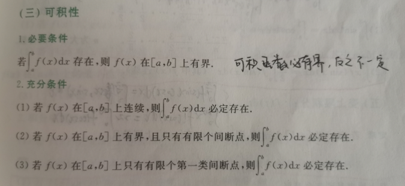 

> **点火公式**
>
> 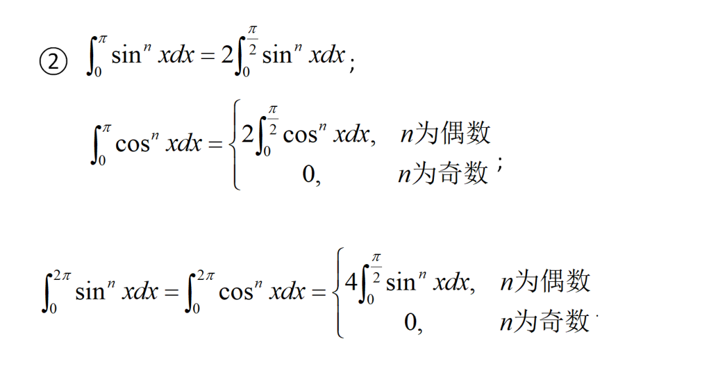 
>
> **区间再现**
>
> 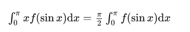 
>
> 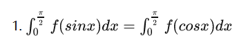 
>
> 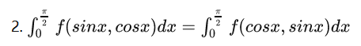 
>
> 
>
> **三角函数积分一般方法**
>
> 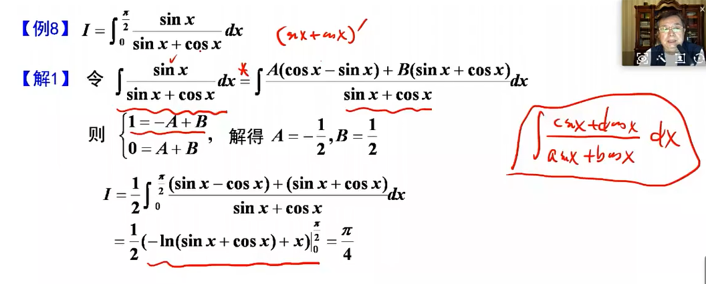 
>
> 但此题用上面区间再现的公式做更快
>
> **e的x次方用区间再现**
>
> 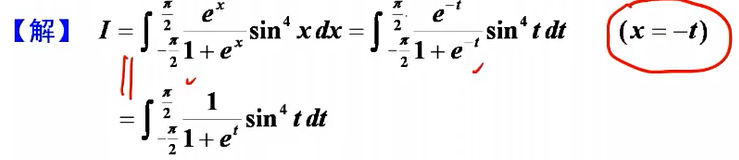 

> ==变上限积分函数==
>
>  

积分不等式

> ==柯西积分不等式==
>
> 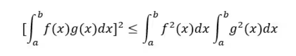 
>
> 乘积积分的平方不超过平方积分的乘积
>
> **提到单调性，改用变上限积分用函数的思想证明积分不等式**

**反常积分**

> 1.收敛+收敛才收敛， 其中一个发散则发散
>
> 2.p积分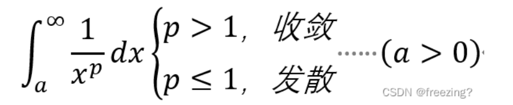 
>
> 3.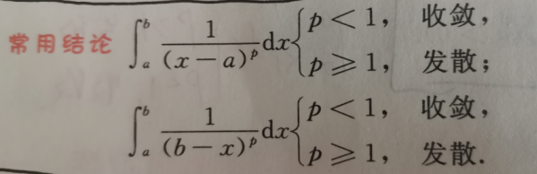 

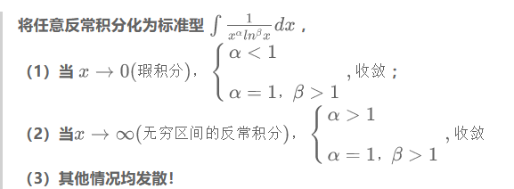 

  例子：

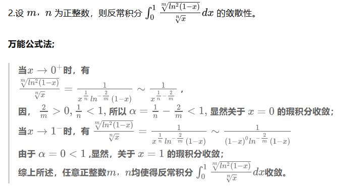 

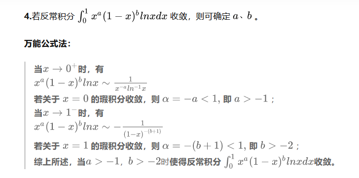 

> **定积分的几何应用**
>
> 旋转体体积：
>
> 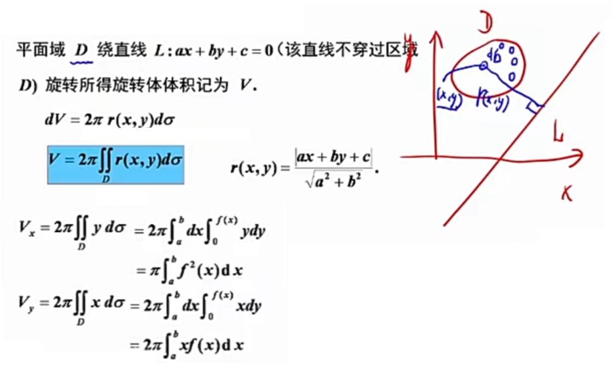 、
>
> 旋转体侧面积：
>
> 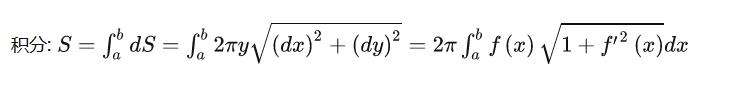 
>
> 物理应用p32：
>
> 1.变力做功 2.液体压力 3.引力

## 常微分方程

伯努利方程 欧拉方程p141    欧拉方程的另一种解法p169  

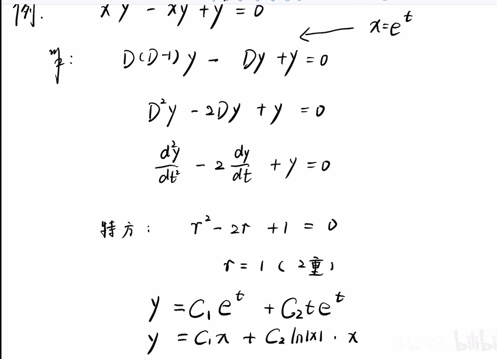 

## 多元函数微分学

全微分p155  用定义判断可微

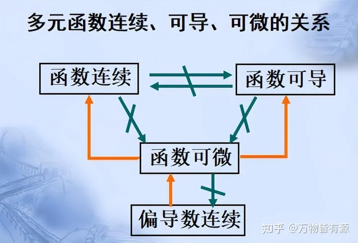 

绝对值不等式：**||a|-|b|| ≤ |a±b| ≤ |a|+|b|**

## 无穷级数

如果说明绝对值发散时使用了比值或根值判别，那么可以立即得出原级数发散

绝对收敛±条件收敛=条件收敛

绝对收敛±绝对收敛=绝对收敛

条件收敛±条件收敛=条件收敛或绝对收敛

==求收敛域-->an加绝对值用比值或根值，取倒数==，如果缺项，则用un

级数求导收敛域可能变小，积分可能变大 

==幂级数展开P214==  p220

==傅里叶级数p224==

## 向量代数

求a,b为临边的平行四边形面积：S=|a × b|

判定两向量平行：a × b = 0

混合积：（abc）=(a×b)·c 代数表示为行列式

V平行六面体 = |（abc）|

判定三向量共面：（abc）=0

==点到直线距离P233==

==平面束方程== 正常设，然后检验括号里的方程

==两直线距离公式== p236   |s1s2AB|/|s1×s2|

==常见二次曲面== p237  单叶双曲面，双叶双曲面

==建立旋转面方程步骤== p239

==方向导数和梯度== p242  方向导数是一个数（梯度×方向余弦向量）  梯度是一个向量

## 多元函数积分学

==柱坐标和球坐标== p247 

==先一后二 先二后一==

==**合一投影法**== 

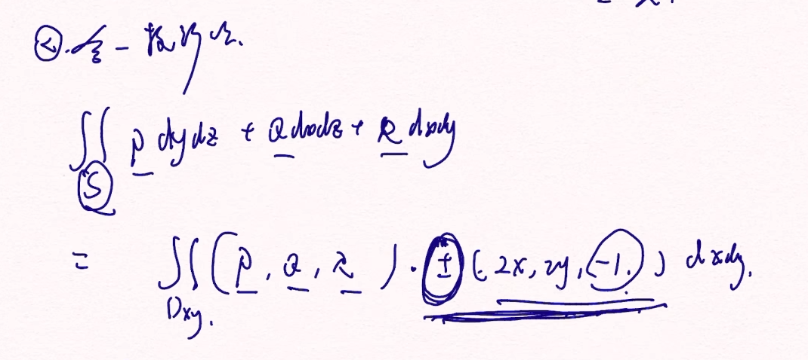 

==格林公式 斯托克斯公式 高斯公式==  空间线积分化投影线积分用格林 p262

==梯度散度旋度== p272  梯度是向量 散度是数量PQR偏导之和  旋度是向量（行列式i j k 偏x 偏y 偏z P Q R）

偶零奇倍（二型面积分dxdy）区分   向一个面投影S区域变为D区域

 

## 补充：

心型线，双扭线 方程

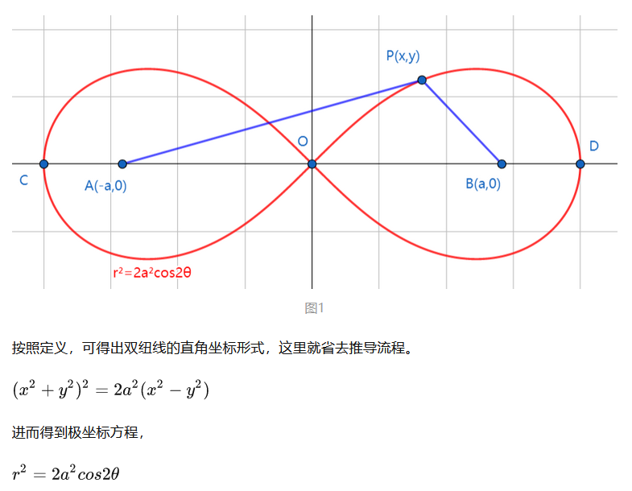 

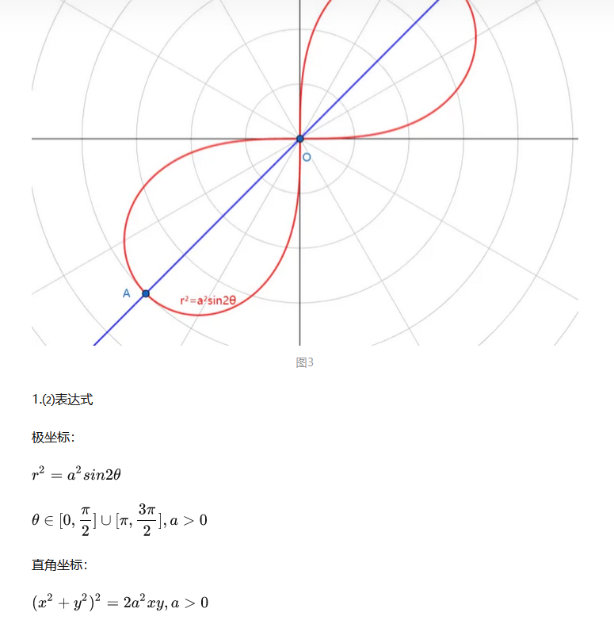 

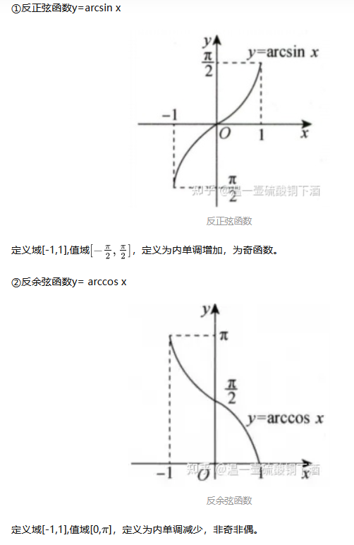 

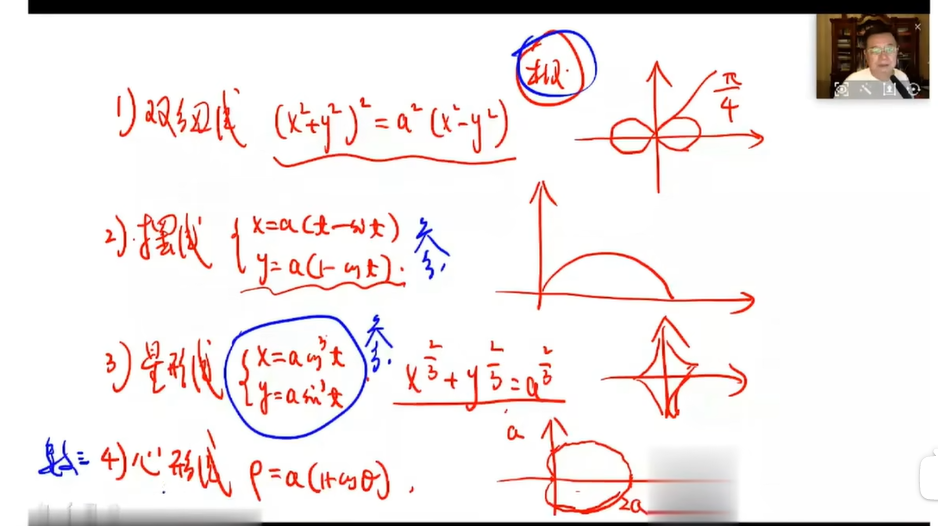 

# 线性代数

## 行列式

> **克拉默法则** ：
>
> 非齐次线性方程组系数行列数不为0，方程组有唯一解
>
> 推论：1.齐次方程组系数行列式不为0，方程组只有0解
>
> 2.齐次方程组有非零解，则系数行列式为0

> **数学归纳法**
>
> 型式1：验证n=1成立，假设n=k成立，证明n=k+1成立；
>
> 型式2：验证n=1,n=2成立，假设n<k成立，证明n=k成立

## 矩阵

**重要公式**

分块求逆

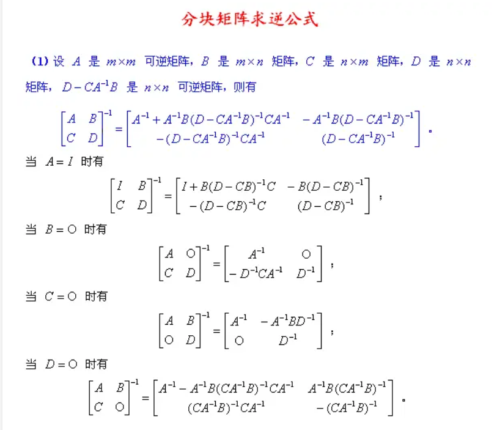 

二阶伴随：主对调负变号

 

 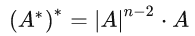

> *A：m×n  B:n×s*
>
> **==AB=C专题==**
>
> 如果A列满秩(r(A)=n),则r(AB)=r(B)
>
> AB的行向量可由B的行向量线性表出  AB的列向量可由A的列向量线性表出
>
> ==**AB=0专题 **==   
>
> （1）B的每一个列向量都是齐次方程Ax=0的解
>
> （2）r(A) + r(B) ≤ n（A的列数，B的行数）

**特殊矩阵**

> ==**正交矩阵**==
>
> 1.A的转置=A的逆矩阵，即ATA=AAT=E
>
> 2.==|A|^2 = 1==
>
> 3.A,B n阶正交，则AB正交
>
> 性质：1.正交矩阵的每个列向量都是单位向量
>
> 2.任意两个列向量垂直
>
> 3.==正交矩阵一定可逆，|A|不是1就是-1==

> **==秩1矩阵==**
>
> αTβ是矩阵αβT的主对角线元素之和
>
> ααT对称，αTα平方和
>
> 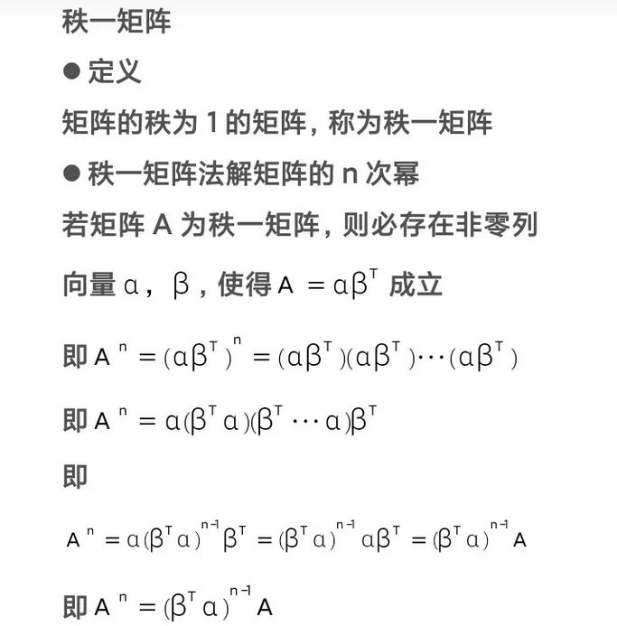 
>
> 总结：A^n = L^(n-1)*A     L是矩阵的迹  
>
>  
>
> ==秩1矩阵，且迹不为0，则可以相似对角化==

## 向量

> ⭐施密特正交化
>
> 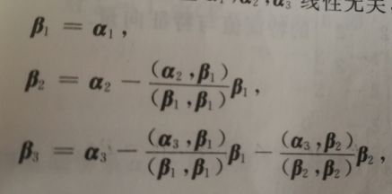 

**线性相关线性无关定理** p67 p68

> **秩的关系**
>
> ==r(A+B) ≤ r(A,B) ≤ r(A) + r(B)==
>
> r(AB)  ≤ min{r(A), r(B)}

> **同解和公共解**
>
> 公共解：α既是（I）的解，也是（ I）的解，则是公共解
>
> 解法：①（I)(II)联立求解  ②求各自基础解系，令相等  ③（I)的通解带入（II）寻找k1,k2关系式 
>
> 同解：如果α是（I）的解，则必是（II）的解，反过来，如果α是（II）的解，则必是（I）的解
>
> ABx=0与Bx=0同解
>
> **同解方程组**
>
> ==**矩阵方程**AX=0与BX=0同解的充分必要条是A,B的行向量组等价，即R(A)=R(B)=R(A/B)==
>
> ==A,B列向量组等价的充要条件是R(A)=R(B)=R(A，B)==  
>
> 向量组A=【a1，a2，a3，……】和向量组B=【b1，b2，b3，……】等价的充要条件是rA=rB=r（A，B）。同型矩阵A，B等价的充要条件是rA=rB

## 特征值与特征向量

> **对角化**
>
> 充要条件：①A有n个线性无关特征向量 ②如果λ是k重特征值，那么λ必有k个线性无关特征向量 ③r(λiE - A) = n- ni，λi为ni重特征值
>
> 充分条件：A有n个不同的特征值，A是实对称矩阵，则一定可以相似对角化
>
> 充分条件：==秩1矩阵，且迹不为0，则可以相似对角化==

> **实对称矩阵**
>
> ①必相似对角阵
>
> ②可用正交矩阵对角化
>
> ③不同特征值的特征向量相互正交
>
> ④特征值必是实数
>
> ⑤k重特征值必有k个线性无关的特征向量

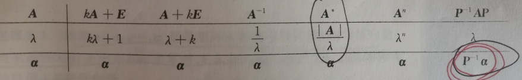 

## 二次型

反对称矩阵对角线元素一定为0

> **正定**
>
> 潜台词:一定是对称矩阵
>
> 正定一定可逆，因为特征值全＞0
>
> 充要条件：①特征值全＞0  ②正惯性指数p=n  ③顺序主子式全＞0  ④A=CT E C,c可逆
>
> 必要条件：aii＞0  |A|＞0

## 矩阵相似等价合同

> **矩阵等价**：Ps…P3P2P1 A Q1Q2…Qt = B => PAQ = B => r(A) = r(B)   A经初等变换得到B
>
> 同型矩阵等价充要条件：r(A) = r(B) 
>
> **向量组等价**：==A,B列向量组等价的充要条件是R(A)=R(B)=R(A，B)==  
>
> 向量组A=【a1，a2，a3，……】和向量组B=【b1，b2，b3，……】等价的充要条件是rA=rB=r（A，B）。同型矩阵A，B等价的充要条件是rA=rB
>
> **相似**:P-1AP = B
>
> 必要条件迹相等，秩相等，行列式相等，|λE-A|=|λE-B|
>
> 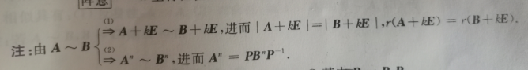 
>
> ==判实对称矩阵相似充要条件==：看特征值是否一样
>
> **合同**：存在可逆矩阵C，使CTAC=B，充要条件是正负惯性指数相同
>
> ==**相似一定等价，但等价不一定相似**==
>
> **==实对称矩阵相似一定合同==**  实对称矩阵看特征值正负

## 大数定律与中心极限定理

p110

切比雪夫条件：独立，期望方差存在，方差一致有界

辛钦：独立同分布，期望存在

中心极限定理：列维-林德伯格定理条件：独立同分布，期望方差存在     标准化

## 数理统计

p118

## 参数估计与假设检验

p134  

p140 无偏性 有效性 一致性

p160

# 李林880题目总结

## 高等数学

空间几何 

> 两直线之间的距离公式 ——平面束
>
> 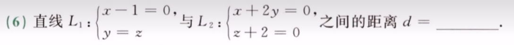 
>
> 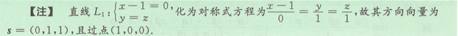 
>
> 平面束：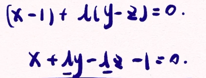 
>
> 使平面的法向量与L2的方向向量s垂直，求得平面
>
> 在L2上找一点，求点到平面的距离，即为两直线距离
>
> 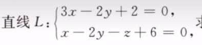 
>
> 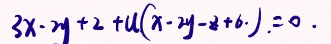 
>
> 正常设，然后检验括号里的方程

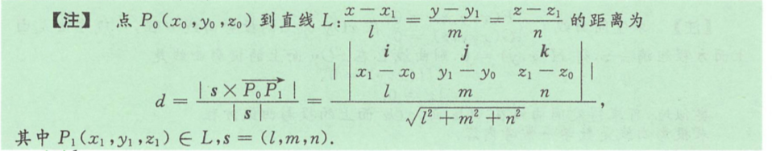 

> 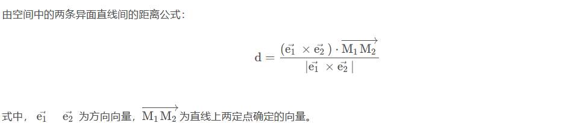  
>
> e1×e2 记为n 法向量
>
> 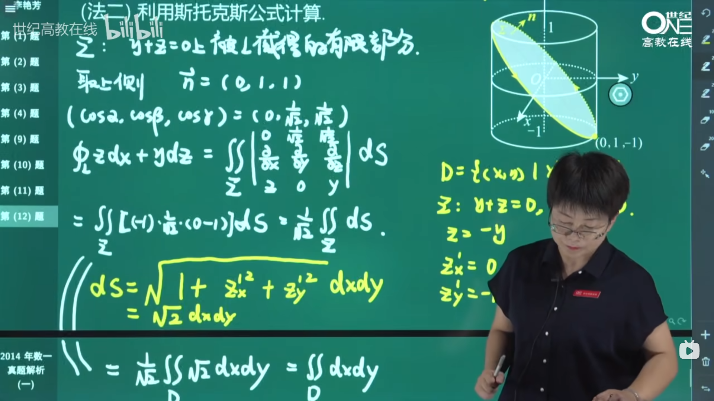   

==建立旋转面方程==

==无穷级数== 

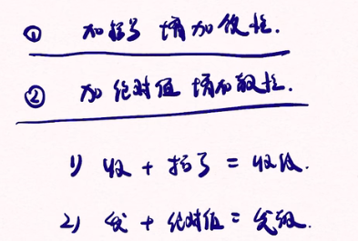 

==多元微分p28==

==微分方程伯努利 欧拉  p38==

==中值定理==

## 线性代数

秩1矩阵

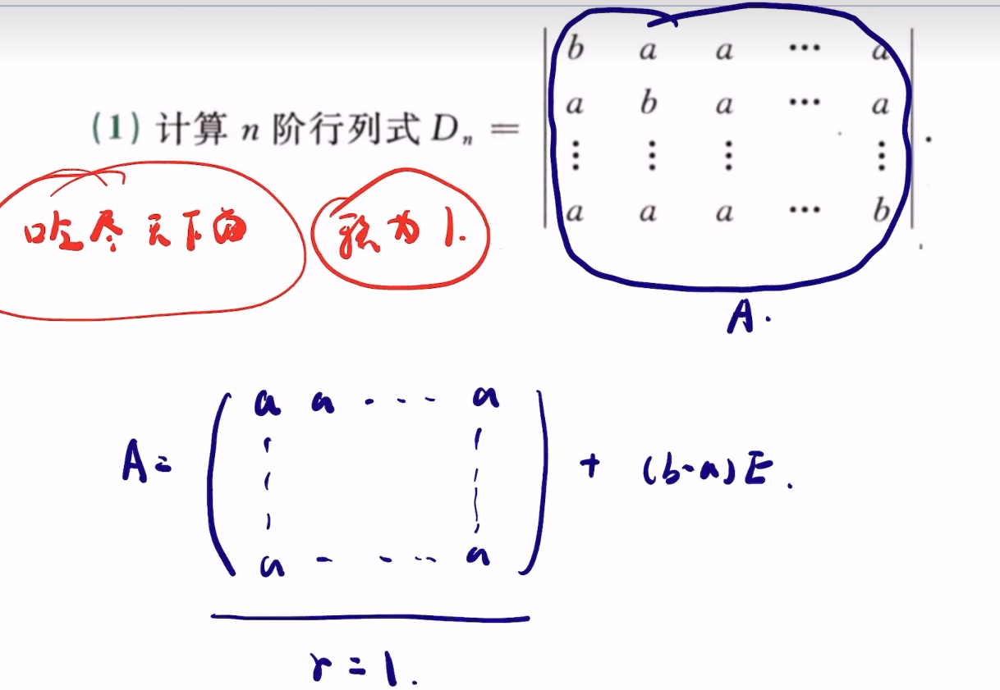 秩1矩阵特征值是主队角元素之和，和n-1个0

三对角矩阵

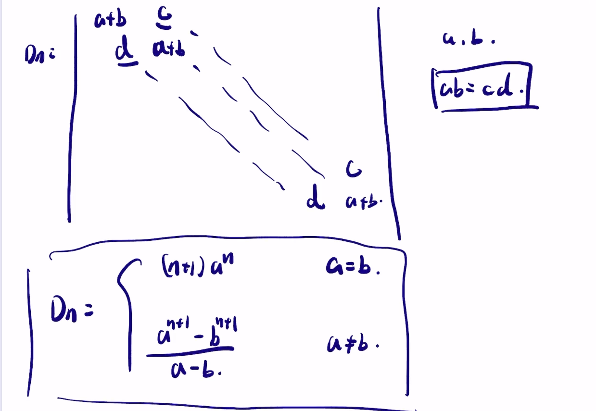 

分块矩阵求逆

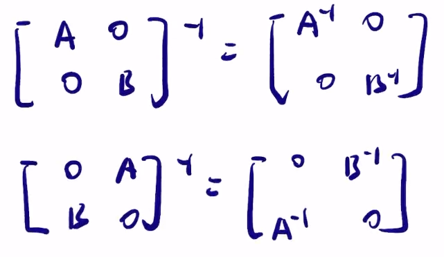 

p56 拓展（1）

（AB）T = BT AT

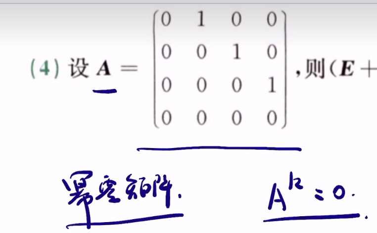 

初等矩阵逆矩阵

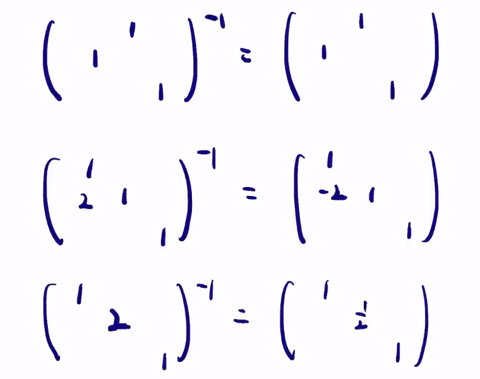 

分块矩阵转置

 

同解方程组

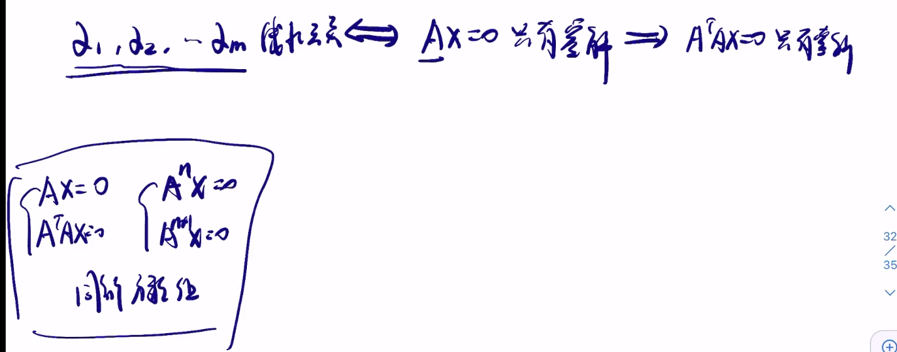  

两方程组非零公共解：法1：联立求解   法2：联立基础解系 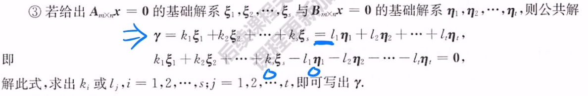 

两方程组同解：①的通解代入②，解出②的通解，验证①②是否相同

特征向量：重根表示：k1ξ1+k2ξ2 ， （k1,k2不同时为0）, 单根：k3ξ3 ,（k3不为0）   因为特征向量不为0，而解齐次方程组时，k1k2为任意常数

A^2=A   n阶    —> 特征值为0或1  ，r(E-A) + r(A) ≥ r(E) = n，  且A(A-E)= 0 --> r(A)+r(A-E) ≤ n，所以r(A)+r(A-E) = n

写基础解系就写（）T，（）T   写通解就写k()T+k()T

两正一负是单叶，两负一正是双叶

标准形->规范形

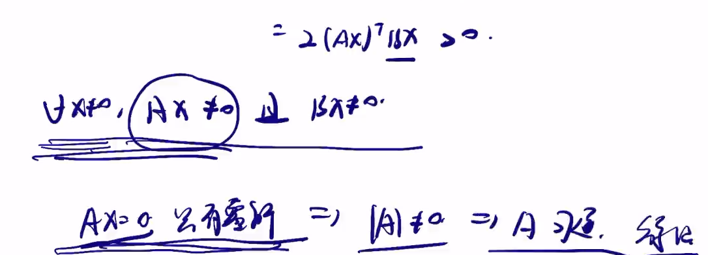  

## 概率论

Y=sinX    —–>  2kΠ+(-Π-arcsiny) < x <   2kΠ+arcsiny (关于y=-Π对称)   注意arcsin和arccos的定义域都是[-1,1]

==大数定律中心极限定理==

大数定律：

切比雪夫：独立，期望方差存在，方差一致有界

 伯努利 

辛钦：独立同分布，期望存在

中心极限定理：

列维林德伯格：独立同分布 期望 方差  ，n很大时，近似服从正态

==数理统计==

t分布的平方服从F（1，n)

 

 	DX的矩估计是二阶中心矩

==参数估计==  矩估计：X拔等于EX  最大似然估计无极值的情况，L(λ)的导数大于0恒成立，则λ↑，L↑。则λ取max时，最大似然，而λ≤x1,x2…xn,所以λ≤min{x1.x2..xn},   因此λ取min{x1,x2…xn}

==置信区间：给定一个分布Y，先写出Y拔服从的分布，再标准化==

 

==假设检验==

 

 

 

==伽马函数==

# 数学遗忘

方向导数 梯度散度旋度   沿梯度方向的方向导数就是梯度的模 背十遍

等价无穷小1

方向导数： 

 

==常见分布的期望方差== 指数分布期望1/λ  方差1/λ^2     泊松分布期望λ  方差λ

大数定律 中心极限定理 数理统计 参数估计 假设检验

等价相似合同   相似于对角矩阵

 

 

 

同解方程组 公共解

方向导数

 

其中cosβ=sinα

方向导数是一个值    若z=f(x,y)可微，则αf/αl=αf/αx·cosα+αf/αy·cosβ

而梯度是一个向量，gradz=(αf/αx,αf/αy)

gradz 点乘 方向余弦 = 方向导数

==傅里叶级数 p224==

==偶零奇倍==

==合一投影法==

先二后一和先一后二

无穷级数背诵    [-1,1)

二维正态 

Γ(1) = Γ(2) = 1   Γ(1/2) = 根号Π  Γ(n+1) = n!

 

 

对应的特征向量：kα1（k≠0）

格林公式用D

 

球面坐标系