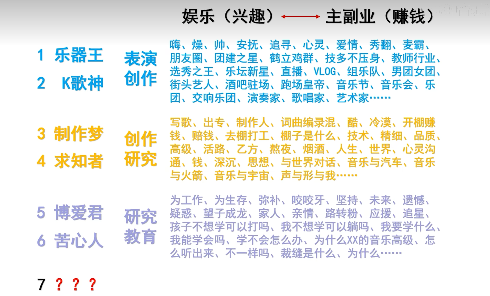

## 乐理知识

【【四川音乐学院作曲硕士】零基础自学音乐学乐理合集-第二季（最终版）/已完结】https://www.bilibili.com/video/BV14p4y1e7TV?p=6&vd_source=6dbb4fdc724891f6d7066d49d3f4bb1e

笔记来自个人总结及视频截取（更新中）

# 不是 我图怎么没了？埋个坑, 以后有时间再来补图

### 1.你为什么学乐理 

### 2.唱名与记住唱名的方法

 2.1 唱名

> ​        1 2 3 4 5 6 7
>
> 中文名：一二三四五六七
>
> 英文名：one two three four five six seven
>
> 唱名： do re mi fa sol la si

2.2 记住唱名的方法

 

例如：第一天 随机 1451451444515145145441544 然后用唱名读

### 3.唱名的来历 简谱的构造

3.1 唱名的来历（略）以后用到，网上查一查即可

3.2 简谱的构造

 

### 4.初探调号、拍号、情绪与速度

拍号初步影响音乐的律动

速度可分为抽象的速度（快速）和精确的速度（=120） 

### 5. 音名、钢琴键盘

 

 

钢琴五个黑键+七个白键盘，把这12个按键的结构单元称为==组== 

钢琴有9个组，如图为88键 

 

练习：说出音名（随机指） 每天10分钟  

### 6. 初步理解 1=C

 

>   
>
>  
>
>  
>
>  
>
>  
>
>  
>
>  

### 7.升降号、黑键的音名

   

  

- #C和 bD称为==等音==

- **E-F   A-B 是直接相邻的，中间没有黑键**

### 8.重升重降号、等音扩展篇

  

  

 	 

### 9.纯八度

两个相同且相邻的音名之间的距离：纯八度

 

   

频率接近整数比，听上去极度相似，听不出来是两个音，但是如果不接近整数比，例如C和D，约为1：1.122，能听出是两个音

  

  

这两个D中间隔了一个D，可以说这两个D相差了两个纯八度

### 10.音的分组、中央C、标准音

**两种记号法：** 

   

  

C换成D、#G也同理 

  

 

**中央C和标准音： ** 

 

**作业：**  

### 11.高音点、低音点

简谱中的1234567如何区分是那个一组的：加上高音点或者低音点

 

### 12.音域、 1=C到底是哪组的C

#### 12.1 音域

 

 

 

#### 12.2 1=C 到底是哪组的C

 

原则上1=C可以等于任何一个组的C，但在实际中，简谱绝大多是给人唱的，而大多数人的音域如上，因此，把1=C对应到小字一组的c，就成了最合理的做法

> 总结：根据音域去选择合适的组
>
> 1=哪个组的C仅仅是为了让我们的乐谱看上去简洁，不要出现那么多的高音点和低音点而已。

### **13.半音、全音（⭐）**

> 半音：==相邻==的==两个音==之间的==距离==
>
> 重要:E和F，B和C是直接相邻的，他们之间的距离是半音
>
> 全音：半音距离的==两倍==

作业：上图找半音，下图找全音

 

答案：

### 14.乐音、噪音、乐音体系、音列

> **乐音：**震动规则，频率稳定。钢琴上每一个键盘，每一个音名都是乐音。因为每一个键，都对应一个固定的频率 
>
> **噪音：** 发出声音的物体震动地很不规则，可以说是“无数”的频率交织在一起
>
>  
>
> 上图：揉纸的声音 此外还有 打开水龙头的声音，剃须刀，鼓等
>
> **音乐往往是乐音和噪音的结合**
>
> **乐音体系：**音乐中使用到的所有乐音的==总和==
>
> **音列：**乐音体系中，取==若干==乐音，并==有序==地排列起来，称为==音列==

作业：上面六个找半音，下面六个找全音 你 

答案：  

### 15. 音级、基本音级、变化音级

> **音级：** 乐音体系中的每一个==音==，都叫==音级==
>
> **基本音级：**七个具有独立名称，且不带有任何升降记号的音级：CDEFGAB
>
> **变化音级：**除了基本音级，都是变化音级（一定要使用升降号，重升降号来表示）：可分为升音级、降音级、重升音级、重降音级
>
>  

练习：写出这些音级是基本音级还是变化音级 

答案：

 

### 16.自然半音、变化半音、自然全音、变化全音

> CDEFGABCDEFGABCDEFGAB
>
> 任意取出两个音级，只要两个音级是相邻的，他一定是**自然**
>
> 如图：下图也是自然  看法：==忽略掉一切升降符号，只看音名是否相邻==
>
>  
>
>  
>
> 然后再把升降号加回来，再看是**自然全音**还是**自然半音** 上图四个分别是半音、全音、全音、半音
>
> 反过来 **变化** ，则忽略掉升降号，音名不相邻则为变化， 再加回升降号，看是**变化全音**还是**变化半音**
>
>  

总结：第一步：忽略升降号，只看音名是否相邻，只要音名相邻，不管升降号多么离谱，都必是自然，若不相邻，则一定是变化 

第二步：把升降号加回来，看这两个音的实际位置到底是构成了“半音”还是“全音"，然后加到”自然"或“变化”二字后面，就是答案

作业：判断自然全音、自然半音、变化全音、变化半音 

答案：

 

### **17. 1234567的内在规则（⭐）**

      

### 18. 调式、自然大调式

> **调式：**若干高低不同的乐音，围绕某一有稳定感的中心音，按一定的音程关系组织在一起，成为一个有机的体系，称为调式
>
> 简化版：若干个音，按某种规则排列起来，就是调式
>
>  **自然大调式：**七个音按照“全全半全全全半”的规则排列，这一个集体叫自然大调。自然大调我们最常用，因此一般直接称为==大调==
>
>  
>
> 虽然是八个圈，但是最后一个一定是第一个的高八度的音，因此是七个音。 但是只是音的数量是七个，并没有说自然大调是从哪一个音开始的因此有C大调（1=C），D大调等七个自然大调
>
>   

### **19. 音阶是什么、有什么用（⭐）**

> **音阶：**将调式中的音，从以主音开始到以主音结束，由低到高（叫做上行），或者由高到低（叫做下行），以阶梯状排列起来，就叫做音阶
>
> 注意：①主音开始，主音结束**（有始有终）**
>
> ②音阶是有序的**（方向性）**
>
> ③包含该调式的所有音**（完整性）**
>
> **作用：**认谱、练习乐器、声乐等的初级阶段或热身阶段

### 20. 关于调式、音阶的一个萌新常见误区

"C大调到底指的是哪一个组呢？"

 

看上去只有七个音，实际上我们要理解为“七个音名的范围”，只要在这七个音名的范围里面，随便哪个组都是可以使用的。千万不要觉得一个调只能用哪一个组，一定要明白调式、音阶指的是==音名的范围==

### **21.黑键出发的自然大调、等音调、音阶的选择（重要）**

>  那么问题来了：我们叫他**#C大调**还是**bD大调**呢？
>
> 由于我们要保证音阶像阶梯一级一级走一样，那么==CDEFGAB七个字母必须都要出现==
>
> 如图我们如果选择了#C，那么，我们的re，必须选择#D，要是选择bE,就没有出现D，就形成不了阶梯的感觉了。由此往后推，我们的mi，如果是F，则没有出现E，所以我们的mi应该是#E（#E是F的等音），如图
>
>  
>
> 只有这样选择我们的名字，才能CDEFGAB都出现，才能保持音阶的完整性
>
>  
>
> 同理：bD大调：
>
> 
>
>  
>
> 由此可见，**#C大调**和 **bD大调**的音是一样的，只是表示方法不同，我们称为==等音调==
>
> 下图为do从第二个黑键出发：bE大调符号比#D大调符号少，因此我们常用bE大调来形容
>
>  
>
> 同理：#F和bG都常用：
>
> do从第四个黑键开始我们常用bA大调来形容： 
>
>  
>
> do从第五个黑键开始我们常用bB大调来形容：
>
>  

**总结：** （划掉的为不常用，并不代表不存在）  

### 22.等音调扩展篇、何为一共十五个大调

  

从原理上来说，应该有35个大调。但人们往往偏向于简单、简洁。因此我们把带有重升、重降号的大调排除掉（因为有更简洁的等音调作替代），最后剩下15个：

我们一个组共12个键，do的出发方式只有12种，所以从听觉效果上来说，是只有12中大调的。而我们有15个大调，说明有三个键上出发的大调，两种名字经常使用。哪三个呢：**第一个黑键、第三个黑键、第七个白键**（科普） 

总结：12：实际按键、实际听觉

15：常用调号、三组等音调

35：理论上大调数量。那么如果我们有更多的升降号可以使用的话，那我们可以有无穷无尽的大调数量。

### 23.调号总结篇

> 1-22课 纯粹的理论
>
> 23课 梳理与总结
>
> 24-40左右 常见的误区、一些练习方法 、暂时未讲的东西和为什么
>
> 再进行第二大板块：拍号

### 24.模唱、相对音高的练习方式

> 模唱：弹一个键，发出声音，然后模仿它的音高
>
> 相对音高：给你一个音把它当成do（参照物）,之后把re mi fa sol la si唱出来。
>
> 相对音高的练习：   
>
> （标红的do是高音do）可以把音拖长一点，闭上眼睛去体会
>
>  

### 25. 为什么要有这么多调号？（有疑问看🌙）

林俊杰的《她说》  原版是1=C

  

但我由于音域问题，远远不如林俊杰高，不如林俊杰宽广，嚎到C都困难，但我又很想舒服的唱这首歌，因此我们需要整体降低这首歌的高度

 

结论：1.每个人的音域是有差异的  2.乐器的音域也是有差异的，因此乐器也需用不同的调来适配某些旋律与和声的演奏 

   

同样一段旋律，在不同的调上演奏，虽然音的相对感觉是相同的，但是他们的质感不同（情感）

### 26.如何构建大调音阶（有疑问看🌙）

1.满足全全半全全全半 2.CDEFGAB要轮流出现（音阶的字母（音名）连续且不重复）

### 27.  7的发音是Si还是Ti（有疑问看🌙）

 

由于#5的Si与原来的7冲突，因此把原来的7改为Ti。图中的红圈是因为3-4，7-1之间是半音，例如#7是To直接念1（Do)就可以了，不常用

最重要的是唱准音高，而不是纠结哪种发音正统或者高级

### 28.升降号写音名左边还是右边（有疑问看🌙）

两种都可以

  

> ①书面化形容的时候，写左写右都可以
>
> ②乐谱中，一定写在音的左边

### 29.调性是什么（有疑问看🌙）

> 调式（Mode)：若干个音， 按照一定规则排列的集体。但不能确定具体从哪个音开始，具体是哪些音
>
> 调性：主音+调式
>
> 例如：自然大调（调式）   
>
> C自然大调(调性)
>
>   

### 30. C大调也会用到黑键吗？

即XX大调的音乐中，能够出现XX大调音阶中没有的音吗？   （可以）但数量一定要少，基本不超过5%，带来新奇感

 

并没有改变CDEFGAB骨架。

### 31.首调与固定调

> 首调的首：主音、第一个音、首音
>
>   把任何一个大调的首音当作dol
>
>  
>
> 固定调：无论什么情况，永远把1对应C，2对应D
>
>  
>
> 各自的优势：人体对相对音高是有天生的感觉，C调会了D调也会，因此首调对于人唱比较友好。而首调对于乐器演奏极不方便。明明是不同的键，而首调永远写的都是1231。我们还要根据调号，花时间找键
>
>  

### 32.相对音感与绝对音感

> 相对音感：给你一个音X，再给你一个音Y，你就能根据X音判断Y音是什么，原理在于你掌握了X与Y相对距离的感觉
>
> 绝对音感：随便给出一个音，不给参照，你只能知道是哪个音。甚至两个玻璃杯相碰，发出的音也知道是哪个音

### 33.原调、移调、转调、离调

> 移调：对原调进行升调或者降调（整首音乐都移动）
>
> 转调：一开始在某个调，之后去了另一个调，最后结尾也在之后去往的调上结束
>
> 离调：在某一刻突然用了其他调的音或和弦，但是马上又回到原本的调上

### 34.简谱需要移调吗？

简谱用首调，移调的话，仅有左上角的1=C改变，正文是不会改变的。只有用固定调方式改变，正文才会改变

### 35.高八度低八度算不算跑调（有疑问看🌙）

不算（纯八度太和谐了，太像一个音了）

你唱的调CDEFGAB = 歌手（伴奏）的调（高八度/低八度）CDEFGAB

而跑调：你唱的调E #F #G A B #C #D  ≠ 歌手（伴奏）的调 CDEFGAB

### 36.音名为什么有时候分组、有时候不分组（有疑问看🌙）

分组：

 

不分组：

  

结论：①对于一些在所有组上都适用的知识点，常常不分组  例如无论哪个组的C到B都是全音

②对于EGBD/3572之类的形容，是==从左到右==按照==从低到高==的顺序排列的，==哪怕要跨越组==

  

### 37. 不太明确的乐理题（非艺考略）

### 38.调号章节哪些东西还没有讲？为什么？什么时候讲？

（略）以后会讲

五度圈、（主音、上主音、中音、下属音、属音、下中音、导音、主音）、还原号

### 39. 拍号部分开始，认识音符

 

**音符：**全音符、二分音符、四分音符、八分音符、十六分音符、三十二分音符...

### 40. 什么是一拍

x/y中  分母确定了到底以哪一个音符为一拍 

### 41. 小节、小节线、终止线

  

> 小节线：①均分每一小节  ②预示强弱关系

### 42. 看懂拍号的意义

练习题： 

 

答案： 3 6 4 8

### 43. 附点

附点：延长前面音符本身时值的一半

  

### 44.复附点

   

### 45. 延音线

 

> **延音线：**①用来组合无法用常规方式表达的拍数
>
> ②某个音符跨越小节线的时候
>
> ③必须连接相同的音
>
> ④音值组合法中的使用

### 46. 连线

> **延音线：**100%连接相同的音
>
> **连线：**99%连接不同的音 1%连接相同的音
>
> **连线作用：**①歌谱中，**某一个字对应几个音**的时候，需要用连线将这几个音连接起来 
>
>  
>
> ②框起来的部分，要唱（奏）的连贯

### 47.休止符

全休止符、二分休止符、四分休止符... 简谱用0表示

### 48. 小节线、音符、休止符之间无其他任何停顿（有疑问看🌙）

 

为了乐谱看上去简单明了，常常将一排以内的下方有横线的音符与休止符，把他们的横线链接起来，而对不是不连线中间有停顿

### 49. 常见的拍号、强弱关系

> **拍号->律动（强弱关系）：**
>
> 动次动次动次动次
>
> 动次次动次次动次次
>
> 动次打次动次打次动次打次
>
> **拍号中的强弱关系：**①无论什么拍号，每小节==第一拍==都是==强拍==，并且每小节==只有这一个==强拍
>
> ②强拍、弱拍并不是说强拍的音量一定响，弱拍的音量一定弱（⭐）
>
> 看看就行了：①旋律中的长音符，稳定音，通常处于强拍；短音符，不稳定音符通常处于弱拍
>
> ②和声通常要在强拍发生变化，弱拍进行保持
>
> ③不同的强弱关系还影响旋律的动机，织体的写法，配器的选择，速度的选择等等

### 50. 单拍子、复拍子（艺考）

> 单拍子：每小节只有一个强拍，并且也存在弱拍
>
> 复拍子：由==相同==的==单拍子==组合起来的
>
> 新规则：如果某个拍号是由多个拍号组合而成的，那么==每小节的第二个强拍开始，都要变成次强拍==。

### 51. 混合拍子（艺考）

混合拍子：由==不同==的==单拍子==组合起来的。

### 52. 一拍子、散拍子（艺考）

> 一拍子：每小节只有一拍并且这一拍是强拍。
>
> 散拍子：不再用分数表示，而是草字头“艹”:有种自由发挥的意思
>
> 1.没有固定小节线 2.没有固定拍数 3.没有固定强弱关系 4.一般用于戏曲音乐中
>
>  
>
> 
>
>  
>
>  
>
> 

### 53.变换拍子、交错拍子（艺考）

变换拍子：例如一首音乐前面是四二拍，后面变为四三拍

交错拍子：如下图同时演奏

  

变换拍子是横向 交错拍子是纵向

### 54.小节序号

 
