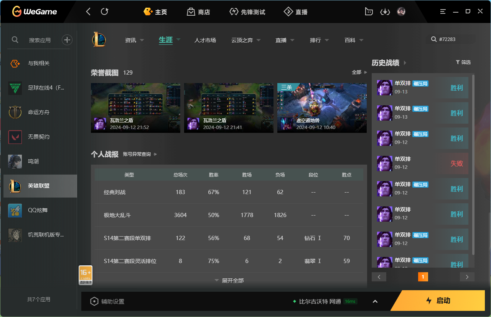
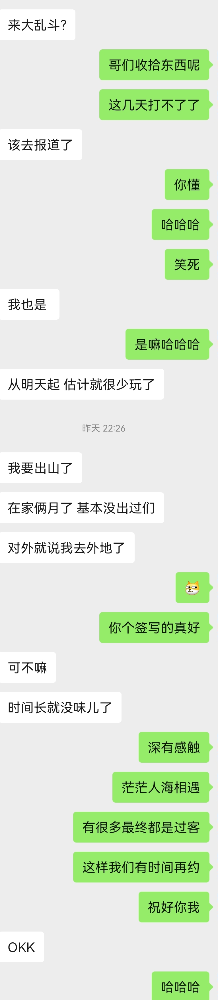
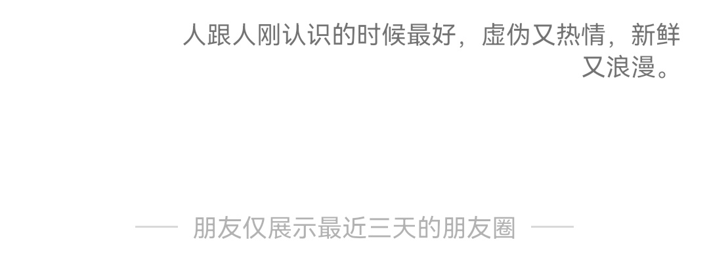

## 记录生活中的灵感/感悟/思考/摘抄

### 2024.07.08 /23：58
你可以不必将自己的意愿屈尊于别人的感受之下
### 2024.07.11
经历过生死之人，哪还有什么放不下的过往
### 2024.07.11 /摘抄自《少有人走的路》
第一部分 自律
人生是一个不断面对问题并解决问题的过程。问题可以开启我们的智慧，激发我们的勇气。为解决问题而努力，我们的思想和心灵就会不断成长，心智就会不断成熟。

自律是解决人生问题最主要的工具，也是消除人生痛苦最重要的方法。

自律的四个原则：推迟满足感、承担责任、忠于事实、保持平衡。

直面问题会使人感觉痛苦。问题通常不可能自行消失，若不解决，就会永远存在，阻碍心智的成熟。

从来不会生气的人，注定终生遭受欺凌和压制，直至被摧毁和消灭。必要的时候生气，可以使我们更好地生存。

一个人越是诚实，保持诚实就越是容易，而谎言说的越多，则越要编造更多的谎言自圆其说。敢于面对现实的人，能够心胸坦荡地生活，不必面临良心的折磨和恐惧的威胁。

放弃某种心爱的事物——至少是自己熟悉的事物，必然会带来痛苦，但这也是心智成熟所必须的。因放弃而感到抑郁，是自然而健康的现象。
### 2024.07.19
知世故而不世故，立圆滑而弥天真，善自嘲而不嘲人
### 2024.07.25
 人不断完善自己的价值观 不断反省自己
小时候对虐待动物的反思
大学时的错误思想和不当言论
抱怨环境—＞提升自己
不随意评价别人，不随声附和，自己要有主见有看法
### 2024.08.29
今日感悟：
1.相互理解是沟通的前提
2.病态的爱是不平等的爱
### 2024.09.14
热爱就去追求 人就活短短几十年 时光短暂 不去追求等下辈子么？ 珍惜当下 珍惜生活中的感动 大胆去爱 你我皆有享受世间美好的自由

### 2024.09.15
你是我几百把排位中的一见钟情

我玩宝石 你玩卢锡安 我钻三 你钻二

相遇瞬间我们的默契便打动了彼此 

你加我好友邀请我双排 我们一路向前

最后你钻一85 我钻一50

此时你的隐藏分只允许单排 我祝福你顺利 我们各自单排了一把 你成功晋级 我钻一70

我很开心你能成功晋级但也夹杂着失落难过

晋级完临维护前的一个小时 我邀请你打大乱斗 玩的轻松又愉悦
 

如图：巅峰战绩

之后的单排过程中 你连续失利三把面临掉级 为了保级选择不再打排位 我屡遭挫折已掉钻二

这是我开学前最后一搏 最后宣布失败 在召唤师峡谷的跌跌撞撞磨平了我的棱角 冷却了我炽热的心 但依旧不甘心

你向我吐槽你和路人辅助没有配合 我向你倾诉我和路人ad行动不一

实力不允许我扶摇直上 而茫茫人海相遇彼此是我小小的幸福

我们认识仅两天 此后我们要各奔东西

可能此次一别，便是永久

但我永远忘不了我们的心有灵犀与默契 在召唤师峡谷每一次精彩的对线与团战

以前的我太看重一段感情 曾经类似的经历让我陷入如同失恋的泥潭

而如今我认识了众多ad，他们也有众多的辅助，一把游戏不是非你，也不是非我

现在的我很清楚 我们最终都是过客 时间会冲淡一切 但是幸福的回忆值得记录

